# Architecture — strm2stl

_Last updated: 2026-05-03_

## Single-Page Architecture

strm2stl is intentionally a **single-page application** (SPA). The three top-level views (`Explore`, `Edit`, `Extrude`) are workflow steps, not destinations — a user picks a region on the map, refines it in the DEM editor, then exports. All three steps share the same in-memory state.

### Why SPA and not multi-page

| Concern | Multi-page cost | SPA status quo |
|---------|----------------|----------------|
| Shared live data | Would require serialising ~3-4 MB of canvas/array state (DEM values, water mask, city raster, satellite image) between page loads | State lives in `window.appState` — all views consume it directly |
| Workflow continuity | Users move Explore → Edit → Extrude in sequence; page transitions would feel like a form wizard | `switchView()` transitions in <16 ms; no network round-trip |
| Canvas and WebGL contexts | Three.js globe + Leaflet map + model viewer share one document; recreating GL contexts is expensive | Canvases are always present; inactive ones are hidden and their GPU backing freed via `_freeLayerBuffer()` |
| Region table / cache inspector | These are panel-level concerns, not page-level | Sidebar state machine cycles: `normal → list → table → normal` |

**Multi-page is only worth considering if** the app ever needs to serve regions or terrain data to external consumers (share-a-link to a specific region's DEM). In that case the correct scope is a **shareable URL via `location.hash`** that deep-links into a pre-selected region + view — not a separate HTML page. This would require no architectural changes beyond wiring `switchView()` and `selectCoordinate()` to read `location.hash` on load. See `proposals.md → A-HASH`.

---

## System Overview

### Frontend → Backend → SDK

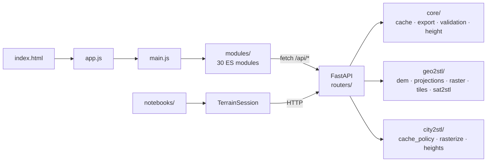
```mermaid
flowchart LR
    HTML["index.html"] --> APP["app.js"]
    APP --> MAIN["main.js"]
    MAIN --> MODS["modules/<br/>30 ES modules"]
    MODS -->|"fetch /api/*"| ROUTERS["FastAPI<br/>routers/"]
    ROUTERS --> CORE["core/<br/>cache · export · validation · height"]
    ROUTERS --> GEO["geo2stl/<br/>dem · projections · raster · tiles · sat2stl"]
    ROUTERS --> CITY["city2stl/<br/>cache_policy · rasterize · heights"]
    SESSION["TerrainSession"] -->|HTTP| ROUTERS
    NB["notebooks/"] --> SESSION
```

### Backend → External Data

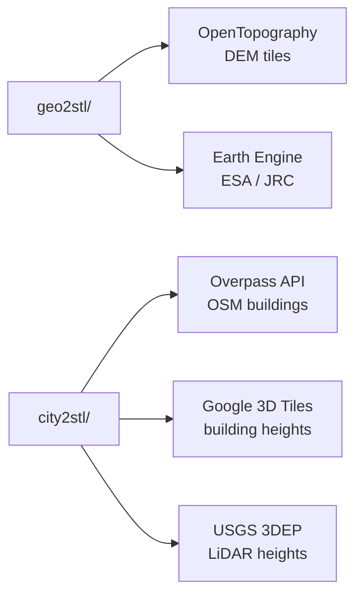
```mermaid
flowchart LR
    GEO["geo2stl/"] --> OT["OpenTopography<br/>DEM tiles"]
    GEO --> EE["Earth Engine<br/>ESA / JRC"]
    CITY["city2stl/"] --> OSM["Overpass API<br/>OSM buildings"]
    CITY --> G3D["Google 3D Tiles<br/>building heights"]
    CITY --> USGS["USGS 3DEP<br/>LiDAR heights"]
```

### Frontend Module Groups

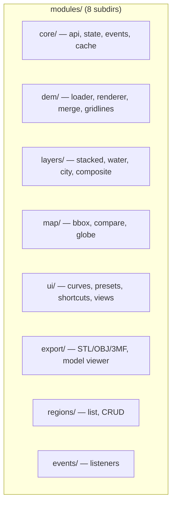
```mermaid
flowchart TD
    subgraph Modules ["modules/ (8 subdirs)"]
        CORE_JS["core/ — api, state, events, cache"]
        DEM_JS["dem/ — loader, renderer, merge, gridlines"]
        LAYERS_JS["layers/ — stacked, water, city, composite"]
        MAP_JS["map/ — bbox, compare, globe"]
        UI_JS["ui/ — curves, presets, shortcuts, views"]
        EXPORT_JS["export/ — STL/OBJ/3MF, model viewer"]
        REGIONS_JS["regions/ — list, CRUD"]
        EVENTS_JS["events/ — listeners"]
    end
```

## Frontend

### Module Boundary

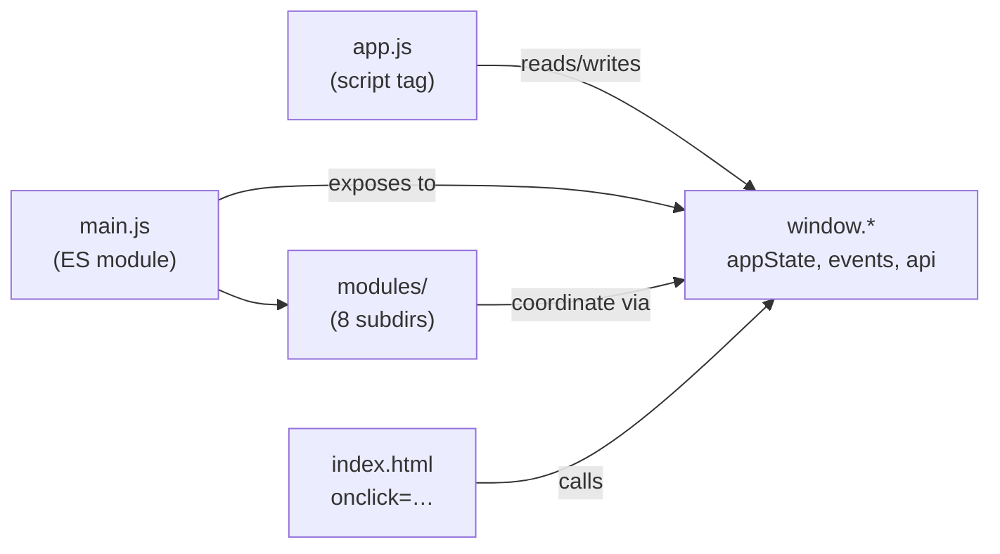
```mermaid
flowchart LR
    APP["app.js<br/>(script tag)"] -->|"reads/writes"| G["window.*<br/>appState, events, api"]
    MAIN["main.js<br/>(ES module)"] -->|"exposes to"| G
    MAIN --> M["modules/<br/>(8 subdirs)"]
    M -->|"coordinate via"| G
    HTML["index.html<br/>onclick=…"] -->|"calls"| G
```

**`app.js`** is a plain `<script>` tag (~333 lines of state container + DOMContentLoaded init). It is **not** an ES module. Public functions must stay on `window.*`. HTML `onclick` handlers reference these global names directly.

**`main.js`** (`type="module"`) is the ES module entry point. It imports 30 modules from `modules/` in dependency order. Modules expose functions on `window.*` so `app.js` can call them.

Key cross-module contracts:
- `window.appState` — Proxy-based reactive state (state.js). All modules read/write via this.
- `window.events` / `window.EV` — Event bus + constants (events.js).
- `window.api.*` — All fetch helpers (api.js).
- Modules must **not** import each other — all coordination is via `window.*`.

### View System

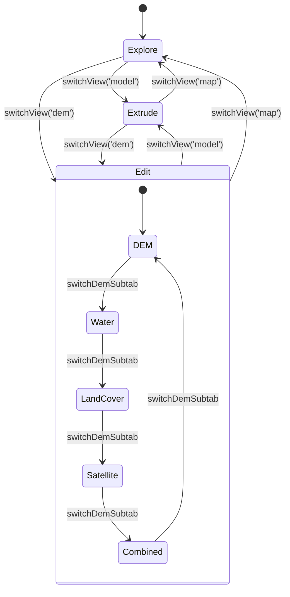
```mermaid
stateDiagram-v2
    [*] --> Explore
    Explore --> Edit : switchView('dem')
    Edit --> Extrude : switchView('model')
    Extrude --> Explore : switchView('map')
    Explore --> Extrude : switchView('model')
    Extrude --> Edit : switchView('dem')
    Edit --> Explore : switchView('map')

    state Edit {
        [*] --> DEM
        DEM --> Water : switchDemSubtab
        Water --> LandCover : switchDemSubtab
        LandCover --> Satellite : switchDemSubtab
        Satellite --> Combined : switchDemSubtab
        Combined --> DEM : switchDemSubtab
    }
```

Three top-level tabs:
- **Explore** (`data-view="map"`) — Leaflet map + globe
- **Edit** (`data-view="dem"`) — DEM canvas, water mask, land cover, stacked layers, compare
- **Extrude** (`data-view="model"`) — 3D model viewer, STL/OBJ/3MF export

Within "Edit", DEM sub-tabs (managed by `switchDemSubtab()`):
- `dem`, `water`, `landcover`, `combined`, `satellite`

### Sidebar State Machine

`cycleSidebarState()` → `'normal'` → `'list'` → `'table'` → `'normal'`

### Preset Versioning & Revert

Presets are stored in `localStorage` as JSON objects. `PRESET_VERSION` (currently `1`) guards against stale preset shapes. When a preset is loaded, `_migratePreset(preset)` merges it with `builtInPresets['default']` so that any new settings keys are populated with defaults.

**Revert flow:**

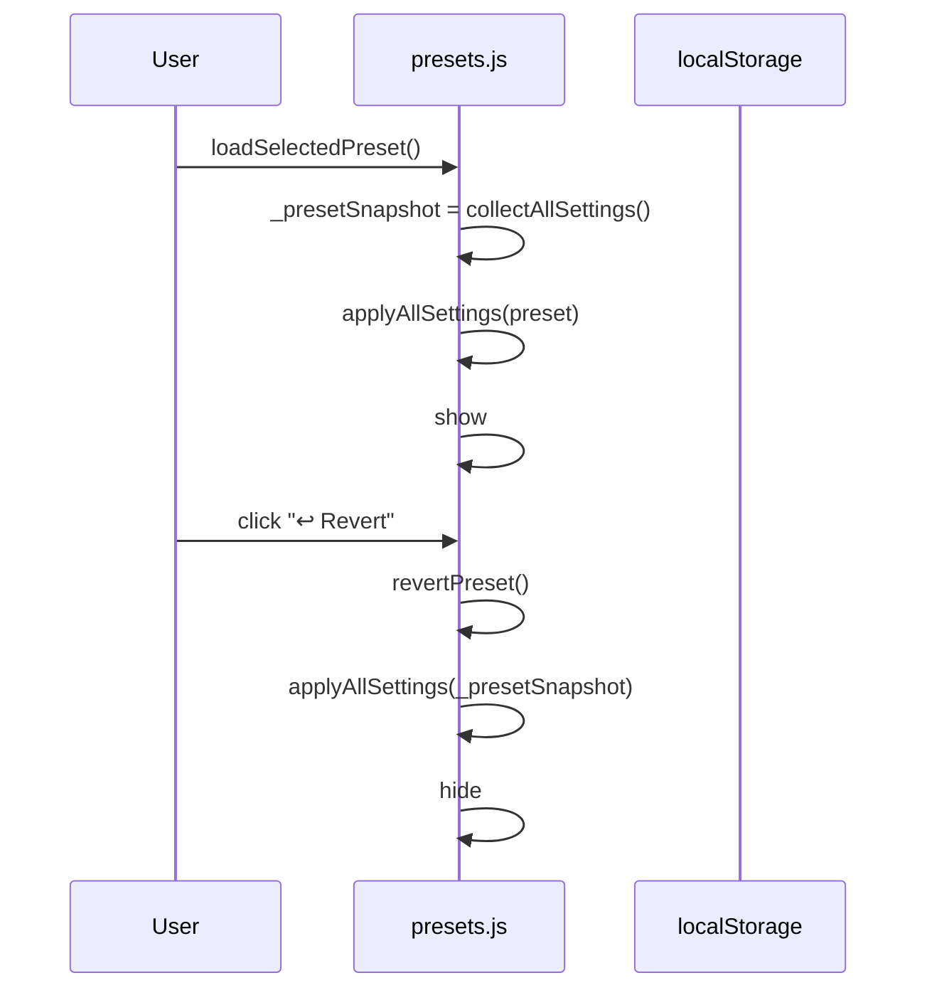
```mermaid
sequenceDiagram
    participant U as User
    participant P as presets.js
    participant LS as localStorage

    U->>P: loadSelectedPreset()
    P->>P: _presetSnapshot = collectAllSettings()
    P->>P: applyAllSettings(preset)
    P->>P: show #revertPresetBtn
    U->>P: click "↩ Revert"
    P->>P: revertPreset()
    P->>P: applyAllSettings(_presetSnapshot)
    P->>P: hide #revertPresetBtn, clear _presetSnapshot
```

When the user saves a new preset, `{ ...getCurrentSettings(), _version: PRESET_VERSION }` is written to `localStorage`. On next load, `_migratePreset()` merges any missing keys from the built-in default.

### Region List Pagination

The regions table in the sidebar supports search and 20-row pagination managed entirely in `region-ui.js`:

- `TABLE_PAGE_SIZE = 20` (module constant)
- `_tablePage` and `_tableSearch` hold current pagination state
- `populateRegionsTable()` filters by search string, slices to current page, and re-renders
- `_renderTablePagination(total, totalPages)` writes Prev/Next buttons into `#regionsPagination`; the div is hidden when total ≤ 20

An `indexByName` Map preserves original region indices (for settings lookups) across filtered/paginated views.


All 7 layer canvases are hidden offscreen buffers. `stackViewCanvas` is the only visible canvas. `updateStackedLayers()` composites the active mode buffers onto `stackViewCanvas`. `setStackMode(mode)` switches active mode.

**Layer canvas registry (`LAYER_CANVAS_IDS`)** in `stacked-layers.js` maps each layer mode key to its DOM canvas ID:

| Mode key | Canvas ID |
|----------|-----------|
| `Dem` | `layerDemCanvas` |
| `Water` | `layerWaterCanvas` |
| `Sat` | `layerSatCanvas` |
| `SatImg` | `layerSatImgCanvas` |
| `CityRaster` | `layerCityRasterCanvas` |
| `CompositeDem` | `layerCompositeDemCanvas` |
| `Hydrology` | `layerHydroCanvas` |

**Canvas lifecycle:** `_getLayerBuffer(mode)` retrieves the canvas by registry lookup. `_freeLayerBuffer(mode)` zeros `width` and `height` to release the GPU backing store when a layer is deactivated. This prevents accumulation of GPU memory for layers not currently in use.

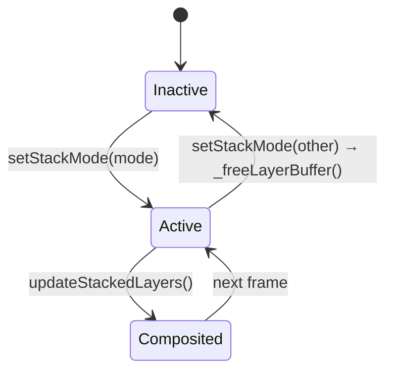
```mermaid
stateDiagram-v2
    [*] --> Inactive
    Inactive --> Active : setStackMode(mode)
    Active --> Composited : updateStackedLayers()
    Active --> Inactive : setStackMode(other) → _freeLayerBuffer()
    Composited --> Active : next frame
```

---

## Backend

The backend (`app/server/`) is a thin layer over two support libraries: `geo2stl` (map projections, tile stitching) and `numpy2stl` (mesh generation). See [reference/libraries.md](reference/libraries.md) for the full import map and integration assessment.

### Structure

See `../CLAUDE.md` for the complete project layout.
<!-- Note: CLAUDE.md lives outside docs/; this link works on GitHub but not MkDocs -->
Backend detail:

```
app/
├── server/                    — HTTP server (Python/FastAPI)
│   ├── server.py    — FastAPI app init, lifespan, router includes
│   ├── schemas.py   — all ~30 Pydantic models
│   ├── config.py    — paths, OPENTOPO_DATASETS, TEST_MODE, API keys
│   ├── core/
│   │   ├── cache.py          — make_cache_key, write/read_array_cache (.npz), write/read_osm_cache (.json.gz), prune
│   │   ├── cache_inspector.py — build_tree_node, build_region_tree, flatten_files (cache UI helpers)
│   │   ├── export.py         — generate_stl/obj/3mf/crosssection (delegates to numpy2stl)
│   │   ├── db.py             — get_db, init_db, WAL mode (SQLite)
│   │   ├── validation.py     — parse_bbox_query, validate_bbox/dim, run_sync, model_to_dict
│   │   ├── responses.py      — error_response() builder
│   │   ├── terrain_raster.py — [compat wrapper → geo2stl.raster]
│   │   ├── osm_cache_policy.py — [compat wrapper → city2stl.cache_policy]
│   │   └── height/           — building height orchestration
│   │       ├── service.py    — RegisteredProvider, provider registry, cache I/O, enhance_city_data
│   │       └── train.py      — training utilities
│   └── routers/
│       ├── terrain.py    — /api/terrain/*
│       ├── regions.py    — /api/regions/* (SQLite-first, JSON fallback)
│       ├── export.py     — /api/export/*
│       ├── cities.py     — /api/cities/*
│       ├── composite.py  — /api/composite/* (city-raster, dem-merge, hydrology-merge)
│       ├── cache.py      — /api/cache/*
│       ├── settings.py   — /api/settings/* + combined /api/settings
│       └── height.py     — /api/height/* (prefix: /api/height)
├── client/                    — browser client (HTML/CSS/JS)
│   ├── static/js/   — main.js, modules/ (30 ES modules in 8 subdirs)
│   ├── static/css/  — app.css
│   └── templates/   — index.html
└── session/                   — Python SDK client (talks to server over HTTP)
    ├── terrain_session.py
    └── viz.py
```

### Key Backend Rules
The backend is a three-layer stack:

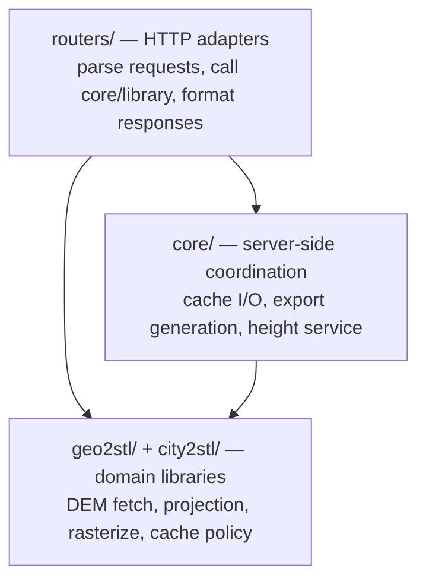
```mermaid
flowchart TD
    R["routers/ — HTTP adapters<br/>parse requests, call core/library, format responses"]
    C["core/ — server-side coordination<br/>cache I/O, export generation, height service"]
    L["geo2stl/ + city2stl/ — domain libraries<br/>DEM fetch, projection, rasterize, cache policy"]
    R --> C
    R --> L
    C --> L
```

- Routers are **thin HTTP adapters**: validate input, delegate, format response
- `core/` handles **server-side concerns** (disk cache, SQLite, export, height provider orchestration)
- `geo2stl/` and `city2stl/` are **domain libraries** reusable without the server (notebooks, scripts)
- Routers import from libraries **directly** where logic belongs in the library layer
- `core/terrain_raster.py` and `core/osm_cache_policy.py` are **deprecated compatibility wrappers** — use `geo2stl.raster` and `city2stl.cache_policy` instead
- Never use `os.chdir()` in handlers — process-global, causes data races
- See `../CLAUDE.md` for async/executor constraints and full editing guidelines
<!-- Note: CLAUDE.md lives outside docs/; this link works on GitHub but not MkDocs -->

### numpy2stl Delegation Pattern

`core/export.py` delegates to `numpy2stl` with availability guards — the library is tried first and a manual fallback runs if unavailable.

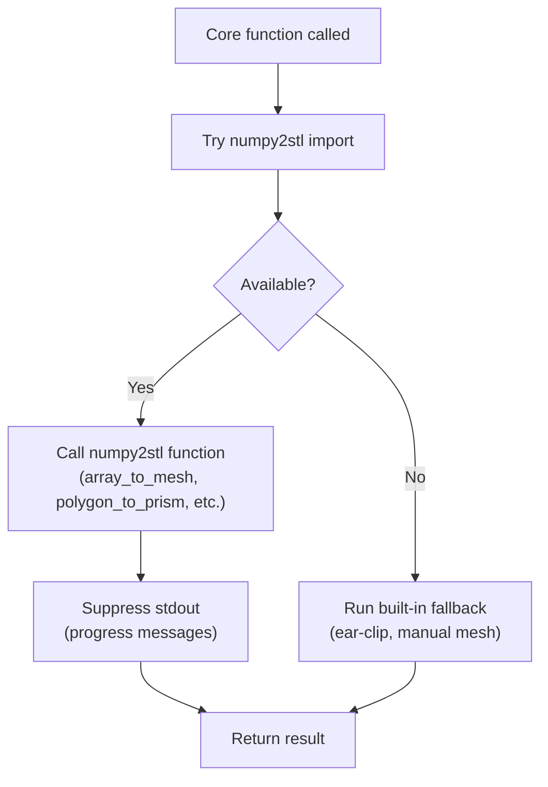
```mermaid
flowchart TD
    CALL["Core function called"] --> TRY["Try numpy2stl import"]
    TRY --> AVAIL{"Available?"}
    AVAIL -->|Yes| NUMPY["Call numpy2stl function<br/>(array_to_mesh, polygon_to_prism, etc.)"]
    AVAIL -->|No| FALLBACK["Run built-in fallback<br/>(ear-clip, manual mesh)"]
    NUMPY --> SUPPRESS["Suppress stdout<br/>(progress messages)"]
    SUPPRESS --> RESULT["Return result"]
    FALLBACK --> RESULT
```

Key guard pattern:
```python
_ARRAY_TO_MESH_AVAILABLE = False
try:
    from numpy2stl import array_to_mesh as _array_to_mesh
    _ARRAY_TO_MESH_AVAILABLE = True
except ImportError:
    pass

# In function body:
if _ARRAY_TO_MESH_AVAILABLE:
    import io, sys
    _buf = io.StringIO()
    sys.stdout, _saved = _buf, sys.stdout
    try:
        result = _array_to_mesh(scaled, floor_val=0.0, solid=True)
    finally:
        sys.stdout = _saved
else:
    result = _manual_fallback(...)
```

### Async Export Pipeline

Long-running exports (puzzle 3MF, large STL) use a background-thread task system:

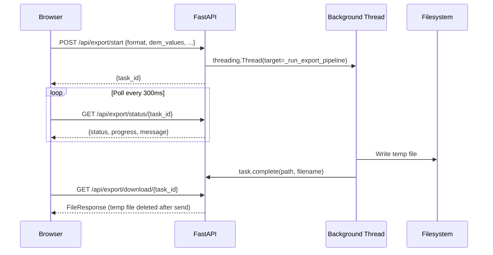
```mermaid
sequenceDiagram
    participant FE as Browser
    participant BE as FastAPI
    participant BG as Background Thread
    participant FS as Filesystem

    FE->>BE: POST /api/export/start {format, dem_values, ...}
    BE->>BG: threading.Thread(target=_run_export_pipeline)
    BE-->>FE: {task_id}
    loop Poll every 300ms
        FE->>BE: GET /api/export/status/{task_id}
        BE-->>FE: {status, progress, message}
    end
    BG->>FS: Write temp file
    BG->>BE: task.complete(path, filename)
    FE->>BE: GET /api/export/download/{task_id}
    BE-->>FE: FileResponse (temp file deleted after send)
```

Tasks expire after 300 seconds. The temp file is deleted by a `BackgroundTask` after the download response is sent. Direct sync endpoints (`POST /api/export/stl`, etc.) still exist for non-interactive callers.

### Cache
- DEM: `.npz` (float32) + `.json` sidecar under `cache/dem/`
- OSM: `.json.gz` under `cache/osm/`
- Key: `MD5(namespace + ":" + "N{n:.4f}_S..." + ":" + sorted_json(extra))`
- OSM key shorthand: `osm_cache_key(N, S, E, W, tol=0.5, min_area=5.0)` in `core/cache.py`
- Pruned at startup via `prune_all_caches()`

### SQLite
- `data.db` — `regions` + `region_settings` tables, WAL mode
- `region_settings` has `ON DELETE CASCADE` from `regions`
- JSON fallback active when `core.db` unavailable (used in tests)

## Python SDK

`app/session/terrain_session.py` is the Python client that drives the same server used by the browser app.

Use it when the workflow is notebook-driven or when a script needs to reproduce the terrain pipeline without using the UI.

The shortest example path is:

`notebooks/API_Terrain.ipynb` → `app/session/terrain_session.py` → router in `app/server/routers/` → `app/server/core/` or `geo2stl/` / `city2stl/`

Use these companion docs:

- `sdk-workflow.md` for notebook-to-method-to-route tracing
- `api.md` for the route index
- `task-routing.md` for deciding which layer to edit

---

## HTML Structure

`templates/index.html` — single-page app, all content always in DOM.

```
body
├── #toastContainer
├── #regionNotesModal
└── .page-wrapper
    ├── .sidebar
    │   ├── #sidebarListView → #coordSearch, #coordinatesList
    │   └── #sidebarTableView → #sidebarRegionsTable
    └── .main-content
        ├── .main-header → .tabs (Explore/Edit/Extrude)
        └── .content-area
            ├── #mapContainer → #map, .map-floating-controls, #regionsPanel
            ├── #globeContainer → #globe
            └── [DEM/Model panels]
```

Key IDs: `#floatingDrawBtn`, `#citiesTab`, `#loadCitiesBtn`, `#modelViewer`, `#stackViewCanvas`, `#demImage`, `#layersStack`

---

## Data Flows

### DEM Load

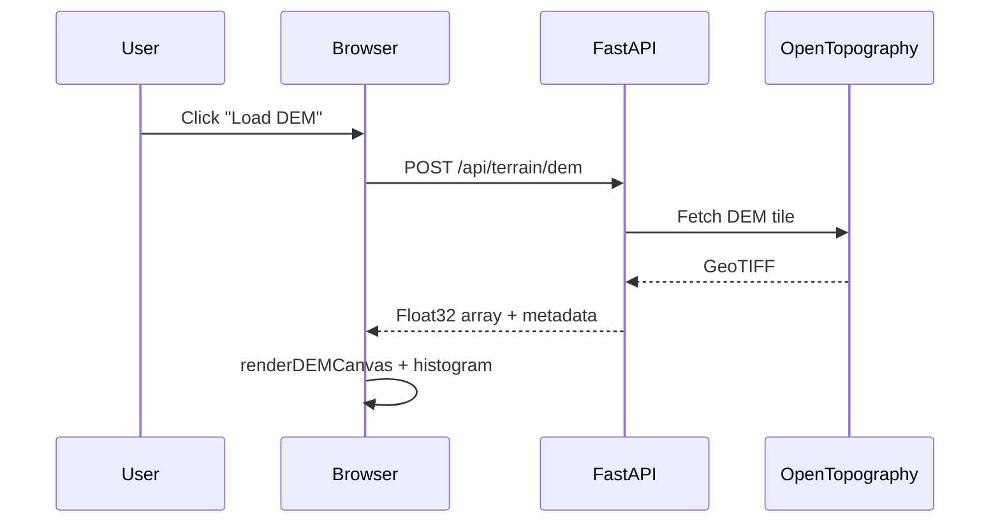
```mermaid
sequenceDiagram
    participant U as User
    participant FE as Browser
    participant BE as FastAPI
    participant OT as OpenTopography

    U->>FE: Click "Load DEM"
    FE->>BE: POST /api/terrain/dem
    BE->>OT: Fetch DEM tile
    OT-->>BE: GeoTIFF
    BE-->>FE: Float32 array + metadata
    FE->>FE: renderDEMCanvas + histogram
```

### Water Mask

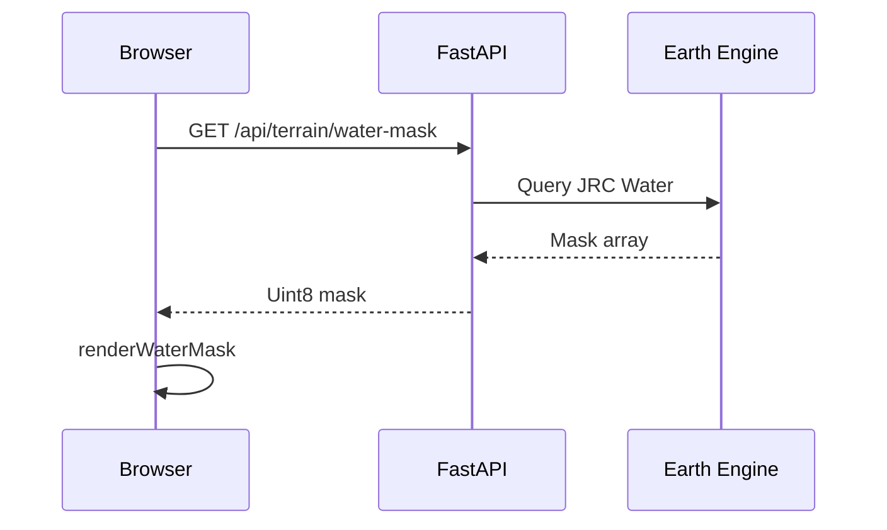
```mermaid
sequenceDiagram
    participant FE as Browser
    participant BE as FastAPI
    participant EE as Earth Engine

    FE->>BE: GET /api/terrain/water-mask
    BE->>EE: Query JRC Water
    EE-->>BE: Mask array
    BE-->>FE: Uint8 mask
    FE->>FE: renderWaterMask
```

### City Overlay

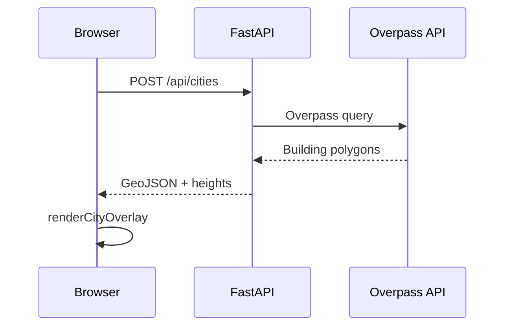
```mermaid
sequenceDiagram
    participant FE as Browser
    participant BE as FastAPI
    participant OSM as Overpass API

    FE->>BE: POST /api/cities
    BE->>OSM: Overpass query
    OSM-->>BE: Building polygons
    BE-->>FE: GeoJSON + heights
    FE->>FE: renderCityOverlay
```

### STL Export

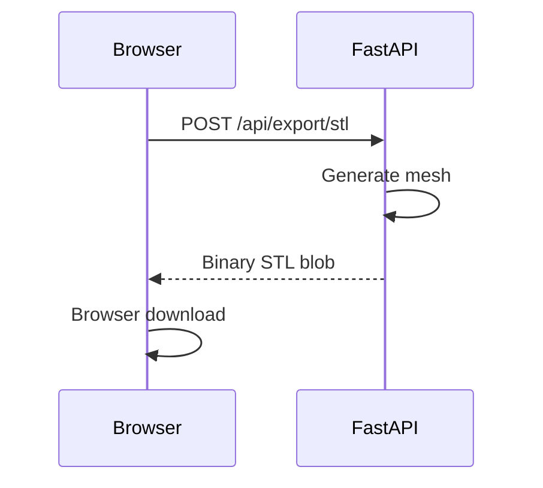
```mermaid
sequenceDiagram
    participant FE as Browser
    participant BE as FastAPI

    FE->>BE: POST /api/export/stl
    BE->>BE: Generate mesh
    BE-->>FE: Binary STL blob
    FE->>FE: Browser download
```

### DEM Load
```
loadDEM() → POST /api/terrain/dem
  → store lastDemData, originalDemValues
  → renderDEMCanvas() → drawColorbar() → drawHistogram() → updateAxesOverlay()
  → setLayerStatus('dem', 'ready')
  → applyCurveTodemSilent() if curve active
```

### Water Mask
```
loadWaterMask() → waterMaskCache.has? return cached : GET /api/terrain/water-mask
  → waterMaskCache.set() → renderWaterMask() → setLayerStatus('water', 'ready')
```

### STL Export
```
downloadSTL() → POST /api/export/stl {dem_values, depth_scale, base, ...}
  → blob → browser download
```

### City Overlay
```
loadCityData() → POST /api/cities → _computeTerrainZ() → store osmCityData
  → renderCityOverlay() [RAF-debounced]
    → _drawCityCanvas(): buildings batched by alpha (8 groups), sub-pixel skipped
    → renderCityOnDEM?() — also paints .city-dem-overlay on DEM canvas

Zoom/pan → applyStackedTransform()
  → CSS transform on all canvases + .osm-overlay
  → scale change >15%: immediate re-render; else: 300ms debounced
```

### Async Export (Puzzle / Large Formats)

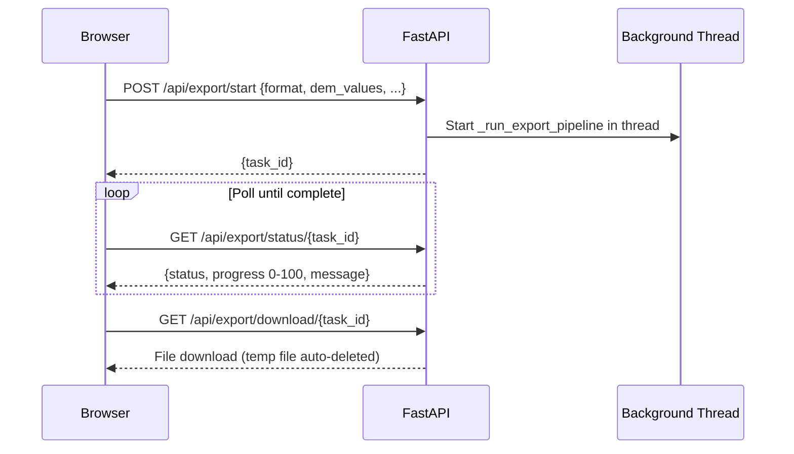
```mermaid
sequenceDiagram
    participant FE as Browser
    participant BE as FastAPI
    participant BG as Background Thread

    FE->>BE: POST /api/export/start {format, dem_values, ...}
    BE->>BG: Start _run_export_pipeline in thread
    BE-->>FE: {task_id}
    loop Poll until complete
        FE->>BE: GET /api/export/status/{task_id}
        BE-->>FE: {status, progress 0-100, message}
    end
    FE->>BE: GET /api/export/download/{task_id}
    BE-->>FE: File download (temp file auto-deleted)
```

Sync endpoints (`POST /api/export/stl`, `/api/export/obj`, `/api/export/3mf`) still work for non-interactive callers.

### 3D Preview (Extrude tab)

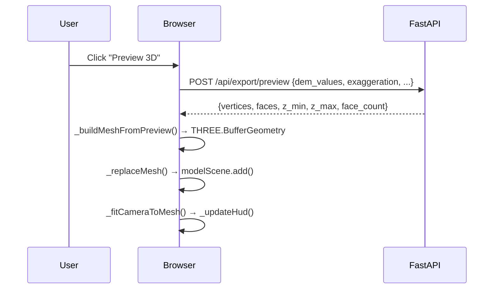
```mermaid
sequenceDiagram
    participant U as User
    participant FE as Browser
    participant BE as FastAPI

    U->>FE: Click "Preview 3D"
    FE->>BE: POST /api/export/preview {dem_values, exaggeration, ...}
    BE-->>FE: {vertices, faces, z_min, z_max, face_count}
    FE->>FE: _buildMeshFromPreview() → THREE.BufferGeometry
    FE->>FE: _replaceMesh() → modelScene.add()
    FE->>FE: _fitCameraToMesh() → _updateHud()
```

Vertex layout from numpy2stl: `[col, row, z_mm]`. In Three.js space: `x=col`, `y=z_mm` (elevation up), `z=row`. Colormap is applied per-vertex with `window.mapElevationToColor(t, cmap)` from `dem-loader.js`. No server round-trip is needed to change colormap — `rebuildViewerColors(cmap)` recomputes all vertex colors from the already-loaded geometry.

### Satellite Scale Calculation

```
fetch_sat_overlay(N, S, E, W, dim, width_px):
  target_dim = max(width_px, dim or width_px)
  scale = max(30, calculate_scale_for_dimensions(N, S, E, W, target_dim))
    ↳ geo2stl.sat2stl.calculate_scale_for_dimensions()
  → fetch_bbox_image(bbox, scale)
```

`calculate_scale_for_dimensions` computes the appropriate tile zoom level for the bbox diagonal, eliminating the manual scale estimation that previously caused under- or over-resolution satellite tiles.

---

## Call Stack Audits

The following diagrams trace the full call path for each major server request, from router to library. Updated after the 2026-05 refactoring passes.

### DEM Fetch — `/api/terrain/dem`

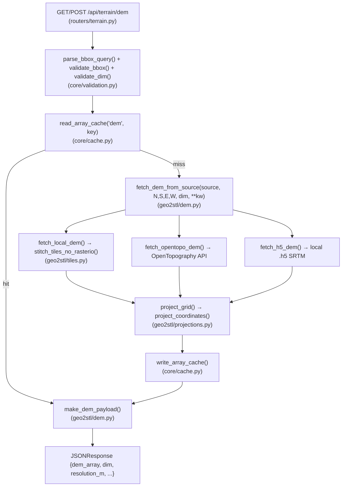
```mermaid
flowchart TD
    ROUTE["GET/POST /api/terrain/dem<br/>(routers/terrain.py)"]
    ROUTE --> PARSE["parse_bbox_query() + validate_bbox() + validate_dim()<br/>(core/validation.py)"]
    PARSE --> CACHE_R["read_array_cache('dem', key)<br/>(core/cache.py)"]
    CACHE_R -->|hit| PAYLOAD["make_dem_payload()<br/>(geo2stl/dem.py)"]
    CACHE_R -->|miss| FETCH["fetch_dem_from_source(source, N,S,E,W, dim, **kw)<br/>(geo2stl/dem.py)"]
    FETCH --> LOCAL["fetch_local_dem() → stitch_tiles_no_rasterio()<br/>(geo2stl/tiles.py)"]
    FETCH --> OT["fetch_opentopo_dem() → OpenTopography API"]
    FETCH --> H5["fetch_h5_dem() → local .h5 SRTM"]
    LOCAL --> PROJ["project_grid() → project_coordinates()<br/>(geo2stl/projections.py)"]
    OT --> PROJ
    H5 --> PROJ
    PROJ --> CACHE_W["write_array_cache()<br/>(core/cache.py)"]
    CACHE_W --> PAYLOAD
    PAYLOAD --> RESP["JSONResponse {dem_array, dim, resolution_m, ...}"]
```

### Water Mask — `/api/terrain/water-mask`

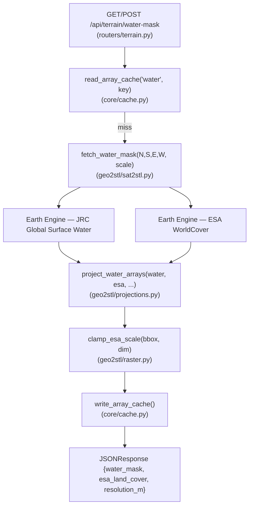
```mermaid
flowchart TD
    ROUTE["GET/POST /api/terrain/water-mask<br/>(routers/terrain.py)"]
    ROUTE --> CACHE_R["read_array_cache('water', key)<br/>(core/cache.py)"]
    CACHE_R -->|miss| WM["fetch_water_mask(N,S,E,W, scale)<br/>(geo2stl/sat2stl.py)"]
    WM --> EE["Earth Engine — JRC Global Surface Water"]
    WM --> EE2["Earth Engine — ESA WorldCover"]
    EE --> PROJ["project_water_arrays(water, esa, ...)<br/>(geo2stl/projections.py)"]
    EE2 --> PROJ
    PROJ --> CLAMP["clamp_esa_scale(bbox, dim)<br/>(geo2stl/raster.py)"]
    CLAMP --> CACHE_W["write_array_cache()<br/>(core/cache.py)"]
    CACHE_W --> RESP["JSONResponse {water_mask, esa_land_cover, resolution_m}"]
```

### Satellite Overlay — `/api/terrain/satellite`

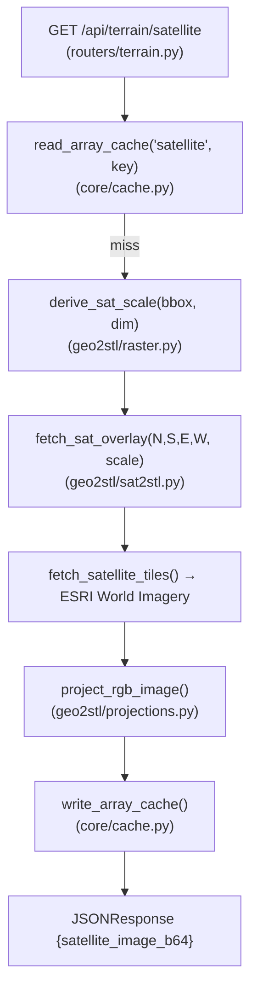
```mermaid
flowchart TD
    ROUTE["GET /api/terrain/satellite<br/>(routers/terrain.py)"]
    ROUTE --> CACHE_R["read_array_cache('satellite', key)<br/>(core/cache.py)"]
    CACHE_R -->|miss| SCALE["derive_sat_scale(bbox, dim)<br/>(geo2stl/raster.py)"]
    SCALE --> SAT["fetch_sat_overlay(N,S,E,W, scale)<br/>(geo2stl/sat2stl.py)"]
    SAT --> TILES["fetch_satellite_tiles() → ESRI World Imagery"]
    TILES --> PROJ["project_rgb_image()<br/>(geo2stl/projections.py)"]
    PROJ --> CACHE_W["write_array_cache()<br/>(core/cache.py)"]
    CACHE_W --> RESP["JSONResponse {satellite_image_b64}"]
```

### OSM City Fetch — `/api/cities` (POST)

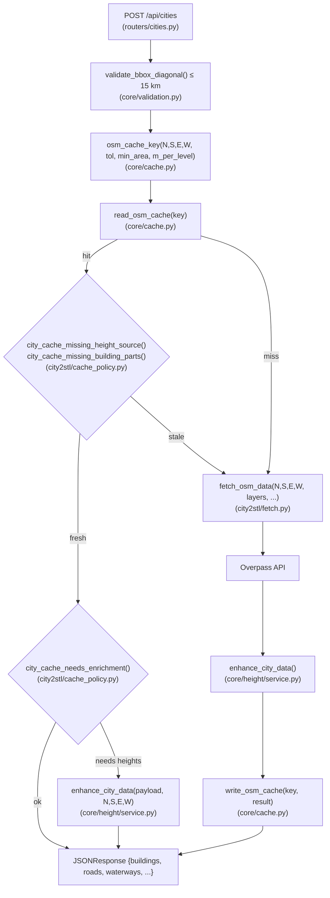
```mermaid
flowchart TD
    ROUTE["POST /api/cities<br/>(routers/cities.py)"]
    ROUTE --> VALIDATE["validate_bbox_diagonal() ≤ 15 km<br/>(core/validation.py)"]
    VALIDATE --> CKEY["osm_cache_key(N,S,E,W, tol, min_area, m_per_level)<br/>(core/cache.py)"]
    CKEY --> CACHE_R["read_osm_cache(key)<br/>(core/cache.py)"]
    CACHE_R -->|hit| STALE{"city_cache_missing_height_source()<br/>city_cache_missing_building_parts()<br/>(city2stl/cache_policy.py)"}
    STALE -->|stale| FETCH
    STALE -->|fresh| ENRICH{"city_cache_needs_enrichment()<br/>(city2stl/cache_policy.py)"}
    ENRICH -->|needs heights| ENHANCE["enhance_city_data(payload, N,S,E,W)<br/>(core/height/service.py)"]
    ENRICH -->|ok| RESP
    ENHANCE --> RESP
    CACHE_R -->|miss| FETCH["fetch_osm_data(N,S,E,W, layers, ...)<br/>(city2stl/fetch.py)"]
    FETCH --> OVERPASS["Overpass API"]
    OVERPASS --> ENHANCE2["enhance_city_data()<br/>(core/height/service.py)"]
    ENHANCE2 --> CACHE_W["write_osm_cache(key, result)<br/>(core/cache.py)"]
    CACHE_W --> RESP["JSONResponse {buildings, roads, waterways, ...}"]
```

### City Raster — `/api/cities/raster` or `/api/composite/city-raster`

```mermaid
flowchart TD
    ROUTE["POST /api/cities/raster or /api/composite/city-raster<br/>(routers/cities.py or composite.py)"]
    ROUTE --> CACHE_R["read_array_cache('city_raster', key)<br/>(core/cache.py)"]
    CACHE_R -->|miss| OSM["GET /api/cities (or use in-request GeoJSON)"]
    OSM --> RASTER["rasterize_composite_layers(buildings, roads, waterways, dim)<br/>(city2stl/rasterize.py)"]
    RASTER --> PROJ["project_city_raster(arr, N,S,E,W, projection)<br/>(geo2stl/projections.py)"]
    PROJ --> CACHE_W["write_array_cache()<br/>(core/cache.py)"]
    CACHE_W --> RESP["JSONResponse {city_raster, dim}"]
```

### Building Height Fetch — `/api/height/fetch`

```mermaid
flowchart TD
    ROUTE["POST /api/height/fetch<br/>(routers/height.py)"]
    ROUTE --> CKEY["make_cache_key('height', bbox, provider_params)<br/>(core/cache.py)"]
    CKEY --> CACHE_R["read_array_cache('height', key)<br/>(core/cache.py)"]
    CACHE_R -->|miss| PROV["RegisteredProvider.instance.fetch(N,S,E,W, dim)<br/>(core/height/service.py)"]
    PROV --> WSF["WSF3DProvider"]
    PROV --> G3D["Google3DTilesProvider"]
    PROV --> COP["CopernicusProvider"]
    PROV --> NDSM["NDSMProvider"]
    PROV --> LIDAR["LiDAR3DEPProvider"]
    WSF --> MERGE["merge_height_rasters(results)<br/>(city2stl/height/__init__.py)"]
    G3D --> MERGE
    COP --> MERGE
    NDSM --> MERGE
    LIDAR --> MERGE
    MERGE --> PROJ["project_grid(arr, N,S,E,W, projection)<br/>(geo2stl/projections.py)"]
    PROJ --> CACHE_W["write_array_cache()<br/>(core/cache.py)"]
    CACHE_W --> RESP["JSONResponse {height_raster, confidence, resolution_m}"]
```

### STL Export — `/api/export/stl`

```mermaid
flowchart TD
    ROUTE["POST /api/export/stl<br/>(routers/export.py)"]
    ROUTE --> VALID["validate_dim() + validate_bbox()<br/>(core/validation.py)"]
    VALID --> GEN["generate_stl(dem_values, depth_scale, base, ...)<br/>(core/export.py)"]
    GEN --> NUMPY["array_to_mesh(scaled, floor_val=0.0, solid=True)<br/>(numpy2stl)"]
    NUMPY -->|unavailable| FALLBACK["_manual_ear_clip_fallback()"]
    NUMPY --> RESP["FileResponse (binary STL)"]
    FALLBACK --> RESP
```

### Library Layer Summary

```mermaid
flowchart LR
    subgraph geo2stl ["geo2stl/ — terrain domain"]
        DEM["dem.py<br/>fetch_dem_from_source<br/>fetch_local_dem<br/>make_dem_payload<br/>create_dem_model"]
        PROJ["projections.py<br/>project_grid<br/>project_water_arrays<br/>project_city_raster<br/>project_rgb_image"]
        RASTER["raster.py<br/>derive_sat_scale<br/>clamp_esa_scale<br/>bbox_longer_side_m"]
        TILES["tiles.py<br/>stitch_tiles_no_rasterio<br/>get_tile_files"]
        SAT["sat2stl.py<br/>fetch_sat_overlay<br/>fetch_water_mask<br/>fetch_satellite_tiles"]
        HYDRO["hydrology.py<br/>fetch_and_rasterize_hydrology<br/>merge_rivers_with_dem"]
    end
    subgraph city2stl ["city2stl/ — city domain"]
        POLICY["cache_policy.py<br/>city_cache_missing_height_source<br/>city_cache_needs_enrichment"]
        RAST2["rasterize.py<br/>rasterize_composite_layers"]
        HT["height/<br/>HeightResult, merge_height_rasters<br/>providers: WSF3D, Copernicus, etc."]
    end
    subgraph core ["core/ — server coordination"]
        CACHE["cache.py<br/>make_cache_key<br/>read/write_array_cache<br/>read/write_osm_cache"]
        EXPORT["export.py<br/>generate_stl/obj/3mf"]
        HEIGHT_SVC["height/service.py<br/>RegisteredProvider<br/>enhance_city_data"]
        VALID2["validation.py<br/>parse_bbox_query<br/>run_sync<br/>model_to_dict"]
    end
```

