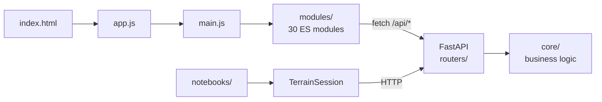
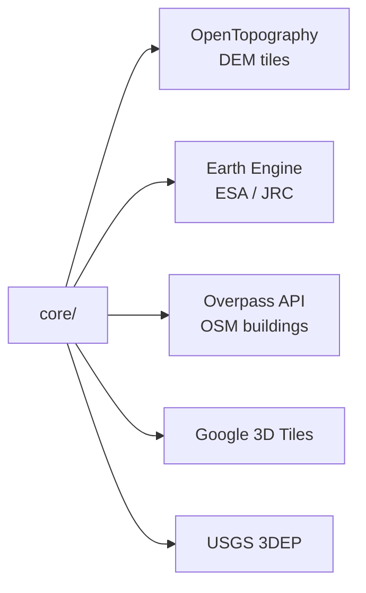
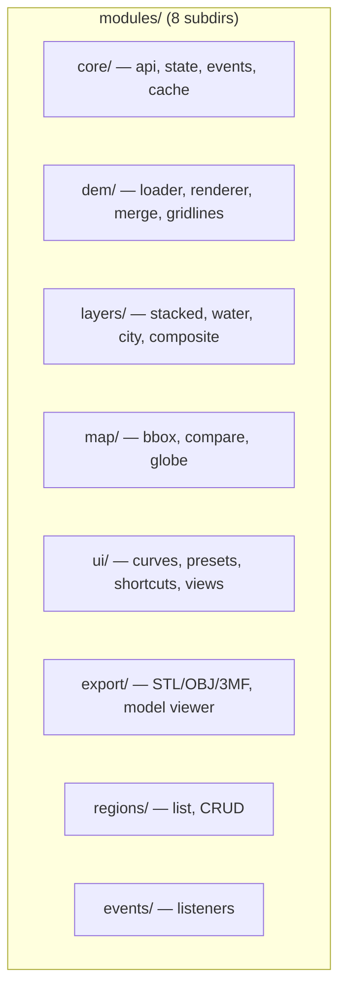
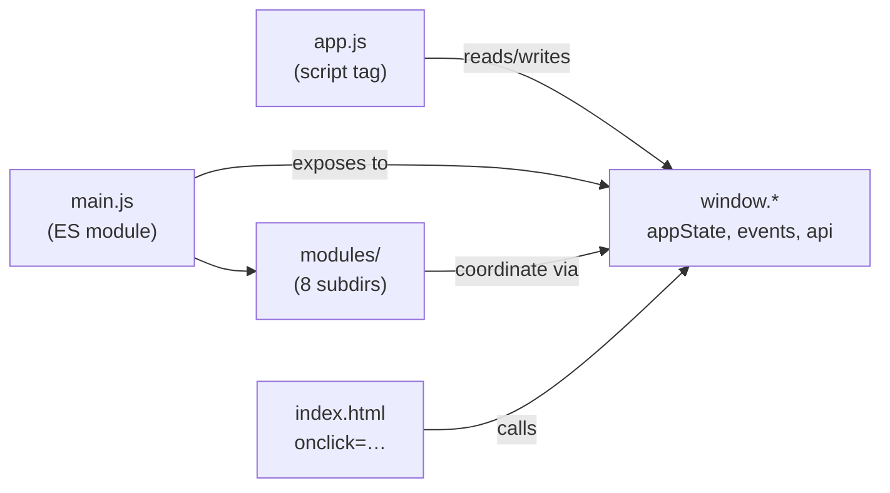
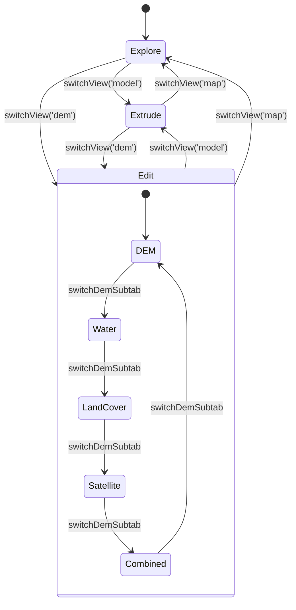
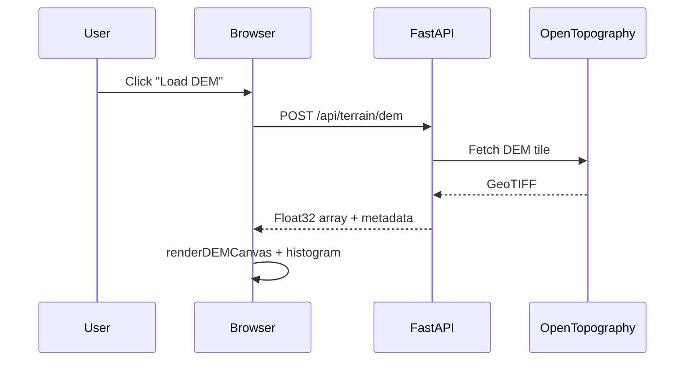
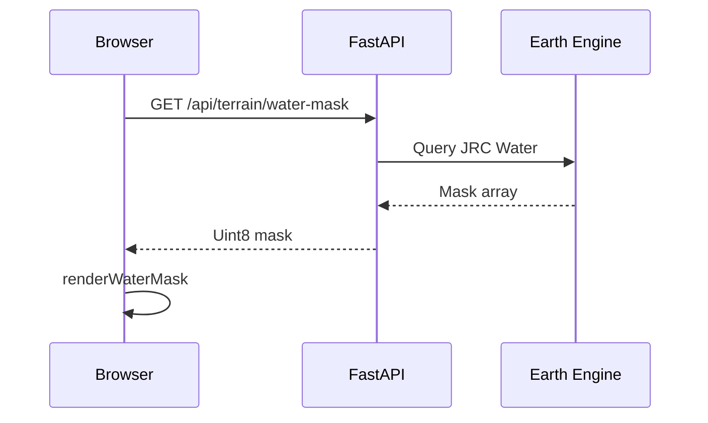
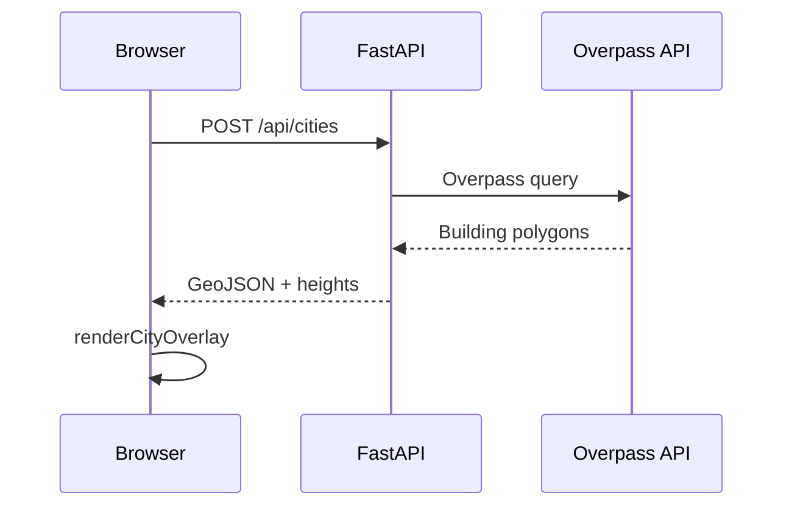
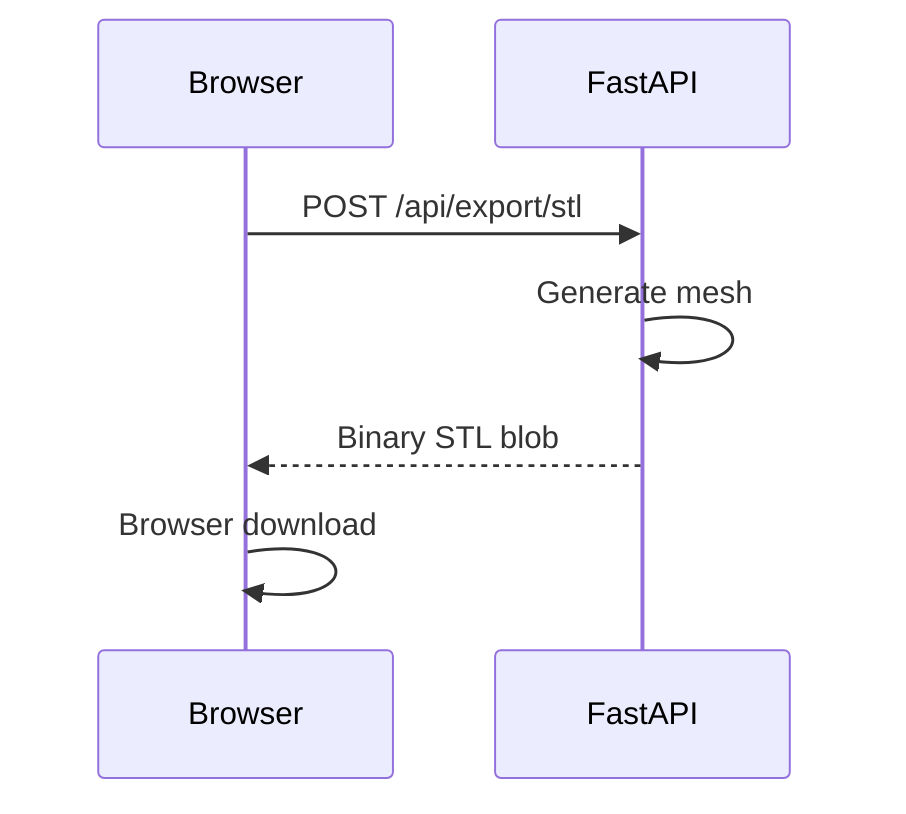

# Architecture — strm2stl

_Last updated: 2026-04-19_

## System Overview

### Frontend → Backend → SDK



### Backend → External Data



### Frontend Module Groups



## Frontend

### Module Boundary



**`app.js`** is a plain `<script>` tag (~333 lines of state container + DOMContentLoaded init). It is **not** an ES module. Public functions must stay on `window.*`. HTML `onclick` handlers reference these global names directly.

**`main.js`** (`type="module"`) is the ES module entry point. It imports 30 modules from `modules/` in dependency order. Modules expose functions on `window.*` so `app.js` can call them.

Key cross-module contracts:
- `window.appState` — Proxy-based reactive state (state.js). All modules read/write via this.
- `window.events` / `window.EV` — Event bus + constants (events.js).
- `window.api.*` — All fetch helpers (api.js).
- Modules must **not** import each other — all coordination is via `window.*`.

### View System



Three top-level tabs:
- **Explore** (`data-view="map"`) — Leaflet map + globe
- **Edit** (`data-view="dem"`) — DEM canvas, water mask, land cover, stacked layers, compare
- **Extrude** (`data-view="model"`) — 3D model viewer, STL/OBJ/3MF export

Within "Edit", DEM sub-tabs (managed by `switchDemSubtab()`):
- `dem`, `water`, `landcover`, `combined`, `satellite`

### Sidebar State Machine

`cycleSidebarState()` → `'normal'` → `'list'` → `'table'` → `'normal'`

### Stacked Layers View

All 6 layer canvases (`layerDemCanvas`, `layerWaterCanvas`, etc.) are hidden offscreen buffers. `stackViewCanvas` is the only visible canvas. `updateStackedLayers()` copies the active mode buffer to `stackViewCanvas`. `setStackMode(mode)` switches active mode.

---

## Backend

The backend (`app/server/`) is a thin layer over two support libraries: `geo2stl` (map projections, tile stitching) and `numpy2stl` (mesh generation). See [libraries.md](libraries.md) for the full import map and integration assessment.

### Structure

See [CLAUDE.md § Project Structure](../CLAUDE.md#project-structure--key-paths) for the complete project layout.
<!-- Note: CLAUDE.md lives outside docs/; this link works on GitHub but not MkDocs -->
Backend detail:

```
app/
├── server/                    — HTTP server (Python/FastAPI)
│   ├── server.py    — FastAPI app init, lifespan, router includes
│   ├── schemas.py   — all ~30 Pydantic models
│   ├── config.py    — paths, OPENTOPO_DATASETS, TEST_MODE, API keys
│   ├── core/
│   │   ├── dem.py        — fetch_layer_data, apply_layer_processing, blend_layers
│   │   ├── export.py     — generate_stl/obj/3mf/crosssection
│   │   ├── cache.py      — write/read_array_cache (.npz), write/read_osm_cache (.json.gz), prune
│   │   ├── db.py         — get_db, init_db, WAL mode (SQLite)
│   │   ├── osm.py        — fetch_osm_data, _fill_building_heights, _get_road_width_m
│   │   ├── cities_3d.py  — generate_city_3mf, 3D building mesh
│   │   ├── hydrorivers.py — HydroRIVERS shapefile loading + simplification
│   │   ├── hydrology.py  — river depression grid rasterization
│   │   ├── sat.py        — satellite imagery fetch (ESRI + Earth Engine)
│   │   ├── projection.py — CRS transforms, coordinate utils
│   │   ├── validation.py — input validation helpers
│   │   ├── responses.py  — standardized API response builders
│   │   └── height/       — building height estimation package
│   │       ├── __init__.py     — HeightResult, HeightProvider, merge_height_rasters()
│   │       └── providers/      — wsf3d, google_3d, copernicus, ndsm, lidar_3dep
│   └── routers/
│       ├── terrain.py    — /api/terrain/* + /api/dem/merge
│       ├── regions.py    — /api/regions/* (SQLite-first, JSON fallback)
│       ├── export.py     — /api/export/*
│       ├── cities.py     — /api/cities/*
│       ├── composite.py  — /api/composite/*
│       ├── cache.py      — /api/cache/*
│       ├── settings.py   — /api/settings/*
│       └── height.py     — /api/height/* (prefix: /api/height)
├── client/                    — browser client (HTML/CSS/JS)
│   ├── static/js/   — main.js, modules/ (30 ES modules in 8 subdirs)
│   ├── static/css/  — app.css
│   └── templates/   — index.html
└── session/                   — Python SDK client (talks to server over HTTP)
    ├── terrain_session.py
    └── viz.py
```

### Key Backend Rules
- Business logic in `core/`, request handling in `routers/`
- Never use `os.chdir()` in handlers — process-global, causes data races
- See [CLAUDE.md § Editing Rules](../CLAUDE.md#editing-rules) for async/executor constraints and full editing guidelines
<!-- Note: CLAUDE.md lives outside docs/; this link works on GitHub but not MkDocs -->

### Cache
- DEM: `.npz` (float32) + `.json` sidecar under `cache/dem/`
- OSM: `.json.gz` under `cache/osm/`
- Key: `MD5(namespace + ":" + "N{n:.4f}_S..." + ":" + sorted_json(extra))`
- OSM key shorthand: `osm_cache_key(N, S, E, W, tol=0.5, min_area=5.0)` in `core/cache.py`
- Pruned at startup via `prune_all_caches()`

### SQLite
- `data.db` — `regions` + `region_settings` tables, WAL mode
- `region_settings` has `ON DELETE CASCADE` from `regions`
- JSON fallback active when `core.db` unavailable (used in tests)

## Python SDK

`app/session/terrain_session.py` is the Python client that drives the same server used by the browser app.

Use it when the workflow is notebook-driven or when a script needs to reproduce the terrain pipeline without using the UI.

The shortest example path is:

`notebooks/API_Terrain.ipynb` → `app/session/terrain_session.py` → router in `app/server/routers/` → processing in `app/server/core/`

Use these companion docs:

- `sdk-workflow.md` for notebook-to-method-to-route tracing
- `api.md` for the route index
- `task-routing.md` for deciding which layer to edit

---

## HTML Structure

`templates/index.html` — single-page app, all content always in DOM.

```
body
├── #toastContainer
├── #regionNotesModal
└── .page-wrapper
    ├── .sidebar
    │   ├── #sidebarListView → #coordSearch, #coordinatesList
    │   └── #sidebarTableView → #sidebarRegionsTable
    └── .main-content
        ├── .main-header → .tabs (Explore/Edit/Extrude)
        └── .content-area
            ├── #mapContainer → #map, .map-floating-controls, #regionsPanel
            ├── #globeContainer → #globe
            └── [DEM/Model panels]
```

Key IDs: `#floatingDrawBtn`, `#citiesTab`, `#loadCitiesBtn`, `#modelViewer`, `#stackViewCanvas`, `#demImage`, `#layersStack`

---

## Data Flows

### DEM Load



### Water Mask



### City Overlay



### STL Export



### DEM Load
```
loadDEM() → POST /api/terrain/dem
  → store lastDemData, originalDemValues
  → renderDEMCanvas() → drawColorbar() → drawHistogram() → updateAxesOverlay()
  → setLayerStatus('dem', 'ready')
  → applyCurveTodemSilent() if curve active
```

### Water Mask
```
loadWaterMask() → waterMaskCache.has? return cached : GET /api/terrain/water-mask
  → waterMaskCache.set() → renderWaterMask() → setLayerStatus('water', 'ready')
```

### STL Export
```
downloadSTL() → POST /api/export/stl {dem_values, depth_scale, base, ...}
  → blob → browser download
```

### City Overlay
```
loadCityData() → POST /api/cities → _computeTerrainZ() → store osmCityData
  → renderCityOverlay() [RAF-debounced]
    → _drawCityCanvas(): buildings batched by alpha (8 groups), sub-pixel skipped
    → renderCityOnDEM?() — also paints .city-dem-overlay on DEM canvas

Zoom/pan → applyStackedTransform()
  → CSS transform on all canvases + .osm-overlay
  → scale change >15%: immediate re-render; else: 300ms debounced
```
