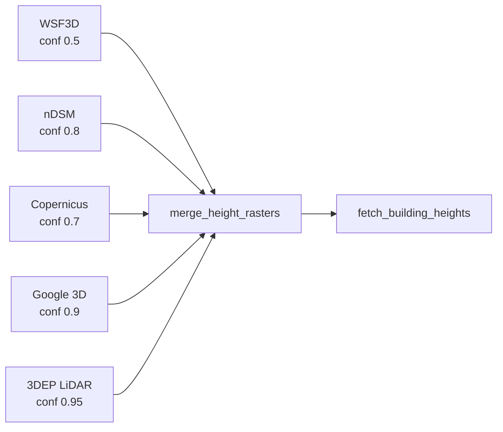
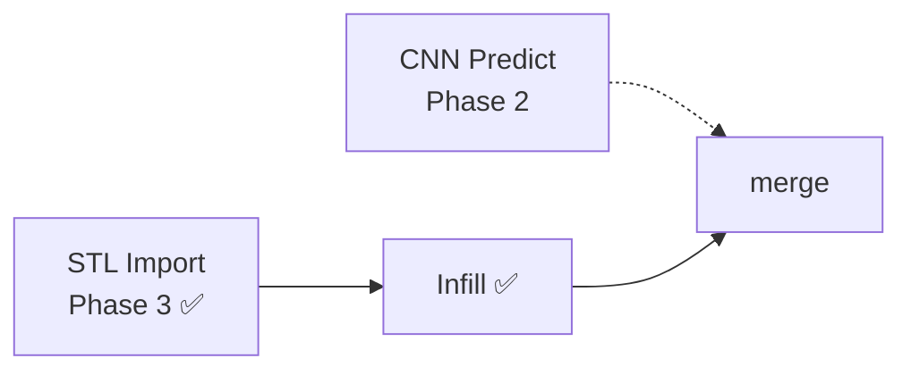
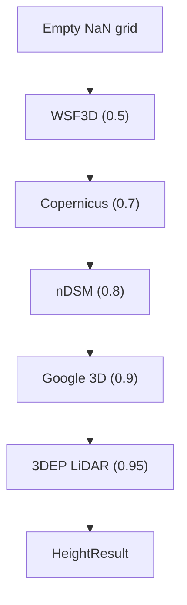
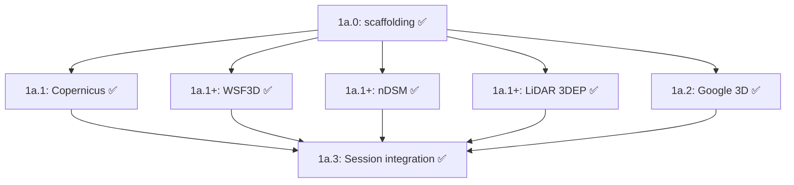
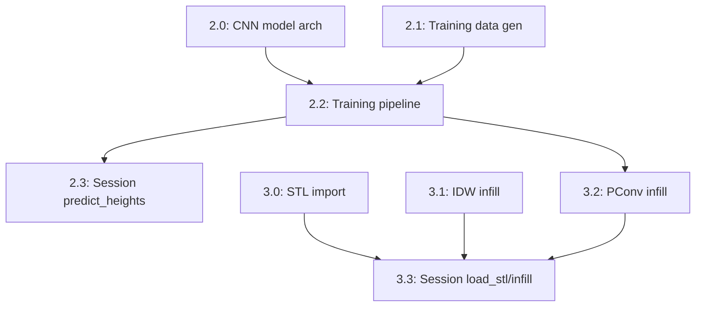

# Plan: Building Height Estimation — Detailed Implementation

> **For current ML/training state, see [`../plans/height-training-status.md`](../plans/height-training-status.md).**
> This file is the original Phase 1–3 design plan. The CNN section (Phase 2) has been superseded by the Retna_V1 line of work documented in the status file above.
>
> **Status (2026-04-30):**
> - Phase 1a: complete (production providers wired)
> - Phase 1b: complete (GHSL, Open Buildings, Shadow integrated; last two are placeholder fetch quality)
> - Phase 2 (CNN): replaced by Retna_V1 — see status doc. RoofNetV3 deprecated due to marginal-mean collapse.
> - Phase 3 (STL import + IDW infill): complete
>
> **Scope:** Backend only, session API. No frontend changes.
> **Target resolution:** ~5m/pixel.
> **Last updated:** 2026-04-30

## TL;DR

The current backend already supports a multi-provider height pipeline with merge logic, a dedicated height router, and `TerrainSession.fetch_building_heights()`. What remains is to harden the exploratory Phase 1b providers, then build the entirely separate CNN and STL/infill phases.

## Current Reality Check

### Implemented now

- `app/server/core/height/` package with `HeightResult`, `HeightProvider`, and `merge_height_rasters()`
- Production-grade providers used in the current pipeline: `wsf3d`, `ndsm`, `copernicus`, `lidar_3dep`, `google3d`
- Phase 1b exploratory providers: `ghsl`, `open_buildings`, `shadow_height` — all wired into `TerrainSession.fetch_building_heights()`; `open_buildings` and `shadow_height` have placeholder fetch paths
- `app/server/routers/height.py` with `/api/height/sources` and `/api/height/fetch`
- `TerrainSession.fetch_building_heights()` local orchestration method — all 8 providers registered
- **Phase 3 complete:** `stl_import.py` (trimesh ray-cast → heightmap) and `infill.py` (IDW + nearest-neighbour)
- **Phase 3 TerrainSession methods:** `load_stl()`, `preview_stl()`, `infill_heights()`
- Height-focused pytest suite: **179 passing tests** (147 pre-Phase 3 + 32 new)

### Not implemented yet

- `TerrainSession.predict_heights()`
- `app/server/core/height/predict.py`, `train.py`
- Height router endpoints for CNN prediction, STL import REST API, or infill REST API
- `open_buildings.py` actual fetch path (currently returns None)
- `shadow_height.py` actual shadow-detection pipeline (currently returns empty result)

---

## Challenged Assumptions

### A1: "Depth Anything V2 works for satellite imagery"

**WRONG.** Depth Anything V2 is trained on ground-level perspective photos. Satellite images are near-orthographic (nadir view). "Depth" from a satellite means "height above ground" — fundamentally different from perspective depth. DA2 will produce meaningless output.

**Correction:** Use models specifically designed for aerial/satellite height estimation: e.g., "Height estimation from single aerial images using a deep ordinal regression network" or train a custom U-Net. The pretrained quick-start should use a **DSM super-resolution** approach instead — take coarse SRTM (30m) + satellite RGB → predict fine-grained (5m) height map. This is a well-studied problem with available pretrained models.

### A2: "Microsoft Planetary Computer has per-building heights globally"

**PARTIALLY WRONG.** Microsoft's GlobalMLBuildingFootprints has footprint polygons globally but heights only in certain regions (US, parts of Europe). The "Microsoft Building Heights" dataset (separate from footprints) is US-only. For Spain/Colombia, footprints exist but heights are spotty.

**Correction:** Use MS footprints primarily for footprint geometry (to identify buildings OSM misses), not heights. For heights, Google 3D Tiles + Copernicus are more reliable in Europe.

### A3: "7+ data sources is the right approach"

**WRONG for initial scope.** Each source has different coordinate systems, formats, authentication, rate limits, and failure modes. Starting with 7 creates an untestable surface.

**Correction:** Start with 3 sources that give best coverage for target cities:
1. OSM (already have) — keep as primary
2. Google 3D Tiles (photogrammetric, best quality for Barcelona/Granada)
3. Copernicus Building Height (10m raster, free, covers all Europe)

That sequencing was correct for initial scope. Since then, the repo has grown beyond the original narrow target: LiDAR 3DEP is implemented, and GHSL / Open Buildings / ShadowHeight were added as exploratory Phase 1b providers. The important distinction now is not "implemented vs not implemented" but "production-ready vs placeholder".

### A4: "PConv is the right inpainting approach for heightmaps"

**QUESTIONABLE.** PConv was designed for RGB images (3-channel, smooth textures). Heightmaps are single-channel with sharp discontinuities at building edges. Building heights have spatial structure (nearby buildings have similar heights, terrain is smooth between them).

**Correction:** Start with **deterministic infill** (IDW interpolation + terrain DEM baseline) as the "dumb" baseline. Then try PConv only if baseline is insufficient. The satellite-conditioned GAN is actually the most promising ML approach because it can learn "these pixels look like tall buildings."

### A5: "Google 3D Tiles are easy to sample"

**HARDER THAN EXPECTED.** Google 3D Tiles use Cesium 3D Tiles format with Draco-compressed glTF. Meshes are in ECEF coordinates (Earth-Centered-Earth-Fixed), not lat/lon. Need:
- `py3dtiles` or custom glTF parser
- ECEF → WGS84 coordinate transforms
- Spatial indexing to find which tiles cover the bbox
- Ray-casting from above to get roof heights
- Ground height subtraction (from DEM) to get building height

**Correction:** This is a standalone module with significant complexity. Budget it as its own development phase with its own integration test.

### A6: "STL files have no coordinate system"

**TRUE AND PROBLEMATIC.** STL files are unit-less meshes. The user's STLs could be in mm, cm, or m. They have no georeference. The user must provide:
- Real-world bbox (lat/lon corners)
- Which axis is "up" (usually Z, but not guaranteed)
- Scale factor or real-world dimensions

**Correction:** Make geo-registration explicit in the session API. Provide a `preview_stl()` method that shows the mesh dimensions before committing.

---

## Architecture

### Pipeline Overview

**Phase 1a: Provider → Merge (implemented)**



**Future phases (not started)**



### Provider Priority Merge

Providers fill pixels in ascending confidence order. Higher-confidence data overwrites lower.



### Core Design: HeightProvider Protocol

Instead of a monolithic cascade, use a **provider pattern** matching the existing dispatcher in `dem.py`:

```
HeightProvider (protocol/interface):
  - name: str
  - covers(bbox) → bool            # can this provider serve this region?
  - fetch_heights(bbox, dim) → HeightResult
    where HeightResult = {
      raster: np.ndarray (H,W) float32 in metres, NaN = unknown,
      confidence: np.ndarray (H,W) float32 [0,1],
      source_name: str,
      resolution_m: float
    }
```

Each source becomes a HeightProvider. The cascade module tries providers in priority order and merges results — filling NaN pixels from lower-priority providers.

**Why this is better than modifying `_fill_heights()`:** The current `_fill_heights()` works per-footprint (vector-based). But most new sources provide **raster** data (height per pixel, not per building). Mixing vector and raster in one function is messy. Better to:
1. Keep `_fill_heights()` for OSM-only vector heights (levels, explicit height tag)
2. Add a new `merge_height_rasters()` function that composites raster sources
3. Merge the two: OSM vector heights override raster where available

### Module Layout

```
app/server/core/
├── height/                    # Height estimation package
│   ├── __init__.py            # HeightResult, HeightProvider protocol, merge_height_rasters()
│   ├── providers/
│   │   ├── __init__.py
│   │   ├── copernicus.py      # ✅ Copernicus / GHSL-backed EU/global raster provider
│   │   ├── ghsl.py            # ✅ Exploratory global raster provider (implemented)
│   │   ├── google_3d.py       # ✅ Google 3D Tiles ~1m, API key, confidence 0.9
│   │   ├── lidar_3dep.py      # ✅ USGS 3DEP LiDAR ~1m US-only, confidence 0.95
│   │   ├── ndsm.py            # ✅ GLO-30 minus FABDEM ~30m global, confidence 0.8
│   │   ├── open_buildings.py  # ⚠️ Coverage scaffold / placeholder fetch path
│   │   ├── shadow_height.py   # ⚠️ Heuristic placeholder provider
│   │   └── wsf3d.py           # ✅ DLR WSF3D ~90m global, confidence 0.5
│   ├── predict.py             # Phase 2 — CNN inference (not started)
│   ├── train.py               # Phase 2 — CNN training pipeline (not started)
│   ├── stl_import.py          # ✅ Phase 3 — STL → heightmap via trimesh ray-cast
│   └── infill.py              # ✅ Phase 3 — IDW + nearest-neighbour heightmap infill
├── osm.py                     # existing, minimal changes
└── ...
```

**Why a `height/` package instead of flat modules:** These modules share types (HeightResult, HeightProvider), configuration (API keys, cache paths), and test fixtures. Grouping them prevents import cycles and makes the test surface clear.

### Cache Strategy for New Sources

Follow existing pattern in `cache.py`:

| Namespace | TTL | Format | Status | Notes |
|-----------|-----|--------|--------|-------|
| `copernicus` | 90 days | .npz + .json | ✅ Implemented | Raster tiles, large, rarely change |
| `google3d` | 30 days | .npz + .json | ✅ Implemented | Expensive API calls, cache aggressively |
| `wsf3d` | 90 days | .npz + .json | ✅ Implemented | DLR 1°×1° tiles |
| `ndsm` | 90 days | .npz + .json | ✅ Implemented | GLO-30 minus FABDEM |
| `lidar_3dep` | 90 days | .npz + .json | ✅ Implemented | USGS 3DEP tiles |
| `height_merged` | 7 days | .npz + .json | Not yet | Composite of all providers for a bbox |

Key generation follows existing `make_cache_key(namespace, N, S, E, W, extra)`.

### Session API Extensions

```python
# New methods on TerrainSession:

# Phase 1: Data sources
s.fetch_building_heights(providers=["wsf3d", "copernicus", "google3d"])
    → self.building_heights: HeightResult (merged raster)
    → currently runs locally in the session process, not through `/api/height/fetch`

# Phase 2: CNN
s.predict_heights(model="dsm_super_res")
  → self.predicted_heights: HeightResult (CNN output)
  → slots into merge as lowest-priority raster

s.train_height_model(ground_truth_cities=["Barcelona"], epochs=50)
  → trains model, saves to models/ directory
  → returns training metrics dict

# Phase 3: STL import + infill
s.load_stl(path, bbox, up_axis="z", resolution_m=5.0)
  → self.stl_heightmap: np.ndarray (H,W) float32, NaN outside mesh
  → self.stl_mask: np.ndarray (H,W) bool (True where STL has surface)

s.preview_stl()
  → matplotlib figure showing imported heightmap extent + values

s.infill_heights(method="idw"|"nearest", use_dem_baseline=True)
  → self.infilled_heights: np.ndarray (H,W) complete
```

**Chaining with existing pipeline:**
```python
with TerrainSession().start() as s:
    s.select_bbox(north, south, east, west)
    s.fetch_dem()                          # terrain baseline
    s.fetch_cities()                       # OSM footprints
    s.fetch_building_heights()             # multi-source heights
    s.predict_heights()                    # CNN fills remaining gaps
    s.composite_city_raster()              # merge all into final raster
    s.export_stl()
```

---

## Phase 1a.0: Height Package Scaffolding — COMPLETE

> ✅ **Implemented.** 20 merge tests pass.

**Files:**
- `app/server/core/height/__init__.py` — HeightResult, HeightProvider, merge_height_rasters()
- `app/server/core/height/providers/__init__.py` — empty
- `tests/test_height/__init__.py`
- `tests/test_height/test_merge.py`

### Segment Tests

- `test_merge_priority_osm_wins()` — OSM says 25m, Copernicus says 20m → result = 25m
- `test_merge_fills_gaps()` — OSM has NaN, Copernicus has 20m → result = 20m
- `test_merge_all_nan()` — no provider has data → result stays NaN (not default 10m)
- `test_confidence_reflects_source()` — verify confidence values match source priority
- `test_merge_different_resolutions()` — Copernicus 10m, target 5m → verify bilinear resampling applied before merge

---

## Phase 1a.1: Copernicus Building Height Provider — COMPLETE

> ✅ **Implemented.** `copernicus.py` — JRC GHSL WCS endpoint, Europe-only coverage, ~10m resolution, confidence 0.7. 15 tests pass (9 unit + 6 integration mock).

**Implementation steps:**
1. Query WCS GetCapabilities to find available layers for bbox
2. GetCoverage request with bbox + CRS → GeoTIFF response
3. Parse with rasterio (or PIL + manual georef if avoiding rasterio dep)
4. Resample to target resolution (dim parameter)
5. Return HeightResult with NaN where no data

**New dependency:** `rasterio` (~15MB)

### Segment Tests

**Unit tests** (no network, synthetic data):
- `test_geotiff_to_heightresult()` — load a tiny test GeoTIFF (10x10 pixels, hardcoded), verify output shape, dtype, NaN handling
- `test_resample_preserves_range()` — resample 10x10 → 50x50, verify min/max unchanged
- `test_cache_key_deterministic()` — same bbox → same cache key
- `test_covers_barcelona()` — verify `covers(barcelona_bbox)` returns True
- `test_covers_cartagena_returns_false()` — Copernicus EU doesn't cover Colombia

**Integration test** (mock HTTP, uses cached response):
- Save a real 100x100 Copernicus GeoTIFF response for Barcelona as test fixture
- `test_fetch_from_fixture()` — monkeypatch requests.get to return fixture → verify HeightResult
- `test_cache_hit()` — call twice → second call reads from cache, no HTTP
- `test_merge_with_osm()` — merge Copernicus raster with OSM vector heights → verify OSM values take priority where both exist

---

## Phase 1a.2: Google 3D Tiles Provider — COMPLETE

> ✅ **Implemented.** `google_3d.py` — ECEF transforms, tileset traversal, ray-casting DSM. API key from env or config.json. MAX_TILES=200 guard. 20 tests pass.

**Data source:** Google Map Tiles API — 3D Tiles (Photorealistic)
- Format: Cesium 3D Tiles (tileset.json → .glb tiles with Draco compression)
- Auth: Google Maps API key (available)
- Coverage: Most major cities globally, excellent for Barcelona/Granada
- Endpoint: `https://tile.googleapis.com/v1/3dtiles/root.json?key=API_KEY`

**Implementation steps:**
1. Fetch root tileset.json
2. Traverse tile tree to find tiles intersecting bbox (bounding volume check)
3. Download .glb tiles (Draco-compressed glTF binary)
4. Parse glTF with `trimesh.load()` (trimesh already a dependency, supports glTF)
5. Transform mesh vertices from ECEF to WGS84 (lon, lat, altitude)
6. Ray-cast Z-down from a grid of points at target resolution → max Z per pixel = DSM
7. Subtract DEM (terrain) to get building height = DSM - DTM
8. Return HeightResult

**Dependency notes:**
- Draco decompression requires `google-draco` or `trimesh[easy]` extras
- ECEF → geodetic: numpy vectorized, no extra dependency

**Cost management:** Cache aggressively. A typical city bbox (~2km x 2km) needs ~20-50 tiles. Free tier ~1000 req/month. Add `max_tiles` guard with clear error message.

### Segment Tests

**Unit tests** (no network):
- `test_ecef_to_wgs84()` — known ECEF coords for Barcelona landmarks → verify lat/lon/alt within 1m
- `test_tile_bbox_intersection()` — synthetic bounding volumes → verify correct tiles selected
- `test_raycast_flat_plane()` — flat triangle mesh at z=100 → raycast → verify all pixels = 100
- `test_raycast_box()` — 10x10x20m box mesh → raycast → verify 20m height in box area, NaN elsewhere
- `test_building_height_from_dsm_dtm()` — DSM=150m, DTM=130m → building_height=20m

**Integration test** (mock HTTP):
- Save a real .glb tile from Google for a small Barcelona area as test fixture
- `test_parse_glb_fixture()` — load fixture → verify mesh has vertices, faces
- `test_full_pipeline_fixture()` — mock tile fetch → parse → raycast → verify HeightResult with reasonable values (10-50m buildings)
- `test_max_tiles_guard()` — bbox covering all of Spain → verify raises error before downloading 10000 tiles

---

## Phase 1a.3: Height Merge + Session Integration — COMPLETE

> ✅ **Implemented.** `fetch_building_heights()` added to `TerrainSession`. The session currently supports 5 providers (`wsf3d`, `ndsm`, `copernicus`, `lidar_3dep`, `google3d`) and the focused height test suite is currently 147 passing tests overall.

**Core function:**
```
merge_height_sources(
    bbox, dim,
    providers: list[str] = ["osm", "copernicus", "google3d"],
    osm_heights: Optional[np.ndarray] = None,
) → HeightResult

Algorithm:
1. Start with result = np.full((dim, dim), NaN)
2. For each provider in REVERSE priority order:
   a. If provider.covers(bbox):
      result_i = provider.fetch_heights(bbox, dim)
      mask = ~np.isnan(result_i.raster)
      result[mask] = result_i.raster[mask]   # lower priority fills first
3. If osm_heights provided:
   mask = osm_heights > 0
   result[mask] = osm_heights[mask]         # OSM always wins (highest priority)
4. Return HeightResult(raster=result, confidence=..., source_name="merged")
```

**Confidence array:** Tracks where each pixel came from:
- 1.0 = OSM explicit height tag
- 0.9 = Google 3D (photogrammetric)
- 0.7 = Copernicus (10m raster, coarser)
- 0.3 = CNN prediction (Phase 2)
- 0.0 = default fallback

**Session API:** Add `fetch_building_heights()` method to `TerrainSession`.

### Notes on Current Gaps

- The dedicated height router exists, but its provider registry does not yet mirror `TerrainSession` exactly.
- `TerrainSession` currently exposes only the 5-provider core path; it does not yet include `ghsl`, `open_buildings`, or `shadow_height`.
- `open_buildings` and `shadow_height` are present primarily as scaffolding for future work, not as production-quality height sources.

---

## Phase 1b: Provider Expansion / Hardening — COMPLETE

> ✅ **Complete (integration-wired).** All 8 providers are registered in `TerrainSession.fetch_building_heights()`. GHSL is meaningfully implemented. Open Buildings and ShadowHeight are integrated but remain placeholder-quality data-fetch paths — they contribute no real data yet.


### What exists now

- `ghsl.py` — implemented global raster provider with cache support; wired into TerrainSession
- `open_buildings.py` — coverage logic and placeholder fetch path (returns empty/NaN); wired into TerrainSession
- `shadow_height.py` — **DEPRECATED**: shadow-based provider is no longer used by default due to high error rate and outlier risk. Only available for research or explicit opt-in.
- Height router registration for all three providers (shadow_height is now commented out by default)
- `TerrainSession._registry` includes 7 production providers; shadow_height is excluded by default

### What still needs to happen before calling Phase 1b “done”

- Replace `open_buildings.py` placeholder fetch with real Google Open Buildings v3 data acquisition
- Replace `shadow_height.py` placeholder with actual shadow-detection-based height inference
- Add end-to-end tests proving these providers improve merged coverage rather than only returning NaNs
- Revisit confidence ordering after real outputs exist

---

## Phase 2: CNN Height Prediction

### Architecture

**NOT monocular depth estimation.** Instead, two approaches:

#### Approach A: DSM Super-Resolution (pretrained, quick start)
- Input: coarse SRTM DEM (30m) + satellite RGB (0.5-5m)
- Output: fine-grained DSM (5m) that includes building heights
- Model: SRCNN or ESPCN adapted for DEM super-resolution
- This is a well-studied remote sensing task with available pretrained weights
- Calibration: compare predicted DSM vs known building heights in same tile

#### Approach B: Satellite → Building Height Map (custom training)
- Input: 256×256 RGB satellite tile at ~5m/px
- Output: 256×256 float32 height map (metres above ground, 0 for non-buildings)
- Architecture: U-Net with EfficientNet-B4 encoder
- Key insight: this is a **semantic regression** task, not depth estimation
- Loss: Masked L1 (only penalize where ground truth exists) + edge-aware gradient loss
- Training data: paired tiles from Phase 1 ground truth cities

### Module Structure

**`app/server/core/height/predict.py`:**
```python
class HeightPredictor:
    def __init__(self, model_path, device="cuda"):
        self.model = load_model(model_path)
        self.device = device

    def predict(self, satellite_rgb, coarse_dem) → np.ndarray:
        # Preprocess → inference → post-process
        # Return: (H, W) float32 metres

    def predict_for_bbox(self, bbox, dim) → HeightResult:
        # Fetch satellite + DEM using existing pipelines
        # Tile into 256x256 patches with overlap
        # Predict each patch, stitch with blending
        # Return HeightResult
```

**`app/server/core/height/train.py`:**
```python
class HeightDataset(torch.utils.data.Dataset):
    # Loads paired (satellite, height_map) .npz tiles

def train(config: TrainConfig) → TrainResult:
    # Standard training loop, saves checkpoints to models/
```

**New dependencies:** `torch` (~2GB CUDA), `torchvision` (~30MB), `timm` (~5MB)

### Segment Tests

**Unit tests (no GPU):**
- `test_normalize_satellite()` — RGB normalization produces [0,1] range
- `test_tiling_256()` — 512x512 image → 4 tiles of 256x256 with correct overlap
- `test_stitch_tiles()` — 4 predicted tiles → stitched 512x512 with smooth blending
- `test_dataset_loads_npz()` — create synthetic .npz pair → verify shapes, dtypes
- `test_mask_loss()` — verify loss is 0 where mask=False

**Integration tests (needs GPU):**
- `test_pretrained_inference()` — load pretrained model → predict on fixture tile → verify output shape/dtype/range
- `test_overfit_single_tile()` — train 100 epochs on 1 tile → verify loss < threshold
- `test_predict_for_bbox()` — mock satellite + DEM fetchers → full pipeline → verify HeightResult

**Validation tests (ground truth):**
- `test_barcelona_mae()` — predict Barcelona, compare against ground truth → MAE < 10m (pretrained) or < 5m (custom)
- `test_granada_generalization()` — train on Barcelona, test on Granada → MAE < 8m

---

## Phase 3: STL → Heightmap → Infill — COMPLETE

> ✅ **Complete.** `stl_import.py` and `infill.py` are fully implemented and tested. `TerrainSession` now exposes `load_stl()`, `preview_stl()`, and `infill_heights()`. 32 tests added.

### 3.0: STL Import — COMPLETE

**Module:** `app/server/core/height/stl_import.py`

```python
def stl_to_heightmap(
    stl_path: str | Path,
    bbox: dict,           # {north, south, east, west}
    resolution_m: float = 5.0,
    up_axis: str = "z",   # one of: x, y, z, -x, -y, -z
) -> tuple[np.ndarray, np.ndarray]:  # (heightmap float32, mask bool)
    # trimesh.load(force="mesh") → optional up-axis rotation
    # → build W×H ray grid from mesh XY bounds
    # → mesh.ray.intersects_location(multiple_hits=True)
    # → np.maximum.at per ray → heightmap + mask
```

**TerrainSession API:**
```python
s.load_stl(path, bbox=None, up_axis="z", resolution_m=5.0)
    # → self.stl_heightmap: (H,W) float32
    # → self.stl_mask: (H,W) bool
s.preview_stl()
    # → matplotlib figure
```

### 3.1: IDW Infill (deterministic) — COMPLETE

**Module:** `app/server/core/height/infill.py`

```python
def infill_idw(heightmap, mask=None, dem_baseline=None, power=2) -> np.ndarray:
    # Delaunay triangulation (scipy.interpolate.griddata "linear")
    # Fallback to "nearest" for < 4 known points or outside hull
    # Optional DEM blend: weight = clip(dist / max_dist, 0, 1)

def infill_nearest(heightmap) -> np.ndarray:
    # scipy.ndimage.distance_transform_edt nearest-index fill
    # O(N), sharp boundaries
```

**TerrainSession API:**
```python
s.infill_heights(method="idw"|"nearest", use_dem_baseline=True, power=2.0)
    # → self.infilled_heights: (H,W) float32, no NaN in active region
```

### 3.2: PConv Infill — NOT STARTED

```python
def infill_pconv(heightmap, mask, model_path) -> np.ndarray:
    # Partial convolution inpainting adapted for single-channel heightmaps
```

### 3.3: Satellite-Conditioned Infill — NOT STARTED

```python
def infill_satellite(heightmap, mask, satellite_rgb, model_path) -> np.ndarray:
    # Pix2Pix-style: input = [satellite_rgb, partial_height, mask] → complete height
```

### Tests — COMPLETE

**32 new tests in `tests/test_height/test_stl_import.py` and `test_infill.py`:**
- STL import: shape, dtype, NaN mask, max height, resolution scaling, axis rotation (all 6 variants), error handling
- Infill IDW: NaN coverage, known-pixel preservation, range bounds, degenerate (1 known point), DEM blending
- Infill nearest: NaN coverage, known-pixel preservation, edge cases
- Consistency: both methods agree on known pixels

---

## Implementation Order & Dependencies

### Phase 1a (complete)



### Phases 2–3 (not started)



---

## New Dependencies

| Package | Purpose | Phase | Size | Status |
|---------|---------|-------|------|--------|
| `rasterio` | GeoTIFF parsing for Copernicus, nDSM, LiDAR | 1a.1 | ~15MB | ✅ Installed |
| `pyproj` | CRS transforms | 1a.1 | ~10MB | ✅ Installed |
| `trimesh` | glTF mesh parsing for Google 3D | 1a.2 | ~5MB | ✅ Installed (4.6.8) |
| `torch` | CNN inference + training | 2.0 | ~2GB (CUDA) | Not yet |
| `torchvision` | EfficientNet encoder | 2.0 | ~30MB | Not yet |
| `timm` | Model zoo (EfficientNet variants) | 2.0 | ~5MB | Not yet |
| `laspy` | LiDAR point clouds (Phase 1b) | 1b | ~2MB | Not yet / only needed if raw point-cloud ingestion is added |

---

## Router Design

Current router: `app/server/routers/height.py`

| Endpoint | Method | Purpose |
|----------|--------|---------|
| `/api/height/sources` | POST | List available providers for a bbox |
| `/api/height/fetch` | POST | Fetch + merge heights from specified providers |
| `/api/height/predict` | POST | Run CNN prediction |
| `/api/height/import-stl` | POST | Upload STL + bbox → heightmap |
| `/api/height/infill` | POST | Infill heightmap NaN regions |

Only `/api/height/sources` and `/api/height/fetch` are implemented today. The predict / import-stl / infill endpoints remain planned only.

---

## Verification Milestones

| Milestone | Test | Pass Criteria |
|-----------|------|---------------|
| Height package scaffolds | `pytest tests/test_height/test_merge.py` | All merge tests pass |
| Copernicus works | `pytest tests/test_height/test_copernicus.py` | Barcelona fetch returns (H,W) array, >50% non-NaN |
| Google 3D works | `pytest tests/test_height/test_google3d.py` | Barcelona fetch returns heights in [0,300]m range |
| Merge improves coverage | Session notebook | % buildings with real height: OSM-only < merged |
| CNN inference runs | `pytest tests/test_height/test_predict.py` | Output shape matches input, values in [0,300] |
| CNN improves MAE | Validation notebook | MAE on held-out city < 10m (pretrained) or < 5m (custom) |
| STL import works | `pytest tests/test_height/test_stl_import.py` | Roundtrip RMSE < 1m |
| IDW infill works | `pytest tests/test_height/test_infill.py` | No NaN in output, known pixels unchanged |
| End-to-end session | Notebook | Full pipeline produces valid exportable model |
