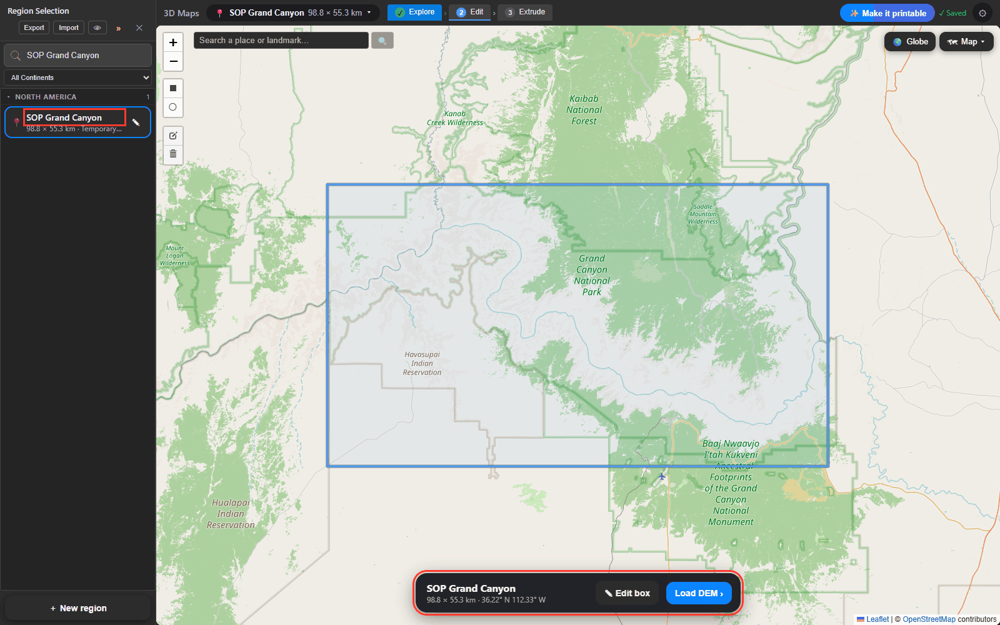
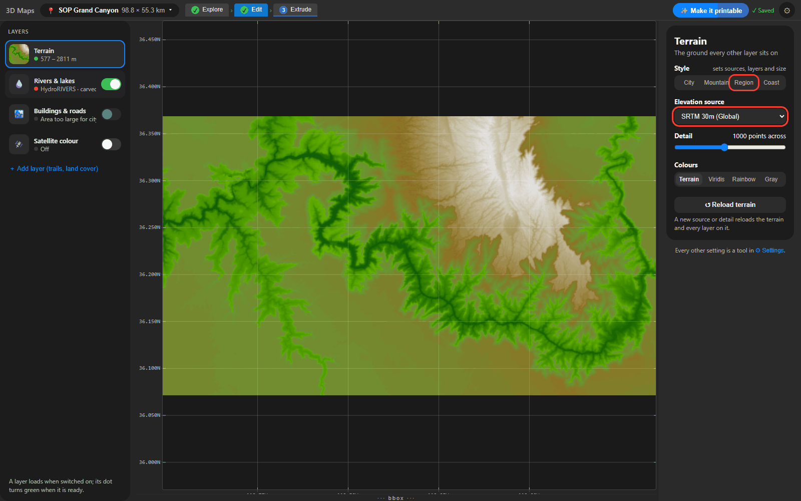
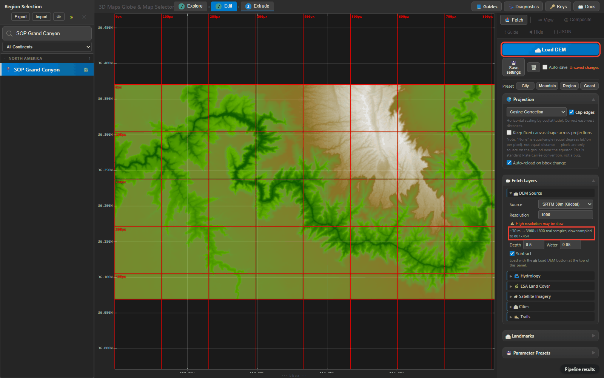
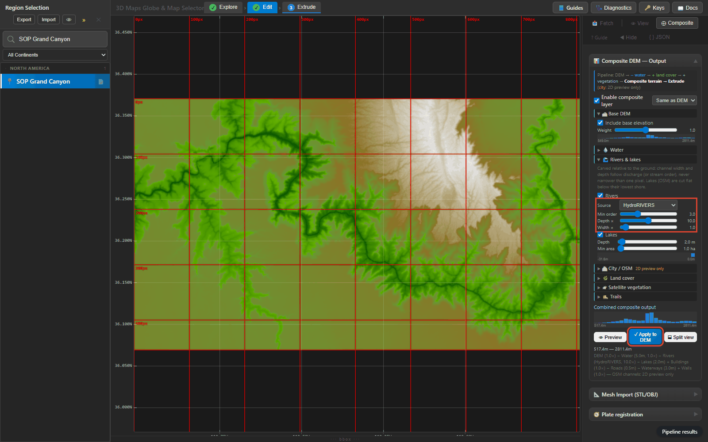
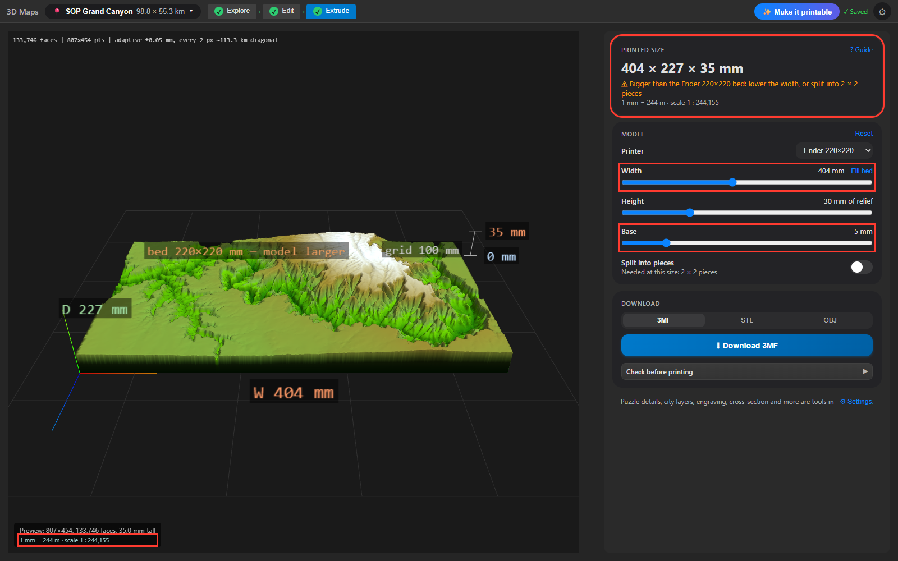
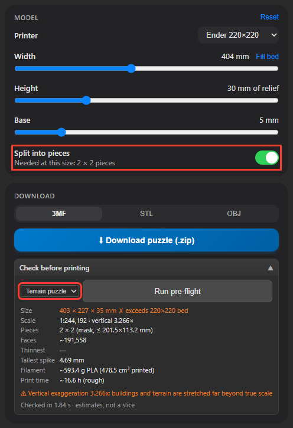
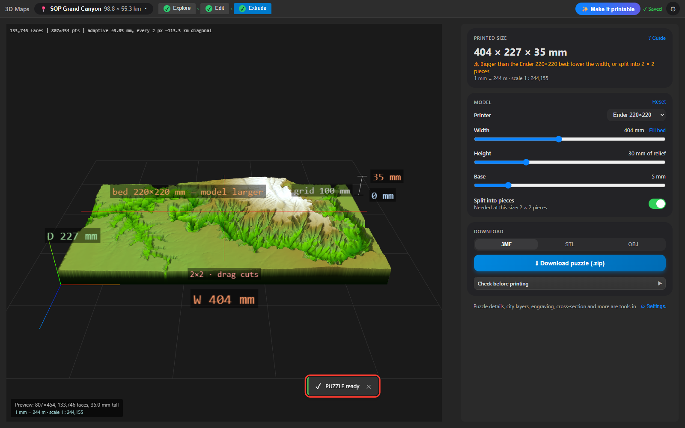

# SOP — Large regions with rivers and lakes (terrain only)

Written 2026-09-27 from the F-REGION step 4 run (`docs/plans/done/F-REGION-large-areas-hydrology.md`).
Companion to `city-stl-and-puzzle-sop.md` (cities, city layers, puzzles). Large areas
(> 20 km) do not use city layers: buildings are below print resolution. They use the
terrain stage plus the composite's river and lake layers. Outputs of the reference run:
`output/renders_regions/<region>/` (gitignored): STLs, `results.json` (timings, pre-flight),
`review.json` (checks below), `<region>_review.png` (hillshade, carve depth map, zoom and
profile per river depth) and `<region>_oblique.png`.

## 1. Reference results (2026-09-27)

Region preset: SRTM 30 m (SRTMGL1, longer side ≤ 100 km), 1000 px, cosine projection,
Vertical *auto* (→ *fit*, 30 mm relief), base 10 mm, 3×3 median, HydroRIVERS order ≥ 3,
lakes ≥ 1 ha 2 m below the shore. 0.5 mm per pixel. Run through the app's routes
(`/api/terrain/dem` → `/api/composite/dem-merge` → `/api/export/preflight` →
`/api/export/start` → status → download) from a snapshot worktree.

| Region | Box | Model | Scale (V.E.) | Faces | Watertight | Export | River depth on print (depth ×1 / ×k) |
|---|---|---|---|---|---|---|---|
| Grand Canyon (Colorado) | 98.8 × 55.3 km | 403 × 227 × 40 mm | 1:244,000 (3.3×) | 384 k | yes | 27 s | 0.04 mm / 0.21 mm at ×5 |
| Middle Rhine (Bingen–Koblenz) | 37.8 × 53.1 km | 320 × 452 × 40 mm | 1:118,000 (5.5×) | 653 k | yes | 47 s | 0.23 mm / 0.70 mm at ×3, 1.15 mm at ×5 |
| Sierra Nevada + Granada | 55.0 × 35.4 km | 398 × 258 × 40 mm | 1:138,000 (1.4×) | 226 k | yes | 17 s | 0.005 mm / 0.10 mm at ×20 (slider max) |

- **Puzzle** (Grand Canyon, rivers ×5, `piece_mm` 200, 256 mm bed): 3 × 2 pieces of
  134 × 113 mm (142 × 121 with knobs), mask path, 33 s, all six watertight, pieces sum to
  the model minus the clearance gaps (2,347 vs 2,356 cm³); 3 plate 3MFs.
- **Time** (success criterion: 100 km export with rivers < 2 min): **met** — Grand Canyon
  DEM 13 s (cold OpenTopography) + Apply 3 s (HydroRIVERS cached) + export 27 s. The
  variable part is the lakes' Overpass fetch on first use of a box: 45–75 s this run
  (a dead mirror costs 40 s of health checks first); during an Overpass outage it failed
  after ~2 min and the lakes were skipped (see §5).
- **Pre-flight** (3 s) got the size, scale and exaggeration exactly right; its face
  estimate was **a half to a third** of the real count (192 k vs 384 k, 217 k vs 653 k,
  177 k vs 226 k). Filament: 681 / 1,003 / 600 g, 19 / 28 / 17 h.
- **Mesh**: the terrain TIN stays within 0.05 mm of the heightfield everywhere, river
  channels included (checked by sampling the STL top at every pixel); a carved channel
  is not simplified away. Rivers add no export time (base vs rivers within the run-to-run spread of ±8 s).
- **River placement** (height of the carved cell above the lowest ground within ±4 px):
  Grand Canyon 98 m median before valley snapping, **15 m after** (main river 151 → 30 m);
  Rhine 0 m; Sierra 3 m.
- **Lakes**: Rhine 31 small lakes, Sierra 20 (Canales 1.3 km²). Surface inside the shore
  flat to 0.01–0.12 mm; the one-pixel rim varies 0.05–0.5 mm (projection resampling,
  §5). Grand Canyon: none worth the name (4 px).
- **Edges**: no artefacts — the step between the first and second row/column is within
  the interior's 99th percentile on every side; no NaN / zero cells in any composite.

## 2. The process (UI)

**Prerequisites**: as in the city SOP (venv, OpenTopography key, server running). Rivers
use HydroRIVERS, downloaded per continent on first use (§5); lakes use Overpass.

**Quick path**: pick the region in Explore, choose the *Region* style in Edit → *Terrain*,
then open **3 Extrude**: it loads the terrain, sizes the model to fill the bed and builds the
preview. Turn on *Split into pieces* for a print bigger than the bed.
Check the *Rivers & lakes* layer in Edit (step 4): with its switch on they are in every preview
and download. The Explore and Edit pages, Extrude's layout and the *More settings* switches are
described in the city SOP, §2.

Screenshots: Grand Canyon reference box (N 36.47, S 35.97, E −111.78, W −112.88), taken
by `Code/claude/scripts/sop_screenshots.py` (outside the repo; its docstring says how to
refresh them). A red outline marks the control each step talks about.

1. **Pick the area** (Explore). Frame the river with a margin: the model's longer side is
   *dim* px in degrees, so after the cosine projection the east-west side shrinks by
   cos(lat) (Grand Canyon: 1000 → 807 px).

   
   *The saved box on the Explore map; the card at the bottom gives its size (98.8 × 55.3 km)
   and position, with ✎ Edit box and Load DEM ›. Type in "Search regions…" to find it in a
   long list.*

2. **Region style** (Edit → *Terrain* → *Style* → **Region**; **Load DEM ›** on the region's
   card opens Edit and loads the DEM with the region's saved or default settings): sets
   SRTM 30 m (≤ 100 km) or 90 m, 1000 points across, Vertical auto, city layers and puzzle
   off, rivers + lakes on, and **Projection → Cosine Correction**. (The default for a
   region without saved settings is *None* (Plate Carrée), which keeps the grid in
   degrees — Grand Canyon 1000 × 454 px instead of 807 × 454, a model 24 % too wide
   east-west — so check Projection if you skip the style: ⚙ *Data sources & fetch
   details* tool → 📥 Fetch → Projection.)

   
   *Terrain selected: Style Region, elevation source SRTM 30 m (Global), detail 1000
   points across; Rivers & lakes is switched on.*

3. **Load the terrain**: the style reloads it by itself when it changes the projection or
   detail; otherwise click **↺ Reload terrain**. ~13 s cold for 100 km, cached after. The
   Terrain dot turns green with the height range. (The note under *Resolution*, in the
   *Data sources & fetch details* tool, compares the source's real samples with the grid:
   807 × 454 from 3960 × 1800 SRTM samples, downsampled.)

   
   *The terrain loaded: 577 – 2811 m; ↺ Reload terrain loads it again after a change.*

4. **Rivers & lakes** (Edit → *Rivers & lakes*): its switch puts the rivers, lakes and open
   water into the model (the Region style turns it on). Click the layer and set:
   - *Rivers*: **Most** (Strahler order 3 and up; *Big only* is 5 and up, *All* every
     stream).
   - **River depth ×** from the table below (the slider goes to ×10; up to ×20 in the
     ⚙ *Composite & imports* tool). *River width ×* and *Lakes* (larger than 1 ha, *Lake
     depth* below the shore) are here too.

   The map shows the rivers as they are carved; every preview and download includes them,
   with no Apply. Skipped channels are not shown in the UI yet (only in the server log):
   open water (ESA) needs Earth Engine and is skipped without it — lakes do the same job.
   The river *Source* (HydroRIVERS or Natural Earth) is in the ⚙ *Data sources & fetch
   details* tool (📥 Fetch → 🌊 Hydrology).

   
   *Rivers & lakes in the model (switch on, dot green: HydroRIVERS · carved in): Most (order
   3 and up), depth ×10, width ×1, lakes on, 2 m below the shore.*

5. **Extrude → Model card**: a new DEM is sized to fill the printer bed (*Printer*,
   default Ender 220 × 220). For a bigger print drag **Width** (it sets mm per pixel:
   0.5 mm/px → ~400–450 mm; the exact value is in the *Vertical & surface* tool card).
   **Height** is the fitted relief (30 mm) because Vertical *auto* fits regions over
   20 km. Lower **Base** from 10 to 3–5 mm for large prints (10 mm is ~40 % of the
   filament here). The *Printed size* card gives W × D × H, whether it fits the bed and
   the scale; the line under the preview repeats the scale.

   
   *Width 404 mm (0.5 mm/px) and 5 mm base: 404 × 227 × 35 mm, "1 mm = 244 m · scale
   1 : 244,155"; Printed size warns it is bigger than the Ender 220 × 220 bed (2 × 2 pieces).*

6. **Split and check** (Extrude → Model card → **Split into pieces**; it sets the puzzle
   grid to the bed), then Download card → **Check before printing**: pick *Terrain puzzle*
   (or *City model*, which with every layer off is the terrain) and **Run pre-flight**:
   size vs bed, scale, vertical exaggeration, piece grid. Expect 1.3–3× the estimated faces.
   Grid, knobs and clearance are in the *Puzzle details* card (switch it on under
   *More settings* in Extrude's right-hand panel).

   
   *Split into pieces on (2 × 2 needed); Terrain puzzle: 403 × 227 × 35 mm, 1:244,192,
   vertical 3.27×, 2 × 2 pieces (mask path, ≤ 201.5 × 113.2 mm), ~192 k faces (estimate),
   ~593 g, ~16.6 h.*

7. **Download** (Extrude → Download card): without pieces pick *3MF*, *STL* or *OBJ* and
   **⬇ Download**; with *Split into pieces* on the button reads **⬇ Download puzzle
   (.zip)** (terrain puzzles take the mask path: fast, watertight). The progress bar at
   the top of the Extrude panel shows the step and elapsed time, with ✕ Cancel; the
   download and a "PUZZLE ready" toast mark the end (15–70 s here). Watertightness is in
   the zip's pieces, not the toast (only single-file STL/OBJ/3MF exports report faces and
   watertightness in the toast).

   
   *2 × 2 puzzle: the cut lines in the preview are the piece boundaries (drag to move
   one; label "2×2 · drag cuts"); "PUZZLE ready" at the bottom.*

8. **QA**: `X-Watertight` / toast (single-file exports), slicer size, and look at a river in the slicer's
   layer preview: it should show in at least two layers.

### River depth (depth ×) — what prints

Depth on the print = hydraulic depth (m) × depth × × vertical scale (mm/m). Aim for
≥ 0.4 mm (2 layers at 0.2 mm, 4 at 0.1 mm) and ≤ ~1 mm (deeper reads as a trench).

| Region type | Main river | Vertical scale | Depth × for ~0.5 mm |
|---|---|---|---|
| Big river, low relief (Rhine, 1,600 m³/s, 540 m relief) | 4.8 m | 0.047 mm/m | 2–3 |
| Big river, deep canyon (Colorado, 530 m³/s, 2,200 m relief) | 3.1 m | 0.014 mm/m | 10–12 |
| Mountain streams (Genil, 2.6 m³/s, 2,900 m relief) | 0.5 m | 0.010 mm/m | ~100 (not reachable: slider max 20) |

In mountains the valleys already show the drainage; small rivers only print as a
separate colour (§6).

## 3. Settings

| Setting | Value | Why |
|---|---|---|
| DEM | SRTMGL1 ≤ 100 km, SRTMGL3 beyond | at 1000 px a 100 km box is ~100 m/px; 30 m is already downsampled 3× |
| Vertical | auto (→ fit, 30 mm) | true scale would be 11–24 mm of relief at 1:120–240 k |
| Smoothing | 3×3 median | rivers and lakes are carved after it, so it cannot erase them |
| Rivers | HydroRIVERS, *Most* (min order 3), width × 1 (Edit → Rivers & lakes) | order ≥ 3 is ≥ ~3 m³/s; lower orders are noise at 50–120 m/px |
| Lakes | 2 m below shore, ≥ 1 ha | below one pixel (1.5–3.5 ha here) a lake is a pit, harmless |
| Base | 3–5 mm | 10 mm default is heavy at 400 mm |

## 4. How it is built (for troubleshooting)

1. **Composite** (`app/server/routers/composite.py:compute_composite_dem`): base DEM on
   the projected grid of `/api/terrain/dem` (upsampled to *dim*, then projected — the same
   grid, so Apply does not change the model size); ESA water (optional); rivers and lakes
   as a separate *carve* grid (negative metres, terrain-relative).
2. **Rivers** (`geo2stl/water_layers.py`): HydroRIVERS reaches → width/depth from
   discharge → each reach re-routed along the valley floor of the DEM (least-cost path in
   a 400–2,000 m corridor by Strahler order) → buffered by half its width → burnt.
3. **Lakes**: OSM `natural=water` / reservoirs → flat at shore minimum − depth, levelled
   against the 3×3-median DEM (what the export prints).
4. **Export** (`app/server/core/export.py`): median → + carve → fit scale → adaptive TIN
   (≤ 0.05 mm) → watertight solid; puzzle via the mask path.

## 5. Known limits

- **Overpass** is the slow and fragile step: the lakes fetch waits ~40 s on a dead mirror
  before trying the next, and an outage costs ~2 min before the lakes are skipped (the
  composite is kept and re-tried after 15 min). The skip is in the `dem-merge` response and
  the server log only; Edit, the export and the pre-flight do not show it yet.
- **Earth Engine**: open water (ESA) goes on with the *Rivers & lakes* switch and fails
  without Earth Engine (`ee` is not installed in the venv). It is now skipped; before
  this run it failed the whole composite, so the Region preset exported *no* rivers.
- **HydroRIVERS first use** per continent: 66–108 MB download, then ~4 min to simplify
  and build the parquet files (Europe: 230 s + 23 s); later reads take < 1 s. Regions
  already cached: af, ar, as, au, eu, na, sa (not si).
- **River position**: snapping fixes most offsets, but in narrow side canyons (Grand
  Canyon tributaries) 10 % of carved cells are still > 66 m above the floor; the carve is
  relative (3 m), so this reads as a faint notch, not a wall cut.
- **Depth is in metres × a multiplier**, so the same setting prints 0.005 mm in the
  Sierra and 1.2 mm on the Rhine; there is no "depth on the print" setting.
- **Lake rims** vary up to 0.5 mm: levels are computed on the unprojected grid and the
  carve is resampled into the projected one, so the one-pixel shore ring does not match
  the export's median exactly (interior flat to ≤ 0.12 mm).
- *dim* applies to the longer side **in degrees**; at mid latitudes the projected model
  comes out 10–20 % smaller than *dim* × mm/px suggests.
- **UI feedback during export** (fixed 2026-09-27): the progress bar (with elapsed time
  and ✕ Cancel) shows during every export and toasts stay up for their requested
  duration. The browser gives up only after 3 min with no progress and no server
  heartbeat, not after a fixed 10 min.
- **Apply to DEM** (⚙ *Composite & imports* tool; since 2026-10-02 only needed for land
  cover, vegetation and trails, not rivers and lakes) (fixed 2026-09-27) waits for / starts the recompute for the loaded
  DEM and refuses a stale, all-zero or flat composite; a flat DEM shows "vertical: DEM
  is flat" on the Extrude scale line instead of a billions-× exaggeration.

## 6. What to improve (prioritised)

Process / pipeline:
1. ~~**River depth in print millimetres**~~ (done 2026-10-02): Edit → Rivers & lakes →
   *River depth* is the main river's depth on the print (default 0.5 mm), channels are at
   least 0.5 mm wide, and the 3D view colours water like the Edit map.
   See `docs/decisions/osm-water-hydrology.md`.
2. **Surface composite warnings in the export** (`export_params.ExportContext`): carry
   `compute_composite_dem(..., warnings=)` into the pre-flight warnings and an
   `X-Composite-Warning` header, as `composite_error` already is.
3. **Overpass**: ~~remember an unhealthy mirror~~ (done: a failed query is tried last for
   10 min, 2026-10-02; probes are parallel and remembered 2 min, 2026-10-03); fetch lakes
   in the background when the Region preset is applied.
4. **Lakes as absolute levels**: carry each lake's level (NaN elsewhere) and apply
   `min(z, level)` after the median on the export grid — exactly flat, rims included.
5. **Pre-flight face estimate**: the strided TIN under-counts rugged terrain by 1.3–3×;
   calibrate the `sqrt(stride)` factor or estimate from a full-resolution TIN of a tile.

UI:
1. Region preset: ~~set Projection to *Cosine Correction*~~ (done 2026-09-27), untick
   *Water (ESA)* when Earth Engine is not configured, set Base 5 mm. (~~Set mm/px from
   the bed~~: every new DEM now fills the bed, 2026-10-01.)
2. ~~Show the river depth on the print (mm)~~: the slider is in mm (2026-10-02).
3. Show skipped channels (ESA water, lakes during an Overpass outage) on the *Rivers &
   lakes* layer (the `dem-merge` response has `warnings`).
4. Terrain puzzle: offer *max piece* (mm) like the City Model instead of only cols × rows.

STL:
1. **Rivers and lakes as their own 3MF part** (a second colour, 0.4–0.6 mm deep) — at
   1:120–240 k a groove alone is hard to see; a blue channel reads at any depth.
2. Optional river width floor in mm (e.g. 0.8 mm = two extrusion lines) for rivers that
   are one pixel (0.5 mm) wide.
3. Optional hillshade-style engraving is not needed: relief reads well at 30 mm fit
   height; at 3–5× exaggeration the Rhine gorge and the canyon walls are steep but
   printable (tallest spike 1.5–4.8 mm per pixel step).

## History

2026-09-27 run fixed: composite failed entirely when ESA water or the Overpass lakes
fetch failed (no rivers in any Region export); Apply to DEM stretched the projected grid
back to *dim* (model 24 % wider than the loaded DEM, every cell interpolated); rivers
carved on the canyon walls (HydroRIVERS offsets up to 2 km); lake surfaces levelled
against the raw DEM (noise under the median). Composite cache version bumped to 2.
