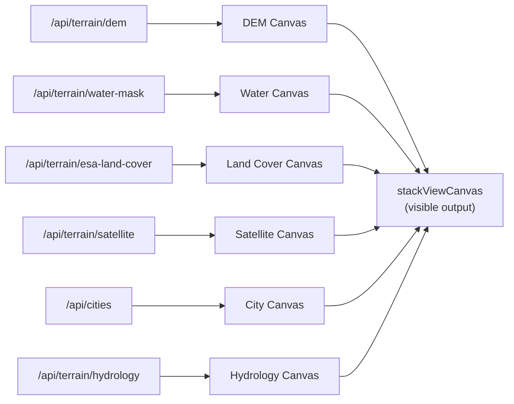
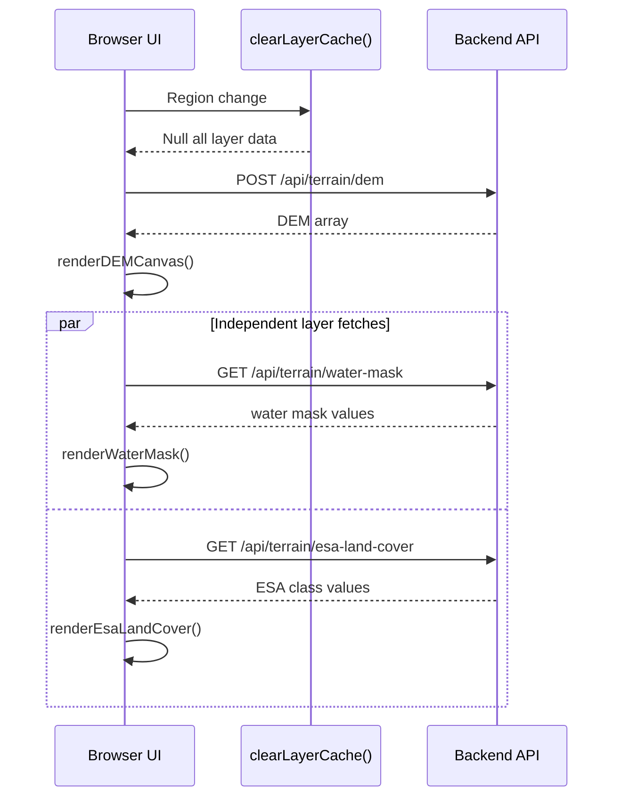

# Layer System Analysis & Improvement Plan

_Last updated: 2026-04-19_

> **Status summary:** All four original audit issues are **resolved**. Water/land-cover endpoints have been split (`/api/terrain/water-mask` + `/api/terrain/esa-land-cover`). Satellite rendering moved to `dem/dem-loader.js`. Hydrology overlay added as a new layer. Per-layer resolution is fully independent. `per-layer-resolution-plan.md` is complete — kept for reference.

---

## Current Architecture (implemented)

### Layer rendering pipeline

### Layer cache lifecycle

---

## Resolved Issues (originally identified March 2026)

### 1. Water Mask Bug on Region Change — FIXED

`clearLayerCache()` is called on every bbox change and region switch. It nulls `lastDemData`, `lastWaterMaskData`, and `lastRawDemData`. The stale-data rendering bug no longer occurs.

### 2. Stale Cache Data — FIXED

Layer data is tracked per-bbox via `appState.layerBboxes`. `clearLayerCache()` resets all layer state atomically. The `waterMaskCache` (keyed by bbox+resolution) also prevents cross-region contamination.

### 3. Tab/Layer State — FIXED

The old `dem-subtab` buttons have been replaced by `.layer-tab` buttons with per-layer status indicators (gray = empty, orange pulse = loading, green = ready, red = error). All 6 layers render to hidden offscreen canvases; `updateStackedLayers()` composites the active layers onto the single visible `stackViewCanvas`.

### 4. Data Flow Coupling — FIXED

Water mask and ESA land cover are now fetched from separate endpoints (`/api/terrain/water-mask` and `/api/terrain/esa-land-cover`) with independent resolution controls and caches. `loadWaterMask()` and `loadEsaLandCover()` are fully independent functions with their own abort controllers.

---

## Resolved Proposals

### A. Split Water/LandCover Endpoints — DONE

`/api/terrain/water-mask` and `/api/terrain/esa-land-cover` are separate endpoints. Each has independent resolution dropdown, abort controller, cache, and status tracking. See `per-layer-resolution-plan.md` for the original design.

## Open Proposals

### B. LayerManager Class

A formal class to centralize layer state (data, bbox, staleness) is still a proposal. Today this role is filled by `appState.layerStatus`, `appState.layerBboxes`, and `clearLayerCache()` — pragmatic but not formalized.

### C. Event Bus Consolidation

Replace direct `window.fn()` calls with `EV.DEM_LOADED`, `EV.REGION_SELECTED`, etc. Tracked in `proposals.md` as `R-EVENTS-A`.

---

## Current Module Ownership

| Layer | Render function | Data source | Module |
|-------|-----------------|-------------|--------|
| DEM | `renderDEMCanvas()` | `/api/terrain/dem` | `dem/dem-main.js` |
| Water Mask | `renderWaterMask()` | `/api/terrain/water-mask` | `layers/water-mask.js` |
| Land Cover | `renderEsaLandCover()` | `/api/terrain/esa-land-cover` | `layers/water-mask.js` |
| Satellite | `renderSatelliteCanvas()` | `/api/terrain/satellite` | `dem/dem-loader.js` |
| Hydrology | `renderHydrology()` | `/api/terrain/hydrology` | `layers/hydrology-overlay.js` |
| City Overlay | `renderCityOverlay()` | `/api/cities` | `layers/city-overlay.js` |
| Composite DEM | `updateCompositeDem()` | Client-side computation | `layers/composite-dem.js` |
| Stacked View | `updateStackedLayers()` | All above canvases | `layers/stacked-layers.js` |
