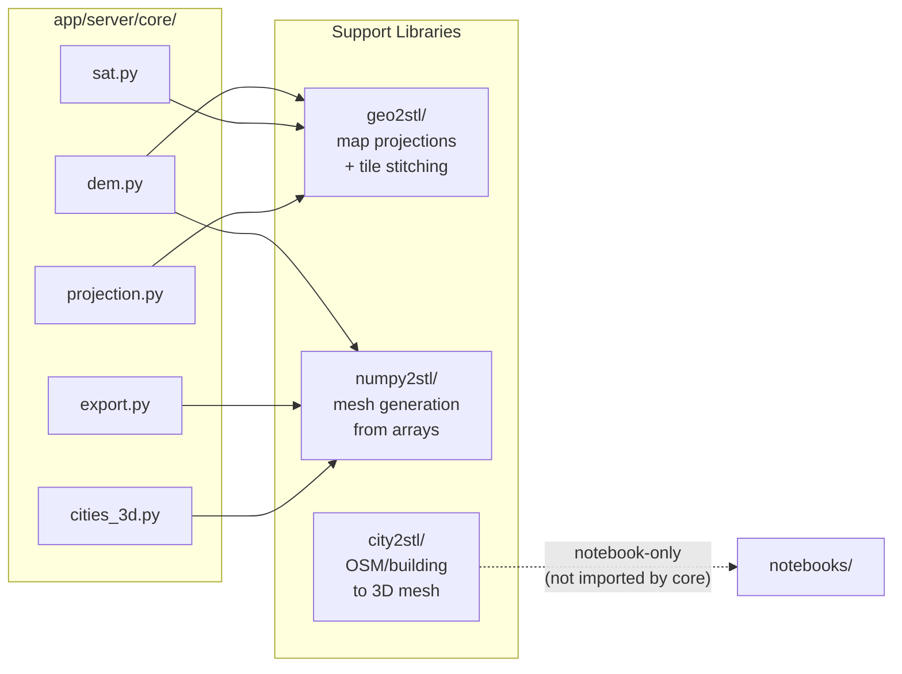

# Support Libraries — strm2stl

_Last updated: 2026-04-19_

The app server (`app/server/core/`) delegates heavy computation to three
support libraries. Core modules should act as **thin wrappers** — translating
HTTP requests into library calls, not reimplementing library logic.

> **Principle:** `app/server/core/` is a thin API adapter around `geo2stl`,
> `city2stl`, and `numpy2stl`. Those libraries are the workhorse systems
> that handle logic and computation.

---

## Library Overview

---

## Import Map

### `core/` → Libraries

| Core Module | Library | Import | Purpose |
|---|---|---|---|
| `dem.py` | `numpy2stl.oceans` | `make_dem_image` | Local SRTM tile → DEM array |
| `dem.py` | `geo2stl.sat2stl` | `fetch_bbox_image` | ESA water layer fetch |
| `dem.py` | `geo2stl.geo2stl` | `stitch_tiles_no_rasterio` | Merge DEM tiles |
| `dem.py` | `geo2stl.projections` | `proj_map_geo_to_2D` | Legacy projection path |
| `projection.py` | `geo2stl.projections` | `project_coordinates` | CRS grid/image transform |
| `sat.py` | `geo2stl.sat2stl` | `fetch_bbox_image` | Satellite imagery fetch |
| `sat.py` | `geo2stl.geo2stl` | `stitch_tiles_no_rasterio` | Satellite tile merge |
| `export.py` | `numpy2stl` | `array_to_mesh` | DEM → 3D mesh |
| `export.py` | `numpy2stl` | `writeOBJ`, `write3MF` | Mesh file writers |
| `cities_3d.py` | `numpy2stl.save` | `write3MF` | City model export |
| `cities_3d.py` | `numpy2stl.simplify` | `simplify_mesh_surfaces` | Mesh simplification |

### `routers/` → Libraries (bypass — should go through core)

| Router | Library | Import | Note |
|---|---|---|---|
| `terrain.py` | `numpy2stl.oceans` | `make_dem_image` | Should route through `core/dem.fetch_local_dem` |
| `settings.py` | `geo2stl.projections` | `get_projection_info` | Acceptable (read-only config) |

### `session/` → Libraries

`terrain_session.py` has **no** direct library imports — it communicates
entirely through the HTTP API. This is correct.

### `city2stl/` → core

`city2stl/` is **entirely unused** by `core/` or `routers/`. It is
consumed only by its own internal modules and notebooks.

---

## Library Public APIs

### `geo2stl/` — Map Projections & Tile Stitching

| Module | Key Functions |
|---|---|
| `geo2stl.py` | `stitch_tiles_no_rasterio`, `proj_map_height`, `proj_map_geo_to_2D`, `mat2coor` |
| `projections.py` | `get_projection_info`, `project_coordinates`, `proj_map_geo_to_2D` |
| `sat2stl.py` | `fetch_bbox_image`, `get_aquatic_regions`, `calculate_scale_for_dimensions` |
| `write.py` | `savefile`, `save_im`, `save_stl` (unused by app — notebook-only) |

### `numpy2stl/` — Mesh Generation

| Category | Key Functions |
|---|---|
| Core (via `__init__`) | `array_to_mesh`, `polygon_to_prism`, `perimeter_to_walls`, `writeSTL`, `write3MF`, `writeOBJ` |
| `simplify` | `simplify_mesh_surfaces` |
| `oceans` | `make_dem_image` |
| `boolean` | `union_pymesh`, `cut_puzzle_pieces` (unused by app) |
| `view` | `plot_edges_3d`, `render_models_napari` (notebook-only) |
| `verify` | mesh validation (unused by app) |

### `city2stl/` — OSM/Building to 3D Mesh

| Module | Key Functions |
|---|---|
| `buildings.py` | `building_to_gdf`, `building_heights`, `get_polygons` |
| `create.py` | `get_building_model`, `polygon_to_prism`, `shapely_to_buildings` |
| `dem2stl.py` | `DEM2STL`, `get_section`, `embed_lines` |
| `osm2stl.py` | `get_roads_osmnx`, `get_rivers`, `get_boundries_osmnx` |
| `roads.py` | `get_road_model`, `get_road_segments` |

> `city2stl/` has no `__init__.py` and is notebook-only research code.

---

## Thin Wrapper Assessment

### Exemplary (no action needed)

| Module | Status | Notes |
|---|---|---|
| `core/projection.py` | ✅ Clean | Three functions wrapping `project_coordinates` with app-specific defaults |
| `core/export.py` | ✅ Clean | Uses `array_to_mesh` / `write3MF` / `writeOBJ` directly; DEM prep is app-layer |
| `core/sat.py` | ✅ Clean | Direct delegation to `fetch_bbox_image` + `stitch_tiles_no_rasterio` |
| `core/dem.py` | ⚠️ Mostly clean | One concern: uses legacy `proj_map_geo_to_2D` instead of `core/projection.project_grid` |

### Violations

| Module | Issue | Severity |
|---|---|---|
| `core/cities_3d.py` | Reimplements `_ear_clip()` polygon triangulation — `numpy2stl.polygon.triangulate_polygon` already does this | 🔴 High |
| `core/cities_3d.py` | Reimplements `_extrude_ring()` extrusion — `numpy2stl.generate.polygon_to_prism` already does this | 🔴 High |
| `core/cities_3d.py` | Reimplements `_terrain_mesh()` DEM→solid (~90 lines) — `numpy2stl.array_to_mesh(solid=True)` does this | 🔴 High |
| `core/dem.py` | Uses legacy `geo2stl.geo2stl.proj_map_geo_to_2D` while rest of app uses `project_coordinates` | ⚠️ Medium |
| `routers/terrain.py` | Imports `numpy2stl.oceans.make_dem_image` directly, bypassing `core/dem` | ⚠️ Medium |

See [proposals.md](proposals.md) B-LIB1–B-LIB3 for recommended refactors.

---

## Unused Library Capabilities

Functions available in libraries but not consumed by the app:

| Library | Unused | Notes |
|---|---|---|
| `geo2stl.sat2stl` | `calculate_scale_for_dimensions` | `core/sat.py` reimplements this inline |
| `geo2stl.sat2stl` | `get_aquatic_regions` | Higher-level water mask wrapper |
| `geo2stl.write` | All functions | App uses `numpy2stl` writers instead |
| `numpy2stl` | `polygon_to_prism`, `perimeter_to_walls` | Reimplemented in `cities_3d.py` |
| `numpy2stl` | `writeSTL` | App uses trimesh for STL instead |
| `numpy2stl` | `boolean`, `puzzle`, `view`, `verify` | Notebook/offline use only |
| `city2stl` | All modules | Notebook-only; not used by server |

These are legitimate library features for notebooks — not dead code per se —
but the app only uses: `array_to_mesh`, `write3MF`, `writeOBJ`,
`simplify_mesh_surfaces`, `make_dem_image`, `fetch_bbox_image`,
`stitch_tiles_no_rasterio`, `project_coordinates`, `get_projection_info`.
