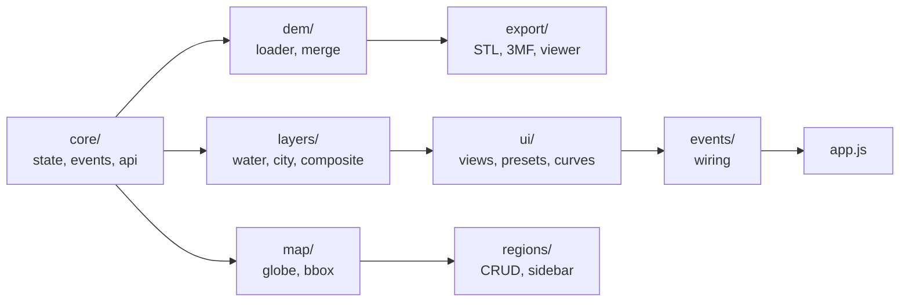

# JS Module Map — strm2stl

_Last updated: 2026-04-19_

All modules in `app/client/static/js/modules/`, imported by `main.js` in dependency order.
Modules expose functions via `window.*` — they do **not** import each other.
See [arch.md § Module Boundary](arch.md#module-boundary) for detailed coordination rules and entry-point architecture.

### Module group overview



## Subdirectory Groups

### `core/` — Foundation & utilities
| File | Key exports | Purpose |
|------|-------------|---------|
| `state.js` | `window.appState` | Proxy-based reactive state with `.on()/.set()/.emit()` |
| `events.js` | `window.events`, `window.EV` | Event bus + EV constants |
| `api.js` | `window.api.*` | All fetch helpers (regions, dem, export, cities, cache, settings) |
| `ui-helpers.js` | `showToast`, `showLoading`, `setLayerStatus` | Toast, spinners, layer status UI |
| `cache.js` | `waterMaskCache`, `setupCacheManagement` | In-memory water mask LRU + cache UI |

### `dem/` — DEM rendering & processing
| File | Key exports | Purpose |
|------|-------------|---------|
| `dem-loader.js` | `mapElevationToColor`, `recolorDEM`, `applyProjection`, `drawHistogram` | Canvas rendering, colormaps, projection, zoom |
| `dem-main.js` | `loadDEM`, `window.renderDEMCanvas` | Main DEM loader + orchestration |
| `dem-gridlines.js` | `drawGridlinesOverlay`, `toggleGridOverlay` | Lat/lon gridline overlay |
| `dem-merge.js` | `setupMergePanel`, `runMerge` | Multi-source DEM blending UI |

### `layers/` — Layer composition & city overlays
| File | Key exports | Purpose |
|------|-------------|---------|
| `stacked-layers.js` | `updateStackedLayers`, `setStackMode`, `applyStackedTransform` | Single-canvas stacked view, zoom/pan |
| `composite-dem.js` | `computeCompositeDem`, `setupCompositeDemControls` | Additive height contributions + ML feature arrays |
| `water-mask.js` | `loadWaterMask`, `renderWaterMask`, `renderEsaLandCover` | Water mask + ESA land cover |
| `city-overlay.js` | `loadCityData`, `renderCityOverlay`, `window.renderCityOnDEM` | OSM building/road/waterway overlay |
| `city-render.js` | `loadCityRaster`, `_clearCityRasterCache` | City rasterization via /api/composite/city-raster |
| `hydrology-overlay.js` | `window.loadHydrology`, `window.clearHydrology` | HydroRIVERS depression grid fetch + canvas render |

### `map/` — Map, globe, bbox
| File | Key exports | Purpose |
|------|-------------|---------|
| `map-globe.js` | `initMap`, `initGlobe`, `setTileLayer`, `toggleDemOverlay` | Leaflet 2D map + Three.js globe |
| `bbox-panel.js` | `setBboxInputValues`, `initBboxMiniMap`, `syncBboxMiniMap` | Bbox input panel + mini-map |
| `compare-view.js` | `initCompareMode`, `loadCompareRegion` | Side-by-side region comparison |

### `regions/` — Region management
| File | Key exports | Purpose |
|------|-------------|---------|
| `regions.js` | `loadCoordinates`, `selectCoordinate`, `goToEdit` | Region CRUD, sidebar list, selection |
| `region-ui.js` | `renderCoordinatesList`, `populateRegionsTable`, `groupRegionsByContinent` | Sidebar views, notes, groups |

### `export/` — 3D export
| File | Key exports | Purpose |
|------|-------------|---------|
| `model-viewer.js` | `initModelViewer`, `previewModelIn3D`, `haversineDiagKm`, `exportPuzzle3MF` | Three.js terrain preview + puzzle export |
| `export-handlers.js` | `downloadSTL`, `downloadModel`, `downloadCrossSection` | STL/OBJ/3MF/cross-section downloads |

### `ui/` — UI management
| File | Key exports | Purpose |
|------|-------------|---------|
| `view-management.js` | `switchView`, `switchDemSubtab`, `cycleSidebarState` | Tab switching + sidebar state machine |
| `app-setup.js` | `setupOpacityControls`, `loadAllLayers`, `saveCurrentRegion` | App init wiring helpers |
| `presets.js` | `initPresetProfiles`, `applyPreset`, `collectAllSettings` | Preset save/load/apply |
| `curve-editor.js` | `initCurveEditor`, `applyCurveTodem`, `interpolateCurve`, `undoCurve` | Elevation curve editor (spline + undo/redo) |
| `keyboard-shortcuts.js` | (no named exports) | Keyboard shortcut event listeners |

### `events/` — Event wiring
| File | Purpose |
|------|---------|
| `event-listeners.js` | Core app event setup |
| `event-listeners-ui.js` | UI button/slider handlers |
| `event-listeners-map.js` | Leaflet map + draw events |
| `event-listeners-export.js` | Export tab button handlers |

## main.js Import Order

The current order in `main.js` (must be preserved — foundation before dependents):
```
core/events → core/api → core/cache → core/ui-helpers → core/state
dem/dem-loader → dem/dem-gridlines → ui/presets → ui/curve-editor
layers/city-overlay → layers/city-render → layers/stacked-layers → layers/composite-dem
export/export-handlers → export/model-viewer → map/compare-view
regions/region-ui → dem/dem-merge → layers/water-mask
map/map-globe → regions/regions → map/bbox-panel
ui/app-setup → ui/keyboard-shortcuts
events/event-listeners-map → events/event-listeners-export → events/event-listeners-ui → events/event-listeners
ui/view-management → dem/dem-main → app.js
```

## Notes
- `app.js` is loaded as plain `<script>`, **after** all modules. It is the only non-module file.
- CDN globals (`window.L`, `window.THREE`, `window.Plotly`) are loaded as `<script>` tags before `main.js`.
- Colormaps: `terrain`, `viridis`, `jet`, `rainbow`, `hot`, `gray` — must match `COLORMAPS` in `mapElevationToColor()`.

---

## Function Index

One-liner index. Search by function name — line numbers are omitted because they go stale.
Use grep: `grep -rn "function functionName" app/client/static/js/`.

### app.js — file-top helpers

| Function | Purpose |
|----------|---------|
| `clearLayerCache()` | Reset lastDemData, waterMask, layerBboxes, layerStatus, composite canvases |
| `clearLayerDisplays()` | Clear canvas elements + status indicators |
| `getCurrentBboxObject()` | Return `{N,S,E,W}` from boundingBox or form inputs |
| `isLayerCurrent(layer)` | True if layer bbox matches current bbox |

### dem/dem-loader.js

| Function | Purpose |
|----------|---------|
| `mapElevationToColor(t, cmap)` | 0–1 → RGB array (12 colormaps) |
| `renderSatelliteCanvas(vals,w,h)` | RGB sat pixels → canvas |
| `updateAxesOverlay(N,S,E,W)` | Draw N/S/E/W axis labels |
| `drawColorbar(min,max,cmap)` | Render colorbar legend |
| `drawHistogram(values)` | Elevation histogram + cumulative |
| `applyProjection(srcCanvas, bbox)` | Apply map projection to canvas |
| `enableZoomAndPan(canvas)` | Mouse wheel/drag zoom on DEM canvas |
| `recolorDEM()` | Re-render DEM with current settings |
| `rescaleDEM(vmin, vmax)` | Rescale display |
| `resetRescale()` | Reset to data min/max |

### dem/dem-main.js

| Function | Purpose |
|----------|---------|
| `loadDEM(highRes?)` | Main DEM loader — fetch, render, update state (pass `true` for high-res) |
| `renderDEMCanvas(vals,w,h,cmap,vmin,vmax)` | Render elevation LUT → canvas |
| `loadSatelliteImage()` | Load ESA land cover (classification raster) |
| `loadSatelliteRGBImage()` | Load ESRI satellite imagery tiles |

### dem/dem-merge.js

| Function | Purpose |
|----------|---------|
| `setupMergePanel()` | Wire merge panel events |
| `runMerge(apply)` | POST /api/dem/merge, optionally apply |

### layers/water-mask.js

| Function | Purpose |
|----------|---------|
| `loadWaterMask()` | Fetch /api/terrain/water-mask (cached) |
| `renderWaterMask(data)` | Render water mask canvas |
| `renderEsaLandCover(data)` | Render ESA classification canvas |
| `renderCombinedView()` | Composite DEM+water+landcover |

### layers/city-overlay.js

| Function | Purpose |
|----------|---------|
| `loadCityData()` | POST /api/cities, computeTerrainZ, store osmCityData |
| `clearCityOverlay()` | Remove city overlays from canvases |
| `renderCityOverlay()` | Debounced: paint buildings/roads on stacked + DEM canvases |
| `_drawCityCanvas(ctx,...)` | Core draw: buildings alpha-batched (8), sub-pixel skipped |
| `renderCityOnDEM()` | Paint .city-dem-overlay on #demImage |

### layers/hydrology-overlay.js

| Function | Purpose |
|----------|---------|
| `loadHydrology()` | Fetch /api/terrain/hydrology, render depression grid |
| `clearHydrology()` | Clear canvas + state + emit update |

### layers/stacked-layers.js

| Function | Purpose |
|----------|---------|
| `updateStackedLayers()` | Render active mode buffer → stackViewCanvas |
| `setStackMode(mode)` | Switch active layer mode |
| `applyStackedTransform()` | Apply CSS zoom/pan transform |
| `enableStackedZoomPan()` | Wire wheel/drag on stackViewCanvas |
| `drawLayerGrid()` | Coordinate grid overlay |

### layers/composite-dem.js

| Function | Purpose |
|----------|---------|
| `computeCompositeDem(opts)` | Add water/city/landcover/sat contributions to DEM |
| `applyCompositeToDem()` | Copy composite into lastDemData.values |
| `setupCompositeDemControls()` | Wire all composite sliders + buttons |

### export/model-viewer.js

| Function | Purpose |
|----------|---------|
| `initModelViewer()` | Three.js scene init |
| `previewModelIn3D()` | Render current DEM in 3D viewer |
| `haversineDiagKm()` | Bbox diagonal in km |
| `exportPuzzle3MF()` | Puzzle piece 3MF export |

### export/export-handlers.js

| Function | Purpose |
|----------|---------|
| `downloadSTL()` | POST /api/export/stl → blob download |
| `downloadModel(format)` | POST /api/export/{format} → download |
| `downloadCrossSection()` | Cross-section OBJ export |
| `generateModelFromTab()` | Trigger server-side generation |

### regions/regions.js + region-ui.js

| Function | Purpose |
|----------|---------|
| `loadCoordinates()` | Fetch regions, draw map boxes |
| `selectCoordinate(i)` | Select + fly to region |
| `goToEdit(i)` | Switch to Edit tab for region |
| `renderCoordinatesList()` | Sidebar list view |
| `groupRegionsByContinent(regions)` | Group by heuristic continent |
| `initRegionNotes()` | Load notes from localStorage |

### ui/presets.js

| Function | Purpose |
|----------|---------|
| `initPresetProfiles()` | Load presets from localStorage |
| `applyPreset(preset)` | Apply preset to all form controls |
| `collectAllSettings()` | Return full settings object |
| `applyAllSettings(s)` | Apply settings object to form |

### ui/curve-editor.js

| Function | Purpose |
|----------|---------|
| `initCurveEditor()` | Setup canvas + state |
| `applyCurveTodem()` | Apply + re-render |
| `interpolateCurve(x)` | Monotone cubic spline at x∈[0,1] |
| `undoCurve()` / `redoCurve()` | Undo/redo curve edits |

### ui/view-management.js

| Function | Purpose |
|----------|---------|
| `switchView(view)` | Switch Explore/Edit/Extrude tab |
| `switchDemSubtab(tab)` | Switch DEM sub-tab |
| `cycleSidebarState()` | normal → list → table cycle |

### map/map-globe.js

| Function | Purpose |
|----------|---------|
| `initMap()` | Leaflet map + draw control |
| `initGlobe()` | Three.js globe |
| `setTileLayer(key)` | Switch tile layer |
| `toggleDemOverlay(show)` | Terrain overlay on map |

### map/compare-view.js

| Function | Purpose |
|----------|---------|
| `initCompareMode()` | Side-by-side compare panel |
| `loadCompareRegion(side)` | Load DEM for left/right panel |
