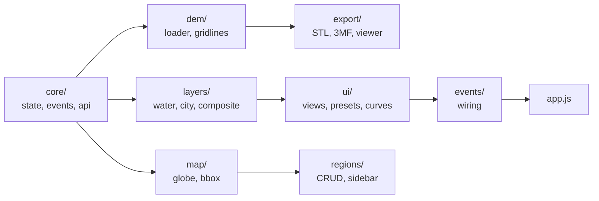
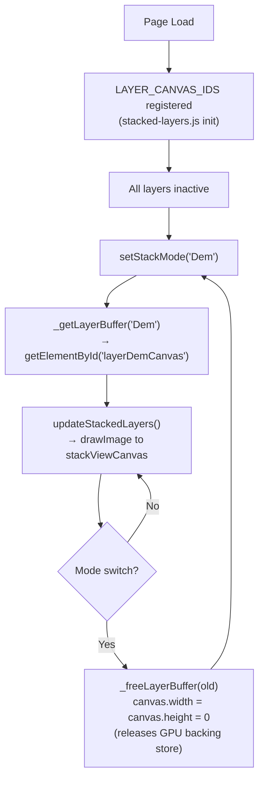

# JS Module Map — strm2stl

_Last updated: 2026-05-14_

All modules in `app/client/static/js/modules/`, imported by `main.js` in dependency order.
Modules expose functions via `window.*` — they do **not** import each other.
See [arch.md § Module Boundary](arch.md#module-boundary) for detailed coordination rules and entry-point architecture.

### Module group overview


```mermaid
flowchart LR
    CORE["core/<br/>state, events, api"] --> DEM["dem/<br/>loader, gridlines"]
    CORE --> LAYERS["layers/<br/>water, city, composite"]
    CORE --> MAP["map/<br/>globe, bbox"]
    DEM --> EXPORT["export/<br/>STL, 3MF, viewer"]
    LAYERS --> UI["ui/<br/>views, presets, curves"]
    MAP --> REGIONS["regions/<br/>CRUD, sidebar"]
    UI --> EVENTS["events/<br/>wiring"]
    EVENTS --> APP["app.js"]
```

## Subdirectory Groups

### `core/` — Foundation & utilities
| File | Key exports | Purpose |
|------|-------------|---------|
| `state.js` | `window.appState` | Proxy-based reactive state with `.on()/.set()/.emit()` |
| `events.js` | `window.events`, `window.EV` | Event bus + EV constants. `EV.BBOX_CHANGED` (payload: bbox) fires from `setBboxRectangle`, the mini-map drag and a drawn rectangle |
| `api.js` | `window.api.*` | All fetch helpers (regions, dem, export, cities incl. `start/status/result/cancel`, geocode `search/edgeLandmarks`, cache, settings) |
| `ui-helpers.js` | `showToast`, `showLoading`, `setLayerStatus`, `getProjectionParams` | Toast, spinners, layer status UI; `getProjectionParams()` reads `#paramProjection`/`#paramMaintainDimensions`/`#paramClipNans` — the single source every layer fetch uses so they all request matching projection settings (F-PROJ-DIMS) |
| `cache.js` | `waterMaskCache`, `setupCacheManagement` | In-memory water mask LRU + cache UI |

### `dem/` — DEM rendering & processing
| File | Key exports | Purpose |
|------|-------------|---------|
| `dem-loader.js` | `mapElevationToColor`, `recolorDEM`, `applyProjection`, `drawHistogram` | Canvas rendering, colormaps, projection, zoom |
| `dem-main.js` | `loadDEM`, `window.renderDEMCanvas` | Main DEM loader + orchestration |
| `dem-gridlines.js` | `drawGridlinesOverlay`, `toggleGridOverlay` | Lat/lon gridline overlay |
| `dem-sampling.js` | `describeDemSampling`, `UPSAMPLE_WARN` | Pure ES exports: "~30 m → 165×165 real samples, upsampled to 600×600" from the DEM response's `source_resolution`, with a warning above 4× (`DemSamplingInfo.vue`) |

### `layers/` — Layer composition & city overlays
| File | Key exports | Purpose |
|------|-------------|---------|
| `stacked-layers.js` | `updateStackedLayers`, `setStackMode`, `applyStackedTransform`, `moveLayer`, `setLayerOpacity`, `getLayerOrder`, `getActiveLayers`, `setSplitViewEnabled`, `isSplitViewEnabled` | Single-canvas stacked view, zoom/pan; uses `LAYER_CANVAS_IDS` registry + `_getLayerBuffer`/`_freeLayerBuffer` for GPU memory management. `setSplitViewEnabled` draws CompositeDem/SatImg side-by-side in `stackViewCanvas` instead of alpha-blending, sharing the same `stackZoom` transform so pan/zoom stays synced. |
| `composite-dem.js` | `computeCompositeDem`, `applyCompositeToDem`, `buildCompositeLayerSpec`, `setupCompositeDemControls` | Additive height contributions (DEM/water/buildings/roads/waterways/walls/landcover/sat/trails, each independently toggleable) + per-layer histograms + ML feature arrays. The OSM channels (buildings/roads/waterways/walls) are 2D preview only; Apply and export use the terrain-only composite (F-ARCH two-stage mesh pipeline). Supersedes the removed legacy merge panel (`dem-merge.js`) |
| `composite-spec.js` | `FEATURE_SOURCES`, `WATER_TERRAIN_SOURCES`, `waterTerrainLayers`, `buildCompositeLayerSpec`, `anyFeatureChannelEnabled` | Pure ES exports: composite panel params → server `MergeLayerSpec` list; terrain-only unless `includeFeatures` |
| `mesh-layer.js` | `uploadMeshLayer`, `selectLibraryMeshFile`, `computeMeshHeightmap`, `autoRegisterMesh`, `suggestedMeshResolutionM`, `applyMeshRegistration`, `applyMeshToDem`, `clearMeshLayer` | STL/OBJ import (F-MESHIMPORT): upload/library source → heightmap → registered `MeshImport` stacked layer → optional DEM merge. `autoRegisterMesh` geocodes the filename + runs automatic OSM registration, always handing off to the manual picker |
| `mesh-registration.js` | `openMeshRegistrationModal`, `computeMeshRegistration`, `undoLastMeshPointPair`, `clearMeshPointPairs` | Side-by-side pan/zoom point-pair picker (DEM vs. mesh heightmap) feeding the `/register` affine fit |
| `water-mask.js` | `loadWaterMask`, `renderWaterMask`, `renderEsaLandCover` | Water mask + ESA land cover |
| `city-overlay.js` | `loadCityData`, `cancelCityFetch`, `renderCityOverlay`, `window.renderCityOnDEM` | OSM building/road/waterway overlay. `loadCityData` runs the background fetch (`city-fetch.js`) and mirrors its status into `appState.cityFetch` |
| `city-fetch.js` | `runCityFetch`, `summarizeCityFetch`, `mirrorHost`, `LAYER_STATE_ICON` | Pure ES exports: start → poll status → result of `/api/cities/start` (cancels the server task when the signal aborts); per-layer summary for `CityFetchProgress.vue` |
| `city-render.js` | `loadCityRaster`, `_clearCityRasterCache` | City rasterization via `/api/cities/raster` |
| `hydrology-overlay.js` | `window.loadHydrology`, `window.clearHydrology`, `window.cancelHydroLoad` | HydroRIVERS depression grid fetch + canvas render |
| `water-hydrology-combined.js` | `loadWaterHydrology`, `clearWaterHydrology` | Unified water + hydrology combined layer; sets `appState.waterHydrologyCanvas` |
| `trails-overlay.js` | `loadTrails`, `renderTrails`, `refreshTrailsCategories`, `clearTrails`, `cancelTrailsLoad` | Ski + hiking trail grids from `/api/terrain/trails`; sets `appState.trailsSourceCanvas` and retains `appState.lastTrailsData` so every display control (category, area fill, colours, difficulty) repaints without refetching. Exposes the difficulty palette as `window.TRAILS_DIFFICULTY_RGB` and fires a `trails-rendered` window event after each repaint |

### `map/` — Map, globe, bbox
| File | Key exports | Purpose |
|------|-------------|---------|
| `map-globe.js` | `initMap`, `initGlobe`, `setTileLayer`, `toggleDemOverlay` | Leaflet 2D map + Three.js globe |
| `bbox-panel.js` | `setBboxInputValues`, `setBboxRectangle`, `initBboxMiniMap`, `syncBboxMiniMap` | Bbox input panel + mini-map. `setBboxInputValues` writes the four coordinate fields, which are display only; `setBboxRectangle` moves `appState.boundingBox`, which is the value every layer fetch actually reads. Anything that changes which area the app is looking at has to call the second one, and the pair should normally be called together |
| `compare-view.js` | `initCompareMode`, `loadCompareRegion` | Side-by-side region comparison |
| `landmarks.js` | `toBbox`, `bboxKey`, `extendBboxToInclude`, `bboxContains`, `placeCaption` | Pure ES exports for `LandmarkSearch.vue` (search box on the Explore map, "extend the box to include it") and `EdgeLandmarkWarnings.vue` (named landmarks within 200 m of the box edge) |

### `regions/` — Region management
| File | Key exports | Purpose |
|------|-------------|---------|
| `regions.js` | `loadCoordinates`, `selectCoordinate`, `goToEdit` | Region CRUD, sidebar list, selection |
| `region-ui.js` | `renderCoordinatesList`, `populateRegionsTable`, `groupRegionsByContinent`, `setupRegionsTable` | Sidebar views, notes, groups; paginated table (20/page, search filter via `_tablePage`/`_tableSearch`) |
| `regions-import-export.js` | `exportRegionsJson`, `importRegionsJsonFile` | Bulk JSON export/import of saved regions + settings |

### `export/` — 3D export
| File | Key exports | Purpose |
|------|-------------|---------|
| `model-viewer.js` | `initModelViewer`, `previewModelIn3D`, `haversineDiagKm`, `updatePuzzlePreview`, `puzzleEdgesFor`, `resetPuzzleEdges`, `resetViewerCamera`, `rebuildViewerColors`, `setViewerNormals`, `setViewerAutoRotate` | Three.js terrain preview (the server's adaptive ≤ 150 k-face mesh, drawn from the faces it sends); orbit/pan/zoom + pinch-zoom; puzzle cut lines that can be dragged (non-uniform grid) |
| `export-handlers.js` | `downloadSTL`, `downloadModel`, `downloadCrossSection`, `exportPuzzle`, `exportCityModel`, `runPreflight` | STL/OBJ/3MF/cross-section downloads; puzzle and City Model builds (knob shape, engraving, plates, dragged edges); pre-flight request |
| `puzzle-cuts.js` | `evenEdges`, `nearestEdge`, `moveEdge`, `minPieceMm`, `gridKey`, `isCustom`, `roundEdges` | Pure ES exports: puzzle cut positions in mm from the west / south edge (the server's `col_edges_mm` / `row_edges_mm`) |
| `print-scale.js` | `modelScale`, `bboxDiagonalKm`, `formatGroundLength`, `parseBedSize`, `defaultPieceMm`, `piecesNeeded` | Pure ES exports (no window): model scale and vertical exaggeration (port of `city_model.choose_scale`), bed size, puzzle piece grid (port of `puzzle.plan_grid`) |
| `building-heights.js` | `summarizeBuildingHeights`, `heightSourceGroup`, `buildingsWithOverrides`, `hasOverrides` | Pure ES exports: height-source summary, histogram, tallest list; City Model `layer_data` payload with height overrides |

### `ui/` — UI management
| File | Key exports | Purpose |
|------|-------------|---------|
| `view-management.js` | `switchView`, `switchDemSubtab`, `_setSidebarViews` | Tab switching; shows the sidebar's list/table view for a mode. The mode itself belongs to `SidebarPanel.vue`. |
| `app-setup.js` | `setupOpacityControls`, `loadAllLayers`, `saveCurrentRegion` | App init wiring helpers |
| `cache-inventory.js` | `loadCacheInventory` | Cache stats browser (Plotly chart + region table) |
| `presets.js` | `initPresetProfiles`, `applyPreset`, `collectAllSettings`, `applyAllSettings`, `saveNewPreset`, `revertPreset`, `loadSelectedPreset` | Preset save/load/apply; `PRESET_VERSION` migration; `_presetSnapshot` revert; `_migratePreset()` fills missing keys from built-in defaults |
| `workflow-presets.js` | `WORKFLOW_PRESETS`, `applyFields`, `applyWorkflowPreset`, `regionDemSource` | Pure ES exports: City / Mountain / Region / Coast presets applied by setting inputs and firing input+change; returns an undo list (presets.js `window.applyWorkflowPreset` wraps it) |
| `curve-editor-state.js` | `CurveEditorState`, `CURVE_PRESETS` | Curve editor state class + named preset definitions (shared by curve-editor.js and tests) |
| `curve-editor.js` | `initCurveEditor`, `applyCurveTodem`, `interpolateCurve`, `undoCurve` | Elevation curve editor (spline + undo/redo) |
| `keyboard-shortcuts.js` | (no named exports) | Keyboard shortcut event listeners |

### `events/` — Event wiring
| File | Purpose |
|------|---------|
| `event-listeners.js` | Core app event setup |
| `event-listeners-ui.js` | UI button/slider handlers |
| `event-listeners-map.js` | Leaflet map + draw events |
| `event-listeners-export.js` | Export tab button handlers |

## main.js Import Order

The current order in `main.js` (must be preserved — foundation before dependents):
```
core/events → core/api → core/cache → core/ui-helpers → core/state
dem/dem-loader → dem/dem-gridlines → ui/presets → ui/curve-editor-state → ui/curve-editor
layers/city-overlay → layers/city-render → layers/stacked-layers → layers/composite-dem (imports layers/composite-spec)
export/export-handlers → export/model-viewer → map/compare-view
regions/region-ui → regions/regions-import-export → layers/water-mask
layers/hydrology-overlay → layers/water-hydrology-combined
map/map-globe → regions/regions → map/bbox-panel
ui/cache-inventory → ui/app-setup → ui/keyboard-shortcuts
events/event-listeners-map → events/event-listeners-export → events/event-listeners-ui → events/event-listeners
ui/view-management → dem/dem-main → app.js
```

## Standalone page scripts

Not part of `main.js`. Each is loaded by its own template and owns its whole page.

| Script | Page | Purpose |
|--------|------|---------|
| `static/js/reports.js` | `templates/reports.html` (`GET /reports`) | Pipeline results browser: reads `/api/reports/index` (skyline artifacts) and `/api/reports/registration` (registration reports + align packs, Registration tab) |

## Notes
- `app.js` is loaded as plain `<script>`, **after** all modules. It is the only non-module file.
- CDN globals (`window.L`, `window.THREE`, `window.Plotly`) are loaded as `<script>` tags before `main.js`.
- Colormaps: `terrain`, `viridis`, `jet`, `rainbow`, `hot`, `gray` — must match `COLORMAPS` in `mapElevationToColor()`.

## Layer Canvas Lifecycle


```mermaid
flowchart TD
    INIT["Page Load"] --> REG["LAYER_CANVAS_IDS registered<br/>(stacked-layers.js init)"]
    REG --> IDLE["All layers inactive"]
    IDLE --> ACT["setStackMode('Dem')"]
    ACT --> GET["_getLayerBuffer('Dem')<br/>→ getElementById('layerDemCanvas')"]
    GET --> RENDER["updateStackedLayers()<br/>→ drawImage to stackViewCanvas"]
    RENDER --> SWITCH{"Mode switch?"}
    SWITCH -->|Yes| FREE["_freeLayerBuffer(old)<br/>canvas.width = canvas.height = 0<br/>(releases GPU backing store)"]
    FREE --> ACT
    SWITCH -->|No| RENDER
```

## Preset Lifecycle


```mermaid
flowchart LR
    INIT2["initPresetProfiles()"] --> LOAD["Load from localStorage"]
    LOAD --> MIG["_migratePreset(preset)<br/>merge with builtInPresets.default<br/>add _version: PRESET_VERSION"]
    MIG --> READY["Presets ready"]
    READY --> SELECT["loadSelectedPreset()"]
    SELECT --> SNAP["_presetSnapshot = collectAllSettings()"]
    SNAP --> APPLY["applyAllSettings(preset)"]
    APPLY --> SHOW["Show #revertPresetBtn"]
    SHOW --> REVERT{"User reverts?"}
    REVERT -->|Yes| RESTORE["applyAllSettings(_presetSnapshot)"]
    RESTORE --> HIDE["Hide button, clear snapshot"]
    REVERT -->|No| SAVE["saveNewPreset()"]
    SAVE --> LS["localStorage ← {settings, _version}"]
```

---

## Function Index

One-liner index. Search by function name — line numbers are omitted because they go stale.
Use grep: `grep -rn "function functionName" app/client/static/js/`.

### app.js — file-top helpers

| Function | Purpose |
|----------|---------|
| `clearLayerCache()` | Reset lastDemData, waterMask, layerBboxes, layerStatus, composite canvases |
| `clearLayerDisplays()` | Clear canvas elements + status indicators |
| `getCurrentBboxObject()` | Return `{N,S,E,W}` from boundingBox or form inputs |
| `isLayerCurrent(layer)` | True if layer bbox matches current bbox |

### dem/dem-loader.js

| Function | Purpose |
|----------|---------|
| `mapElevationToColor(t, cmap)` | 0–1 → RGB array (12 colormaps) |
| `renderSatelliteCanvas(vals,w,h)` | RGB sat pixels → canvas |
| `updateAxesOverlay(N,S,E,W)` | Draw N/S/E/W axis labels |
| `drawColorbar(min,max,cmap)` | Render colorbar legend |
| `drawHistogram(values)` | Elevation histogram + cumulative |
| `applyProjection(srcCanvas, bbox)` | Apply map projection to canvas |
| `enableZoomAndPan(canvas)` | Mouse wheel/drag zoom on DEM canvas |
| `recolorDEM()` | Re-render DEM with current settings |
| `rescaleDEM(vmin, vmax)` | Rescale display |
| `resetRescale()` | Reset to data min/max |

### dem/dem-main.js

| Function | Purpose |
|----------|---------|
| `loadDEM(highRes?)` | Main DEM loader — fetch, render, update state (pass `true` for high-res) |
| `renderDEMCanvas(vals,w,h,cmap,vmin,vmax)` | Render elevation LUT → canvas |
| `loadSatelliteImage()` | Load ESA land cover (classification raster) |
| `loadSatelliteRGBImage()` | Load ESRI satellite imagery tiles |

### layers/water-mask.js

| Function | Purpose |
|----------|---------|
| `loadWaterMask()` | Fetch /api/terrain/water-mask (cached) |
| `renderWaterMask(data)` | Render water mask canvas |
| `renderEsaLandCover(data)` | Render ESA classification canvas |
| `renderCombinedView()` | Composite DEM+water+landcover |

### layers/city-overlay.js

| Function | Purpose |
|----------|---------|
| `loadCityData()` | POST /api/cities/start + poll (city-fetch.js), computeTerrainZ, store osmCityData |
| `cancelCityFetch()` | Abort the running fetch; cancels its server task |
| `clearCityOverlay()` | Remove city overlays from canvases |
| `renderCityOverlay()` | Debounced: paint buildings/roads on stacked + DEM canvases |
| `_drawCityCanvas(ctx,...)` | Core draw: buildings alpha-batched (8), sub-pixel skipped |
| `renderCityOnDEM()` | Paint .city-dem-overlay on #demImage |

### layers/hydrology-overlay.js

| Function | Purpose |
|----------|---------|
| `loadHydrology()` | Fetch /api/terrain/hydrology, render depression grid |
| `clearHydrology()` | Clear canvas + state + emit update |
| `cancelHydroLoad()` | Abort any in-flight hydrology request |

### layers/trails-overlay.js

| Function | Purpose |
|----------|---------|
| `loadTrails({activate})` | Fetch /api/terrain/trails, retain payload, render both categories. `activate` defaults to true and switches the Trails layer on; callers that did not ask to see trails (`loadAllLayers`, `LAYER_AUTOLOAD`) pass false |
| `renderTrails(data?)` | Paint ski and hiking linework to the offscreen canvas; ski wins on overlap. Colours default to cyan/orange but follow the `trailsSkiColor` / `trailsHikingColor` pickers. Interiors of areal features are tinted in the same colour at alpha 46 from the response's area masks, so a ski-area polygon reads as an extent rather than a solid blob. With `trailsColorByDifficulty` on, each ski pixel takes its colour from the response's `ski_difficulty_grid`; an ungraded piste keeps the plain ski colour rather than vanishing. Fires a `trails-rendered` window event when done |
| `_viewSettings()` (private) | Read every Trails Display control out of the DOM in one place, with defaults for the case where the view section has not mounted yet |
| `refreshTrailsCategories()` | Repaint from the retained payload when any Trails Display control changes. Never refetches - one response already carries both categories, both area masks, and the grades |
| `clearTrails()` | Clear canvas + retained payload + emit update |
| `cancelTrailsLoad()` | Abort any in-flight trails request |

### layers/water-hydrology-combined.js

| Function | Purpose |
|----------|---------|
| `loadWaterHydrology()` | Fetch water mask + hydrology in parallel, composite + render combined canvas |
| `clearWaterHydrology()` | Clear combined canvas + `appState.waterHydrologyCanvas` |

### layers/stacked-layers.js

| Function | Purpose |
|----------|---------|
| `updateStackedLayers()` | Render active mode buffer → stackViewCanvas |
| `setStackMode(mode)` | Toggle a layer on or off. Switching one on fetches its data when it has none yet, via the `LAYER_AUTOLOAD` registry (Dem, WaterHydrology, Sat, SatImg, CityRaster, CityOverlay, Trails) |
| `getActiveLayers()` | Copy of the set of layers currently switched on. Read by the layer rack in `LayerViewSection.vue`, which rebuilds on the `layer-stack-changed` window event that `setStackMode` and `moveLayer` dispatch |
| `applyStackedTransform()` | Apply CSS zoom/pan transform |
| `enableStackedZoomPan()` | Wire wheel/drag on stackViewCanvas |
| `drawLayerGrid()` | Coordinate grid overlay. Needs only `currentDemBbox` and the stack rect — it does not depend on the Dem layer being active |

### layers/composite-dem.js

| Function | Purpose |
|----------|---------|
| `computeCompositeDem()` | Add DEM/water/landcover/sat/trails contributions (the terrain heightfield, kept for Apply) and then the city channels (buildings+roads+waterways+walls) for the 2D preview only — DEM and each city sub-layer independently toggleable |
| `_hydroContribution(demW, demH)` (private) | Rivers + lakes for the 2D preview: POSTs the `waterTerrainLayers` stack on a zero-weight base DEM to `/api/composite/dem-merge` (`api.composite.demMerge`), so only the server's carve comes back; nearest-resampled onto the DEM grid and cached per request body. Apply/export send the same layers in the spec |
| `_trailsContribution(demW, demH)` (private) | Nearest-neighbour resample of the retained trails relief onto the DEM grid. Only the linework contributes; the area masks are display-only. Where a piste and a path cross, the deeper cut wins rather than the two summing. Weight defaults to 0, so loading the Trails layer to look at it never silently changes an export |
| `applyCompositeToDem()` | Copy the **terrain-only** composite (no OSM feature channels) into lastDemData.values, and publish the terrain-only server layer spec on `appState.compositeLayerSpec`. Two-stage mesh pipeline (F-ARCH): buildings/roads/waterways/walls reach the mesh only through the City Model's vector stage |
| `buildCompositeLayerSpec({includeFeatures})` | Wrapper around `composite-spec.js` that supplies dim / DEM source / OSM detail from the DEM snapshot. Default is the terrain-only export spec; `includeFeatures: true` adds the `osm_*` channels for a 2D preview only |

### layers/composite-spec.js

Pure ES module (no DOM, no `window`), unit-tested in `tests/js/compositeSpec.test.js`.

| Export | Purpose |
|----------|---------|
| `FEATURE_SOURCES` | `['osm_buildings','osm_roads','osm_waterways','osm_walls']` — 2D preview only, never the mesh terrain. Also used by `export-handlers.js` `_demSettings()` as a last filter on `composite_layers` |
| `buildCompositeLayerSpec(params, {dim, demSource, detail}, {includeFeatures=false})` | Translate the panel's flat parameters into the server's ordered `MergeLayerSpec` list; returns `{layers, unsupported}` — `unsupported` names channels with no server source yet (land cover, vegetation, trails), for which export falls back to inline (terrain-only) values. Water depth (`water_esa`) is a terrain modifier and stays |
| `WATER_TERRAIN_SOURCES` / `RIVER_SOURCES` | `hydrorivers`, `natural_earth_rivers`, `lakes` — terrain-relative server sources (F-REGION, `geo2stl/water_layers.py`), blend `add`; unlike `FEATURE_SOURCES` they are terrain and stay in the export spec |
| `waterTerrainLayers(params, dim)` | The river (`riversEnabled`, `riverSource`, `riverMinOrder`, `riverDepthScale` = weight, `riverWidthScale`) and lake (`lakesEnabled`, `lakeDepth`, `lakeMinAreaHa`) layers; shared by the spec builder and the 2D preview fetch |
| `anyFeatureChannelEnabled(params)` | True when any OSM feature toggle is on |
| `setupCompositeDemControls()` | Wire all composite sliders + toggles + buttons + split-view button |
| `_drawHistogram(canvas, values)` / `_renderAllHistograms(channels)` | Canvas-drawn per-layer + combined contribution histograms (no chart lib) |

### layers/mesh-layer.js

| Function | Purpose |
|----------|---------|
| `uploadMeshLayer(file)` | POST an STL/OBJ, store `upload_id` on `appState.meshImport` |
| `selectLibraryMeshFile(relPath, filename)` | Use a mesh-library file instead of an upload |
| `computeMeshHeightmap(opts)` | Fetch heightmap for the current DEM bbox, render preview canvas. Defaults `resolutionM` via `suggestedMeshResolutionM` when not given |
| `autoRegisterMesh(opts)` | Geocode the mesh's filename/foldername, run automatic OSM registration + region match/create (`/auto-register`), then `loadDEM` + `computeMeshHeightmap` + always open the manual picker — never auto-accepts the result |
| `suggestedMeshResolutionM(bbox)` | Suggest a heightmap resolution (m/px) targeting ~300px on a bbox's longer side; shared by the UI slider default and `autoRegisterMesh` |
| `applyMeshRegistration(result)` | Called by mesh-registration.js with the `/register` response; renders the `MeshImport` layer canvas, fires `mesh-import-registered` window event |
| `applyMeshToDem(blendWeight)` | Patch `lastDemData.values` with the registered mesh in its footprint (mirrors `applyCompositeToDem`) |
| `clearMeshLayer()` | Reset `appState.meshImport`/`meshSourceCanvas` |

### Plate registration and model scoring (Vue, F-REGION §5 / F-LANDMARK §6)

| Component / API | Purpose |
|-----------------|---------|
| `vue/components/dem/PlateRegistrationSection.vue` | Composite tab, under Mesh Import. Pick a library plate → `api.registration.match` pre-selects its align pack → `api.registration.start` (street placement + tile consensus) → polls `status` every 1.5 s → verdict, reasons, placement table; draws the placed outline and the OSM window on `window.getMap()`; **Save to sidecar** posts `geometry.bbox` + a `placement` record through `api.mesh.setLibraryLocation(..., apply_to_city)` |
| `vue/components/views/ModelScorePanel.vue` | Export tab, City Model section ("Score this model"); registered globally in `main-vue.ts` so `ModelContainer.vue` mounts it with one line. Model = current `osmCityData.buildings` (with `cityHeightOverrides`) or an uploaded STL spanning `currentDemBbox`; reference from `api.registration.criticReferences`; shows per-building median/p90 error, bias, footprint IoU/precision/recall, cell MAE/r, roof shape error |
| `MeshImportSection.vue` auto-register | Shows the `scores` breakdown (RMSE, MAE, bias, Pearson r, coverage, footprint IoU, match score, per-building p95) and a link to `report_url` |
| `window.api.registration` (`core/api.js`) | `packs`, `match`, `start`, `status`, `cancel`, `criticReferences`, `criticScore` |

### layers/mesh-registration.js

| Function | Purpose |
|----------|---------|
| `openMeshRegistrationModal()` | Show the picker, render both DEM and mesh heightmap canvases |
| `computeMeshRegistration()` | POST point pairs to `/register`, hand the warped result to `applyMeshRegistration` |
| `undoLastMeshPointPair()` / `clearMeshPointPairs()` | Edit the pending point-pair list |

### layers/stacked-layers.js

| Function | Purpose |
|----------|---------|
| `initModelViewer()` | Three.js scene init |
| `previewModelIn3D()` | Render current DEM in 3D viewer |
| `haversineDiagKm()` | Bbox diagonal in km |
| `updatePuzzlePreview()` | Draw the puzzle cut lines (Split/Puzzle grid, else the City Model grid) at `appState.puzzleEdges` or evenly |
| `puzzleEdgesFor(cols, rows)` | Dragged cut positions `{col_edges_mm, row_edges_mm}` for that grid (or the drawn one), null for an even split |
| `resetPuzzleEdges()` | Back to the even split |

### export/export-handlers.js

| Function | Purpose |
|----------|---------|
| `downloadSTL()` | POST /api/export/stl → blob download |
| `downloadModel(format)` | POST /api/export/{format} → download |
| `downloadCrossSection()` | Cross-section OBJ export |
| `exportPuzzle()` / `exportCityModel()` | Async `puzzle` / `city` builds; bodies from `_puzzleExtra()` / `_cityExtra()` |
| `runPreflight(format)` | POST /api/export/preflight with the body that build would send → `{data, error}` |

### regions/regions.js + region-ui.js

| Function | Purpose |
|----------|---------|
| `loadCoordinates()` | Fetch regions, draw map boxes |
| `selectCoordinate(i)` | Select + fly to region |
| `goToEdit(i)` | Switch to Edit tab for region |
| `renderCoordinatesList()` | Sidebar list view |
| `groupRegionsByContinent(regions)` | Group by heuristic continent |
| `initRegionNotes()` | Load notes from localStorage |

### regions/regions-import-export.js

| Function | Purpose |
|----------|---------|
| `exportRegionsJson()` | Download all saved regions + settings as JSON file |
| `importRegionsJsonFile(file)` | Import regions from a JSON file blob, creating missing regions via POST |

### ui/presets.js

| Function | Purpose |
|----------|---------|
| `initPresetProfiles()` | Load presets from localStorage |
| `applyPreset(preset)` | Apply preset to all form controls |
| `collectAllSettings()` | Return full settings object |
| `applyAllSettings(s)` | Apply settings object to form |

### ui/curve-editor.js

| Function | Purpose |
|----------|---------|
| `initCurveEditor()` | Setup canvas + state |
| `applyCurveTodem()` | Apply + re-render |
| `interpolateCurve(x)` | Monotone cubic spline at x∈[0,1] |
| `undoCurve()` / `redoCurve()` | Undo/redo curve edits |

### ui/view-management.js

| Function | Purpose |
|----------|---------|
| `switchView(view)` | Switch Explore/Edit/Extrude tab |
| `switchDemSubtab(tab)` | Switch DEM sub-tab |
| `_setSidebarViews(state)` | Show the list or table view for a sidebar mode |

### map/map-globe.js

| Function | Purpose |
|----------|---------|
| `initMap()` | Leaflet map + draw control |
| `initGlobe()` | Three.js globe |
| `setTileLayer(key)` | Switch tile layer |
| `toggleDemOverlay(show)` | Terrain overlay on map |

### map/compare-view.js

| Function | Purpose |
|----------|---------|
| `initCompareMode()` | Side-by-side compare panel |
| `loadCompareRegion(side)` | Load DEM for left/right panel |

### reports.js — pipeline results browser (standalone)

One IIFE on `window.reportsPage`; state is `{data, selection, tab, quality, search, heights, registration}`.

| Function | Purpose |
|----------|---------|
| `load()` | Fetch `/api/reports/index` (and `loadRegistration()` beside it) and rerender everything |
| `loadRegistration()` | Fetch `/api/reports/registration` into `state.registration` (errors kept, not thrown) |
| `renderRegistration()` | Registration tab: align-pack table (verdict, placement, refinement, thumbnails) and the registration report list; rows open in the Rendered report iframe |
| `currentRegions()` / `currentRows()` | Apply the sidebar search and quality filters |
| `renderTotals()` / `renderSidebar()` | Header chips; region, height-report and trace lists |
| `qbar(qual)` / `detClass(n)` | Quality bar markup; the warn/caution class for a detection count |
| `seedTable(rows, withRegion)` | Per-seed metrics table, one row per seed |
| `renderOverview()` / `renderRegionOverview(pane)` | All-regions cards vs. one region's screening map, web sources and seeds |
| `loadHeights(dir)` | Fetch `/api/reports/heights/{dir}` for the height summary line |
| `seedHead(row)` / `figure(row, label, url)` | Seed block header; one captioned, lightbox-able image |
| `renderPanoramas()` / `renderViews()` | The panorama lanes and the street-view grid |
| `renderActive()` / `setTab(tab)` | Draw the visible tab only |
| `selectRegion(dir)` / `selectAll()` | Sidebar selection |
| `openFile(url, label)` | Point the Rendered report iframe at an artifact |
| `openLightbox(src, cap)` | Full-size image overlay |
| `init()` | Wire the tabs, filters, search and lightbox, then `load()` |
