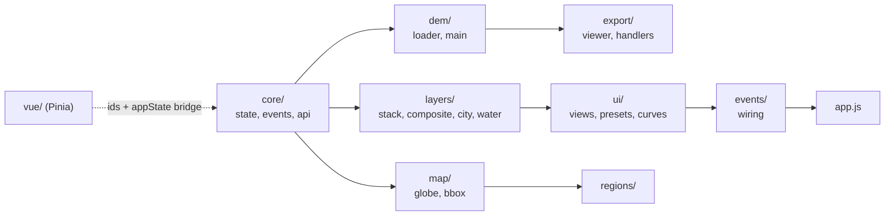
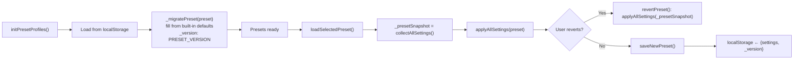

# Frontend module map — map2stl

_Last updated: 2026-09-28_

Where each piece of browser code lives, and a one-line index of its functions.

- State, the Vue ↔ `window.appState` bridge, control ownership: [frontend.md](frontend.md)
- Stacked-layer canvases: [layer-system.md](layer-system.md)
- Architecture summary: [overview.md § Frontend](overview.md#frontend-summary)
- Paths are relative to `map2stl/`; `js/` below means `app/client/static/js/`.
- Citations are `file::symbol`. Find a definition with
  `grep -rn "function name\|name =" app/client/static/js/`.

---

## How the code is wired

- **Entry:** `app/client/static/js/main.js` imports every module for its side effects, then
  `app.js` last. It is a `type="module"` script; vue-main.js (the Vite build of
  `app/client/static/js/vue/main-vue.ts`) is loaded just before it. See [frontend.md](frontend.md).
- **Most modules publish on `window.*`** (`window.loadDEM`, `window.setStackMode`, ...) and
  coordinate through `window.appState` and `window.events`.
- **Pure helper modules use real ES exports** (no DOM, no `window`), unit-tested under
  `tests/js/`. They are imported by other modules and by Vue components:

| Pure module | Imported by |
|---|---|
| `app/client/static/js/modules/export/print-scale.js` | `dem-main.js`, `export-handlers.js`, `model-viewer.js`, `workflow-presets.js`, Vue |
| `app/client/static/js/modules/export/puzzle-cuts.js` | `model-viewer.js` |
| `app/client/static/js/modules/export/city-quickview.js` | `model-viewer.js` |
| `app/client/static/js/modules/export/city-fullmodel.js` | `model-viewer.js` |
| `app/client/static/js/modules/export/export-poll.js` | `export-handlers.js` |
| `app/client/static/js/modules/layers/composite-spec.js` | `composite-dem.js`, `export-handlers.js` |
| `app/client/static/js/modules/layers/hydrology-print.js` | `composite-dem.js`, `water-hydrology-combined.js` |
| `app/client/static/js/modules/layers/city-fetch.js` | `city-overlay.js`, `export-handlers.js`, Vue |
| `app/client/static/js/modules/layers/building-heights.js` | `export-handlers.js`, Vue |
| `app/client/static/js/modules/layers/landmark-overrides.js` | `export-handlers.js`, Vue |
| `app/client/static/js/modules/ui/workflow-presets.js` | `presets.js`, Vue |
| `app/client/static/js/modules/ui/guide-links.js` | `guides.js`, Vue |
| `app/client/static/js/modules/dem/dem-sampling.js` | Vue (`DemSamplingInfo.vue`) |
| `app/client/static/js/modules/map/landmarks.js` | Vue (`LandmarkSearch.vue`, `EdgeLandmarkWarnings.vue`) |



---

## `modules/` by folder

### `core/` — foundation

| File | Key symbols | Purpose |
|---|---|---|
| `storage-migrate.js` | `migrateStorageKeys` | Imported first: copies `strm2stl_*` localStorage keys to `map2stl_*` |
| `state.js` | `window.appState` | Pre-Vue Proxy store (`get/set/on/off/emit`); replaced by the Pinia bridge at DOMContentLoaded ([frontend.md](frontend.md#how-state-flows-windowappstate--pinia)) |
| `events.js` | `window.events`, `window.EV` | Event bus + constants. `EV.BBOX_CHANGED` fires from `setBboxRectangle`, the mini-map drag and a drawn rectangle |
| `api.js` | `window.api` | All fetch helpers: regions, terrain, export, cities (`start/status/result/cancel`, landmarks), composite (`demMerge`, city raster), registration, mesh, geocode, cache (`clearRegion` only), settings (`default` only) |
| `ui-helpers.js` | `showToast`, `toastAnimation`, `toastDropIndex`, `setLayerStatus`, `getProjectionParams`, `emitStackUpdate`, `decode*Values` | Toasts (plain text, max 3, errors persist; see frontend.md "Feedback surfaces"), layer status; `getProjectionParams()` is the single source of projection settings for every layer fetch (F-PROJ-DIMS); base64 grid decoders |
| `usage-log.js` | `window.usageLog` (`pause`, `resume`, `flush`, `session`) | Local usage log (F-USAGE): capture-phase clicks and committed changes, `EV.BBOX_CHANGED` / `REGION_SELECTED` / `DEM_LOADED`, wraps `window.fetch` (every `/api/` call's status and ms), `showToast`, errors; batches to `POST /api/usage` every 5 s. Secret-looking controls are redacted; `map2stl_usage_log` = `off` pauses |
| `cache.js` | `waterMaskCache` | In-memory water-mask cache, oldest-inserted evicted first (the cache-status panel and its 5 s poll were removed 2026-09-30) |

### `dem/` — DEM rendering

| File | Key symbols | Purpose |
|---|---|---|
| `dem-loader.js` | `mapElevationToColor`, `renderSatelliteCanvas`, `drawColorbar`, `drawHistogram`, `updateAxesOverlay`, `enableZoomAndPan` | Colormaps, colourbar, histogram, axes, DEM canvas zoom |
| `dem-gridlines.js` | `drawGridlinesOverlay`, `recolorDEM`, `rescaleDEM`, `resetRescale` | Lat/lon gridlines; recolour / rescale the rendered DEM |
| `dem-main.js` | `loadDEM`, `renderDEMCanvas`, `populateDemSources`, `loadSatelliteImage`, `loadSatelliteRGBImage`, `WORKFLOW_STEPS` | DEM fetch + orchestration; renders pixels off-thread in `app/client/static/js/workers/dem-render-worker.js` |
| `dem-sampling.js` | `describeDemSampling`, `UPSAMPLE_WARN` | Pure: "~30 m → 165×165 real samples, upsampled to 600×600", warns above 4× |

### `layers/` — layer data, stack, composite

| File | Key symbols | Purpose |
|---|---|---|
| `stacked-layers.js` | `updateStackedLayers`, `setStackMode`, `moveLayer`, `setLayerOpacity`, `getLayerOrder`, `getActiveLayers`, `applyStackedTransform`, `setSplitViewEnabled`, `clearAllLayerBuffers`, `drawLayerGrid`, `LAYER_CANVAS_IDS`, `LAYER_AUTOLOAD` | The multi-layer stack; owns order and active set. See [layer-system.md](layer-system.md) |
| `composite-dem.js` | `computeCompositeDem`, `applyCompositeToDem`, `previewComposite`, `buildCompositeLayerSpec`, `setupCompositeDemControls` | Additive, toggleable height channels + histograms. OSM channels are 2D preview only; Apply/export use the terrain-only composite (F-ARCH). The only composite UI (the old merge panel and dem-merge.js were removed) |
| `composite-spec.js` | `FEATURE_SOURCES`, `WATER_TERRAIN_SOURCES`, `RIVER_SOURCES`, `waterTerrainLayers`, `buildCompositeLayerSpec`, `anyFeatureChannelEnabled`, `compositeInputKey`, `compositeApplyCheck` | Pure: panel params → server `MergeLayerSpec` list; Apply-to-DEM staleness guard |
| `mesh-layer.js` | `uploadMeshLayer`, `selectLibraryMeshFile`, `computeMeshHeightmap`, `autoRegisterMesh`, `suggestedMeshResolutionM`, `applyMeshRegistration`, `applyMeshToDem`, `clearMeshLayer` | STL/OBJ import (F-MESHIMPORT) → heightmap → registered `MeshImport` layer → optional DEM merge; `regions.js::selectCoordinate` clears it on region switch |
| `mesh-registration.js` | `openMeshRegistrationModal`, `closeMeshRegistrationModal`, `computeMeshRegistration`, `undoLastMeshPointPair`, `clearMeshPointPairs` | Point-pair picker (DEM vs mesh) feeding the `/register` affine fit |
| `water-mask.js` | `loadWaterMask`, `loadEsaLandCover`, `renderWaterMask`, `renderEsaLandCover`, `renderCombinedView` | Water mask + ESA land cover |
| `hydrology-print.js` | `riverSourceFromHydro`, `readHydrologyRiverControls`, `loadedDemGrid`, `hydrologyPrintQuery`, `readRiverDepthScale`, `readRiverDepthMm`, `NEED_DEM_MESSAGE` | Pure: the one river-settings source (Fetch → Hydrology) and the print-model `/api/terrain/hydrology` query |
| `water-hydrology-combined.js` | `loadWaterHydrology`, `clearWaterHydrology`, `renderWaterHydrologyCombined`, `rerenderWaterHydrology` | Water + hydrology as one layer. Preview = print: the hydrology half asks for the composite's own river carve on the loaded DEM (`dem_source`, the DEM request's `dim`, Composite Depth ×); without a loaded DEM it shows "Load the DEM first" and requests nothing. Legend tooltips count px (`order_counts_unit: "px"`) or reaches; sets `appState.waterHydrologyCanvas` and `appState.lastWaterHydrology`. Samples each canvas pixel from the grid (no forward copy, which striped narrower grids). `#hydroColorMode`: depth (blue) or Strahler order (`HYDRO_ORDER_COLORS`, legend `#hydroOrderLegend`), redrawn without a request. Skips the separate water mask when the hydrology grid carries `water_surface` |
| `trails-overlay.js` | `loadTrails`, `renderTrails`, `refreshTrailsCategories`, `clearTrails`, `cancelTrailsLoad` | Ski + hiking grids from `/api/terrain/trails`; retains `appState.lastTrailsData` so display controls repaint without refetching |
| `city-overlay.js` | `loadCityData`, `cancelCityFetch`, `clearCityOverlay`, `selectCityBuilding`, `enhanceBuildingHeights`, `_drawCityCanvas` | OSM fetch (via `city-fetch.js`), terrain Z, feature pre-bake, building picking |
| `city-render.js` | `renderCityOverlay`, `renderCityOnDEM`, `_renderViaWorker`, `loadCityRaster` | City overlay painting (off-thread in `app/client/static/js/workers/city-worker.js` when OffscreenCanvas is available; each view keeps its last picture) + `/api/cities/raster` layer |
| `city-fetch.js` | `runCityFetch`, `summarizeCityFetch`, `mirrorHost`, `LAYER_STATE_ICON`, `cityPanelOsmParams`, `cityBuildOsmParams` | Pure: start → poll → result of the background city fetch; per-layer summary for `CityFetchProgress.vue` |
| `building-heights.js` | `summarizeBuildingHeights`, `heightSourceGroup`, `buildingsWithOverrides`, `hasOverrides` | Pure: height-source summary, histogram; City Model `layer_data` with overrides |
| `landmark-overrides.js` | `overridesForBuild`, `draftFromSpec`, `specFromDraft`, `overrideLabel`, `meshBounds`, `CATEGORY_LABELS` | Pure: landmark override specs (osm / ndsm / mesh), F-LANDMARK |

### `map/` — map, globe, bbox

| File | Key symbols | Purpose |
|---|---|---|
| `map-globe.js` | `initMap`, `initGlobe`, `setTileLayer`, `toggleDemOverlay`, `toggleTerrainOverlay`, `toggleMapGrid` | Leaflet map + Three.js globe; raster overlays go through Mercator ([why](../decisions/frontend.md#2026-08-30--raster-overlays-are-resampled-to-mercator-before-they-touch-the-map)) |
| `bbox-panel.js` | `setBboxRectangle`, `setBboxInputValues`, `initBboxMiniMap`, `syncBboxMiniMap`, `toggleBboxMiniMap` | Bbox bar + mini-map. `setBboxRectangle` is the one writer of `appState.boundingBox`; `setBboxInputValues` is display only ([why](../decisions/frontend.md#2026-08-28--one-helper-owns-appstateboundingbox)) |
| `compare-view.js` | `updateCompareCanvases` | Inline side-by-side layer compare in the Edit view |
| `landmarks.js` | `toBbox`, `bboxKey`, `extendBboxToInclude`, `bboxContains`, `placeCaption` | Pure helpers for `LandmarkSearch.vue` and `EdgeLandmarkWarnings.vue` |

### `regions/`

| File | Key symbols | Purpose |
|---|---|---|
| `regions.js` | `loadCoordinates`, `selectCoordinate`, `goToEdit` | Region load, selection |
| `region-ui.js` | `renderCoordinatesList`, `setupContinentFilter`, `groupRegionsByContinent`, `resolveRegionContinent`, `detectContinent` (from `continent.js`), `initRegionNotes`, `getRegionNote`, `setRegionNote`, `renameRegionLocalData` | Sidebar list (the map's viewport set under a "Showing N of M in view · Show all" line; a search or Show all lists every region; ✎ button per row; row ↔ box hover link), continent filter, notes in localStorage |
| `region-boxes.js` | `drawRegionBoxes`, `refreshRegionViewSet`, `getViewportRegionSet`, `highlightRegionBox` | Saved-region boxes on the Explore map: outlines over a dark halo, selected = accent, hover = brighter + name tooltip; only the viewport set is drawn, recomputed on moveend/zoomend/resize (150 ms debounce), load, selection, continent filter; the list reads the same set |
| `viewport-regions.js` | `selectViewportRegions`, `VIEWPORT_REGION_LIMIT` | Pure: regions that intersect and fit the view, largest first, ≤ 20, plus the selected one |
| `region-geometry.js` | `bboxSizeKm`, `formatBboxSize`, `formatBboxDims`, `boxAround`, `placeBox`, `parseBbox`, `regionBoxStyle`, `regionHaloStyle`, `REGION_ACCENT` | Pure: box size in km ("12.4 × 8.1 km · 100 km²"), N/S/E/W parsing, Leaflet box styles |
| `region-editor.js` | `openRegionEditor`, `setupRegionEditor` | Sidebar region editor (`SidebarEditView.vue`): name (rename), group, N/S/E/W with live size readout and map box, Save (one `PUT /api/regions/{old name}`), Delete (`deleteRegion`), Notes |
| `continent.js` | `detectContinent` | Pure: continent of a lat/lon for sidebar grouping. Coarse polylines: Mediterranean coast (southern Spain, Sicily, Malta, Crete are Europe), Suez / Red Sea (Sinai, Levant, Arabia are Asia), Bosphorus (Istanbul's historic centre is Europe), Caucasus crest, Urals at 60 E |
| `regions-import-export.js` | `exportRegionsJson`, `importRegionsJsonFile` | Bulk JSON export/import |

### `export/`

| File | Key symbols | Purpose |
|---|---|---|
| `city-fullmodel.js` | `parseModelParts`, `toViewerFrame`, `partColor` | Pure: the finished City Model's parts file (`/api/export/model-parts/{task_id}`) mapped into the viewer's frame |
| `city-quickview.js` | `buildingPrisms`, `demGroundMm`, `MIN_HEIGHT_MM` | Pure: building footprints as prisms on the 3D preview by the City Model's height rule (quick view until the City Model build) |
| `model-viewer.js` | `initModelViewer`, `previewModelIn3D`, `haversineDiagKm`, `updatePuzzlePreview`, `puzzleEdgesFor`, `resetPuzzleEdges`, `resetViewerCamera`, `setViewerNormals`, `setViewerAutoRotate`, `updateBedOutline`, `rebuildViewerColors` (`_applySatelliteTexture`, `_paintWater`, `_updateCityQuickView`, `_scheduleFullModel`, `_showCityFull`) | Three.js preview of the server's mesh; draggable puzzle cuts; colormap or satellite drape (texture from the Edit tab's satellite canvas, fetched at ≥ the DEM's resolution, UVs from each vertex's DEM pixel) |
| `export-handlers.js` | `downloadSTL`, `downloadModel`, `downloadCrossSection`, `exportPuzzle`, `exportCityModel`, `runPreflight`, `cancelExport`, `_demSettings`, `_asyncExport` | Exports, puzzle and City Model builds, pre-flight |
| `export-poll.js` | `EXPORT_STALL_TIMEOUT_MS`, `createStallWatch`, `formatElapsed`, `exportProgressText` | Pure: stall-based give-up, progress text |
| `puzzle-cuts.js` | `evenEdges`, `nearestEdge`, `moveEdge`, `minPieceMm`, `gridKey`, `isCustom`, `roundEdges` | Pure: puzzle cut positions (mm from west / south) |
| `print-scale.js` | `modelScale`, `bboxDiagonalKm`, `formatGroundLength`, `parseBedSize`, `DEFAULT_BED`, `defaultPieceMm`, `piecesNeeded`, `fillBedMmPerPx`, `bedFitMm` | Pure: model scale, bed size, piece grid (ports of `city_model.choose_scale` / `puzzle.plan_grid`) |

### `ui/`

| File | Key symbols | Purpose |
|---|---|---|
| `view-management.js` | `switchView`, `switchDemSubtab`, `setupDemSubtabs`, `saveCurrentRegion`, `deleteRegion`, `renderSidebarTable`, `toggleBboxLayerVisibility`, `toggleDemSettingsPanel`, `_setSidebarViews`, `loadSelectedRegionDem` | Tabs and sub-tabs (`switchView` is null-safe for any view name); sidebar list/table view (the mode itself is `SidebarPanel.vue`'s); region delete (confirm → `DELETE /api/regions/{name}` → reload); show/hide region boxes on the map; "Load DEM ›" on the Explore map (clicks `#tabEdit` then `#loadDemBtn`) |
| `app-setup.js` | `setupStackedLayers`, `loadAllLayers`, `setupAutoReload` | Init wiring; `loadAllLayers` uses `Promise.allSettled` |
| `presets.js` | `initPresetProfiles`, `applyPreset`, `collectAllSettings`, `applyAllSettings`, `saveNewPreset`, `revertPreset`, `loadSelectedPreset`, `setupAutoSave`, `_migratePreset` | Presets, auto-save, `PRESET_VERSION` migration, revert snapshot. Sends `projection.clip_valid_region` only |
| `settings-compat.js` | `normalizeSettingsKeys` | Pure: renames legacy keys in saved region settings / presets (`projection.clip_nans` → `clip_valid_region`) before `applyAllSettings` reads them |
| `workflow-presets.js` | `WORKFLOW_PRESETS`, `applyFields`, `applyWorkflowPreset`, `regionDemSource` | Pure: City / Mountain / Region / Coast presets; returns an undo list |
| `curve-editor-state.js` | `CurveEditorState`, `CURVE_PRESETS` | Curve editor state class + presets |
| `curve-editor.js` | `initCurveEditor`, `applyCurveTodem`, `undoCurve`, `redoCurve`, `setCurvePreset`, `drawCurve` | Elevation curve editor |
| `keyboard-shortcuts.js` | `setupKeyboardShortcuts` | Ctrl+1/2/3 = Explore / Edit / Extrude (the header tabs; no Globe shortcut), Ctrl+S, Ctrl+R, Ctrl+Z/Y, Escape, arrows, G |
| `guide-links.js` | `parseGuideLocation`, `guideHref`, `guideLinkTarget` | Pure: `/guides#slug/anchor` links |

### `events/` — listener wiring

| File | Key symbols |
|---|---|
| `event-listeners.js` | `setupEventListeners` (entry, called from `app.js`) |
| `event-listeners-map.js` | `_setupMapAndDemListeners`, `_setupBboxListeners` |
| `event-listeners-export.js` | `_setupModelExportListeners`, `_setupCityAndExportListeners` |
| `event-listeners-ui.js` | `_setupResizablePanel`, `_setupSettingsJsonToggle` |

### `workers/`

| File | Started by | Purpose |
|---|---|---|
| `app/client/static/js/workers/dem-render-worker.js` | `app/client/static/js/modules/dem/dem-main.js::_getDemWorker` | Elevation + colour LUT → RGBA pixels |
| `app/client/static/js/workers/city-worker.js` | `app/client/static/js/modules/layers/city-render.js::_getCityWorker` | City layers onto an OffscreenCanvas → ImageBitmap |

---

## Vue components

Under `app/client/static/js/vue/components/`. Store and bridge: [frontend.md](frontend.md#vue-layer).

| Folder | Components (parent) |
|---|---|
| `layout/` | `AppShell` (App), `MainHeader`, `MeshRegistrationModal` (AppShell) |
| `shared/` | `CollapsibleSection`, `ToolSwitches` (DemSettingsPanel, ModelContainer) |
| `dem/` (F-DESIGN, F-EDITPANEL) | `EditLayersPanel` (DemContainer), `LayerSettings` + `settings/SetRow` (DemSettingsPanel) |
| `sidebar/` | `SidebarPanel` (App); `SidebarListView`, `SidebarEditView`, `RegionListTable` (SidebarPanel) |
| `views/` | `ContentArea` (App); `MapContainer`, `DemContainer`, `ModelContainer` (ContentArea); `LandmarkSearch`, `EdgeLandmarkWarnings` (MapContainer, DemSettingsPanel); `PreflightPanel`, `ModelScorePanel` (ModelContainer) |
| `dem/` | `DemSettingsPanel`, `CityBuildingsPanel` (DemContainer); in DemSettingsPanel: `WorkflowPresetBar`, `PresetsSection`, `ProjectionSection`, `FetchLayersSection`, `CityLandmarksSection`, `VisualizationSection`, `LayerViewSection`, `LayerDisplaySections`, `CompositeDemSection`, `MeshImportSection`, `PlateRegistrationSection`; in FetchLayersSection: `CityFetchProgress`, `DemSamplingInfo` |
| `shared/` | `CollapsibleSection` (used throughout) |

- **Layer rack:** `LayerViewSection.vue` is a view over `stacked-layers.js` and rebuilds on the
  `layer-stack-changed` window event.
  [why](../decisions/composite.md#2026-09-06--the-layer-engine-owns-stack-state-and-the-rack-is-a-view)
- **Plate registration / model scoring** (F-REGION §5, F-LANDMARK §6):
  - `PlateRegistrationSection.vue` (Composite tab): pick a library plate → `api.registration.match`
    → `start` → poll `status` → verdict + placement; **Save to sidecar** posts through
    `api.mesh.setLibraryLocation`.
  - `ModelScorePanel.vue` (Export tab, City Model): scores `osmCityData.buildings` (with
    `cityHeightOverrides`) or an uploaded STL against `api.registration.criticReferences`.
  - `MeshImportSection.vue` auto-register shows the `scores` breakdown and a `report_url` link.
- **Landmarks panel** (F-LANDMARK §3–§5): `CityLandmarksSection.vue` → `api.cities.landmarks`,
  `landmarkPreview`; saves via `api.regions.saveLandmark` + `appState.cityLandmarkOverrides`.

---

## `main.js` import order

Foundation before dependents; keep it:

```
core/storage-migrate → core/events → core/api → core/cache → core/ui-helpers → core/usage-log → core/state
dem/dem-loader → dem/dem-gridlines → ui/presets → ui/curve-editor-state → ui/curve-editor
layers/city-overlay → layers/city-render → layers/stacked-layers → layers/composite-dem
layers/mesh-layer → layers/mesh-registration
export/export-handlers → export/model-viewer → map/compare-view
regions/region-ui → regions/regions-import-export → layers/water-mask
layers/water-hydrology-combined → layers/trails-overlay
map/map-globe → regions/region-boxes → regions/regions → regions/region-editor → map/bbox-panel
ui/app-setup → ui/keyboard-shortcuts
events/event-listeners-map → events/event-listeners-export → events/event-listeners-ui → events/event-listeners
ui/view-management → dem/dem-main → app.js
```

Pure modules (`composite-spec`, `city-fetch`, `print-scale`, ...) load through the imports above.

---

## Standalone pages

Not part of `main.js`; each owns its page.

| Script | Page | Purpose |
|---|---|---|
| `app/client/static/js/reports.js` | `app/client/templates/reports.html` (`GET /reports`) | Pipeline results browser: `/api/reports/index`, `/api/reports/registration` |
| `app/client/static/js/guides.js` | `app/client/templates/guides.html` (`GET /guides`) | In-app SOP guides from `/api/guides/{slug}`; imports `guide-links.js` |

## Notes

- Vendor globals: `window.L` (`/static/vendor/leaflet.js`, `leaflet-draw.js`), `window.THREE`
  (cdnjs r128) load before the module scripts.
- Colormap names in the UI must match the branches in
  `app/client/static/js/modules/dem/dem-loader.js::mapElevationToColor`.

## Preset lifecycle



---

## Function index

One line per function. `window.*` unless marked (private) or (export).

### `app.js`

| Function | Purpose |
|---|---|
| `clearLayerCache()` | Reset DEM, water mask, layer bboxes/status, composite and satellite canvases |
| `clearLayerDisplays()` | Clear layer canvases + status indicators |
| `getCurrentBboxObject()` | `{north, south, east, west}` from the bbox or the form |
| `isLayerCurrent(layer)` | True if the layer's bbox matches the current one |

### `dem-loader.js`, `dem-gridlines.js`

| Function | Purpose |
|---|---|
| `mapElevationToColor(t, cmap)` | 0–1 → RGB |
| `renderSatelliteCanvas(vals, w, h)` | RGB pixels → canvas |
| `updateAxesOverlay(N, S, E, W)` | Axis labels |
| `drawColorbar(min, max, cmap)` | Colourbar legend |
| `drawHistogram(values)` | Elevation histogram + cumulative |
| `enableZoomAndPan(canvas)` | Wheel/drag zoom on the DEM canvas |
| `drawGridlinesOverlay()` | Lat/lon gridlines |
| `recolorDEM()` | Re-render the DEM with current settings |
| `rescaleDEM(vmin, vmax)` / `resetRescale()` | Rescale display / back to data range |

### `dem-main.js`

| Function | Purpose |
|---|---|
| `loadDEM(highRes?)` | Fetch, render, update state; snapshots `appState.lastDemRequest` |
| `renderDEMCanvas(vals, w, h, cmap, vmin, vmax)` | Elevation LUT → canvas (via the worker) |
| `populateDemSources()` | Fill `#paramDemSource` from `GET /api/terrain/sources` |
| `loadSatelliteImage()` | ESA land cover (classification raster) |
| `loadSatelliteRGBImage({dim?})` | ESRI satellite imagery (`dim` overrides the resolution control; the 3D drape asks for ≥ the DEM grid) |
| `updatePrintDimensions()` | Print-size readout |

### `water-mask.js`, `water-hydrology-combined.js`

| Function | Purpose |
|---|---|
| `loadWaterMask()` | `/api/terrain/water-mask` (cached) |
| `loadEsaLandCover()` | ESA land cover |
| `renderWaterMask(data)` / `renderEsaLandCover(data)` | Render to canvas |
| `renderCombinedView()` | DEM + water + land cover |
| `loadWaterHydrology()` | Water mask + print-model hydrology (`hydrologyPrintQuery`: `dem_source`, `dim`, `source`, `min_order`, `width_scale`, `depth_scale`, projection) in parallel → combined canvas |
| `clearWaterHydrology()` | Clear combined canvas + `appState.waterHydrologyCanvas` |

### `trails-overlay.js`

| Function | Purpose |
|---|---|
| `loadTrails({activate})` | Fetch `/api/terrain/trails`, retain payload, render. `activate` (default true) switches the layer on; `loadAllLayers` and `LAYER_AUTOLOAD` pass false |
| `renderTrails(data?)` | Paint ski + hiking; ski wins on overlap; area masks tinted; optional colour-by-difficulty; fires `trails-rendered` |
| `_viewSettings()` (private) | Read every Trails Display control in one place |
| `refreshTrailsCategories()` | Repaint from the retained payload; never refetches |
| `clearTrails()` / `cancelTrailsLoad()` | Clear / abort |

### `city-overlay.js`, `city-render.js`

| Function | Purpose |
|---|---|
| `loadCityData()` | `POST /api/cities/start` + poll (`city-fetch.js`), terrain Z, store `osmCityData` |
| `cancelCityFetch()` | Abort and cancel the server task |
| `clearCityOverlay()` | Remove city overlays |
| `selectCityBuilding(...)` | Pick a building on the overlay |
| `_drawCityCanvas(ctx, ...)` | Core draw: alpha-batched buildings, sub-pixel skipped |
| `renderCityOverlay()` | Paint the overlay on the stack (worker when available) |
| `renderCityOnDEM()` | Paint `.city-dem-overlay` on the DEM image |
| `loadCityRaster()` | `/api/cities/raster` → `appState.cityRasterSourceCanvas` |

### `stacked-layers.js`

| Function | Purpose |
|---|---|
| `updateStackedLayers()` | Draw each active layer into its buffer, then composite onto `#stackViewCanvas` in `_layerOrder` |
| `setStackMode(mode)` | Toggle a layer; switching on fetches missing data via `LAYER_AUTOLOAD` ([why](../decisions/frontend.md#2026-08-28--layers-fetch-their-own-data-when-switched-on)) |
| `moveLayer(mode, delta)` | Swap past the next active layer; fires `layer-stack-changed` |
| `setLayerOpacity(mode, v)` | Per-layer alpha |
| `getLayerOrder()` / `getActiveLayers()` | Copies of the order and the active set (read by `LayerViewSection.vue`) |
| `setSplitViewEnabled(on)` / `isSplitViewEnabled()` | Composite / Satellite side-by-side |
| `applyStackedTransform()` | Shared CSS zoom/pan transform |
| `enableStackedZoomPan()` | Wheel/drag + hover tooltip on `#layersStack` |
| `drawLayerGrid()` | Graticule on `#layerGridCanvas`; needs only `currentDemBbox` |
| `clearAllLayerBuffers()` | Free every buffer and reset zoom (region change) |

### `composite-dem.js`, `composite-spec.js`

| Function | Purpose |
|---|---|
| `computeCompositeDem()` | Terrain channels (DEM, water, land cover, satellite, trails; kept for Apply) then city channels for the 2D preview only |
| `_hydroContribution(w, h)` (private) | Rivers + lakes for the preview: posts the `waterTerrainLayers` stack on a zero-weight DEM to `/api/composite/dem-merge`, so only the server's carve returns |
| `_trailsContribution(w, h)` (private) | Retained trails relief resampled to the DEM grid; deeper cut wins; weight defaults to 0 |
| `applyCompositeToDem()` | Refuse stale / flat results (`compositeApplyCheck`), copy the terrain-only composite into `lastDemData.values`, publish `appState.compositeLayerSpec` |
| `buildCompositeLayerSpec({includeFeatures})` | Wrapper over the pure builder; terrain-only unless `includeFeatures` |
| `setupCompositeDemControls()` | Wire sliders, toggles, buttons, split view; `change` on `#hydroSource` / `#hydroMinOrder` / `#hydroWidthFactor` re-carves when rivers are on |
| `_syncRiverParamsFromHydrology()` (private) | Copy river source / min order / width from Fetch → Hydrology into `params`; called by `_currentInputs`, `_hydroContribution`, `buildCompositeLayerSpec`, `_updateContribStatus` |
| `_drawHistogram(canvas, values)` / `_renderAllHistograms(channels)` (private) | Per-channel + combined histograms |
| `FEATURE_SOURCES` (export) | `osm_buildings/roads/waterways/walls`; preview only, filtered out of `composite_layers` at export |
| `buildCompositeLayerSpec(params, ctx, opts)` (export) | Panel params → ordered `MergeLayerSpec` list; `{layers, unsupported}` |
| `WATER_TERRAIN_SOURCES` / `RIVER_SOURCES` (export) | `hydrorivers`, `natural_earth_rivers`, `lakes` — terrain sources (`geo2stl/water_layers.py`) that stay in the export spec |
| `waterTerrainLayers(params, dim)` (export) | River + lake layers, shared by the spec and the preview |
| `compositeInputKey(...)` / `compositeApplyCheck(result, current)` (export) | Input identity; `{ok}` or `{ok:false, reason}` |

### `mesh-layer.js`, `mesh-registration.js`

| Function | Purpose |
|---|---|
| `uploadMeshLayer(file)` / `selectLibraryMeshFile(relPath, filename)` | Upload or pick from the mesh library |
| `computeMeshHeightmap(opts)` | Heightmap for the DEM bbox; preview canvas |
| `autoRegisterMesh(opts)` | Geocode filename → automatic OSM registration → always opens the manual picker |
| `suggestedMeshResolutionM(bbox)` | ~300 px on the longer side |
| `applyMeshRegistration(result)` | Render `MeshImport`; fires `mesh-import-registered` |
| `applyMeshToDem(blendWeight)` | Patch `lastDemData.values` inside the mesh footprint |
| `clearMeshLayer()` | Reset mesh state; called on region switch |
| `openMeshRegistrationModal()` / `computeMeshRegistration()` | Show picker / POST pairs to `/register` |
| `undoLastMeshPointPair()` / `clearMeshPointPairs()` | Edit pending pairs |

### `model-viewer.js`

| Function | Purpose |
|---|---|
| `initModelViewer()` | Three.js scene |
| `previewModelIn3D()` | Build the preview; sets `appState.modelPreviewState` |
| `haversineDiagKm()` | Bbox diagonal |
| `updatePuzzlePreview()` | Draw cut lines at `appState.puzzleEdges` or evenly |
| `puzzleEdgesFor(cols, rows)` | Dragged cuts `{col_edges_mm, row_edges_mm}`, null for even |
| `resetPuzzleEdges()` | Back to the even split |

### `export-handlers.js`

| Function | Purpose |
|---|---|
| `downloadSTL()` / `downloadModel(format)` / `downloadCrossSection()` | Exports |
| `exportPuzzle()` / `exportCityModel()` | Async builds; bodies from `_puzzleExtra()` / `_cityExtra()` |
| `_asyncExport(format, extra, fileName)` (private) | Start → poll → download; stall-based give-up |
| `_demSettings()` (private) | DEM part of the body from `appState.lastDemRequest` (+ composite spec) |
| `runPreflight(format)` | `POST /api/export/preflight` with that build's body |
| `cancelExport()` | Stop polling (client-side) |

### `regions/`

| Function | Purpose |
|---|---|
| `loadCoordinates()` | Fetch regions, draw boxes + list (`drawRegionBoxes`) |
| `selectCoordinate(i)` | Select + fly to region |
| `goToEdit(i)` | Open region in Edit |
| `renderCoordinatesList()` | Sidebar list |
| `groupRegionsByContinent(regions)` | Continent grouping |
| `initRegionNotes()` | Notes from localStorage (edited in the region editor) |
| `openRegionEditor(i)` | Select + open the sidebar region editor |
| `refreshRegionViewSet()` / `getViewportRegionSet()` | Viewport set shared by map boxes and list |
| `exportRegionsJson()` / `importRegionsJsonFile(file)` | Bulk JSON |

### `ui/`

| Function | Purpose |
|---|---|
| `initPresetProfiles()` / `applyPreset(p)` | Load presets / apply one |
| `collectAllSettings()` / `applyAllSettings(s)` | Settings object ↔ form |
| `initCurveEditor()` / `applyCurveTodem()` | Curve editor setup / apply |
| `undoCurve()` / `redoCurve()` | Curve history |
| `CurveEditorState.interpolate(x)` (method) | Spline value at x∈[0,1]; backs a 1024-entry LUT |
| `switchView(view)` / `switchDemSubtab(tab)` | Tabs; `switchView` skips a missing tab or container instead of throwing |
| `setupDemSubtabs()` | Idempotent sub-tab wiring; re-runs on each Edit entry ([why](../decisions/frontend.md#2026-09-04--a-setup-function-that-re-runs-must-bind-idempotently)) |
| `_setSidebarViews(state)` | List or table view for a sidebar mode |

### `map/`

| Function | Purpose |
|---|---|
| `initMap()` / `initGlobe()` | Leaflet map + draw control / Three.js globe |
| `setTileLayer(key)` | Switch base tiles |
| `toggleDemOverlay(show)` | Terrain overlay on the map |
| `updateCompareCanvases()` | Inline layer compare (Edit view) |

### `guides.js` (standalone, ES module)

State on `window.guidesPage`.

| Function | Purpose |
|---|---|
| `openGuide(slug, anchor, {push})` | Fetch `/api/guides/{slug}` when it changes, render + TOC, update URL, scroll |
| `fromLocation()` | URL → `{slug, anchor}` |
| `renderList()` / `renderToc(toc)` | Guide list; TOC |
| `trackSections(toc)` | IntersectionObserver TOC highlight |
| `wrapTables(root)` | Horizontal scroll at phone width |
| `openLightbox(img)` / `closeLightbox()` | Screenshot lightbox |

"? Guide" links live in `DemSettingsPanel.vue` and `ModelContainer.vue`; the Guides row is in
the header's "?" help menu (`MainHeader.vue`). Tests: `tests/js/guideLinks.test.js`.

### `reports.js` (standalone)

One IIFE on `window.reportsPage`.

| Function | Purpose |
|---|---|
| `load()` / `loadRegistration()` | Fetch the index + registration reports, rerender |
| `renderRegistration()` | Align-pack table + report list |
| `currentRegions()` / `currentRows()` | Apply search + quality filters |
| `renderTotals()` / `renderSidebar()` | Header chips; sidebar lists |
| `seedTable(rows, withRegion)` | Per-seed metrics |
| `renderOverview()` / `renderRegionOverview(pane)` | All regions / one region |
| `loadHeights(dir)` | `/api/reports/heights/{dir}` |
| `renderPanoramas()` / `renderViews()` | Panorama lanes / street-view grid |
| `renderActive()` / `setTab(tab)` | Draw the visible tab |
| `selectRegion(dir)` / `selectAll()` | Sidebar selection |
| `openFile(url, label)` / `openLightbox(src, cap)` | Report iframe / image overlay |
| `init()` | Wire tabs, filters, search, lightbox; `load()` |
