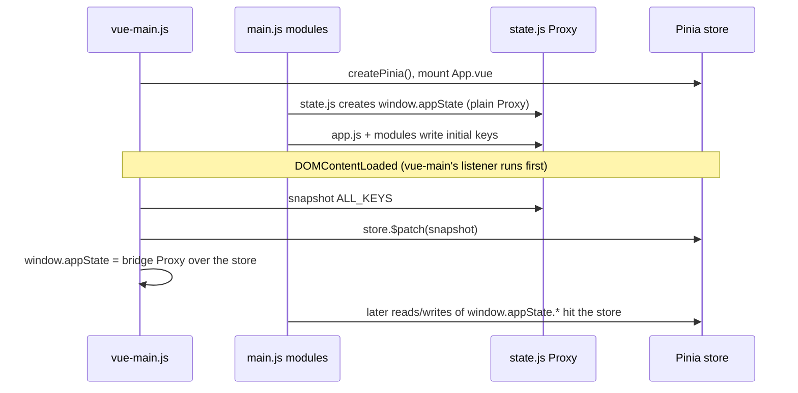

# Frontend — state and control ownership

_Last updated: 2026-09-28_

How the browser client is put together: the two halves on one page, who owns shared state, which
file owns which pipeline control, and the conventions a change must respect.

- Module map and function index: [frontend-modules.md](frontend-modules.md)
- Stacked-layer canvas pipeline: [layer-system.md](layer-system.md)
- What the pipeline does server-side: [pipeline.md](pipeline.md), [overview.md](overview.md)
- Code paths below are relative to `map2stl/`.

---

## Two frontends, one DOM

`app/client/templates/index.html` loads two `type="module"` scripts, in this order:

| Half | Source | Served as | Owns |
|---|---|---|---|
| Vue 3 + Pinia + PrimeVue | `app/client/static/js/vue/` (TypeScript, `.vue`) | /static/js/vue-main.js, a Vite build into `dist/` | Nearly all markup; a growing set of reactive panels |
| Plain ES modules | `app/client/static/js/modules/**`, `app.js`, entry `main.js` | Raw files, no build step | Most behaviour: fetches, canvases, export, presets |

- **Direction: one frontend, Vue.** Vanilla code moves behind components and stores one piece at a
  time. [why](../decisions/frontend.md#2026-09-26--standardise-on-vue-and-retire-v2) ·
  [F-FE1 plan](../plans/active/F-FE1-vue-consolidation.md)
- **`dist/` is gitignored.** A fresh clone has no built vue-main.js and the page renders blank.
  - Fix: `npm install && npm run build` in `map2stl/`.
  - `app/server/server.py` logs an error at startup when the bundle is missing.
- **Edits to `.vue` / `.ts` need `npm run build`**; edits to `static/js/**` are served raw and
  need only a reload.

### Vue layer

| File | Role |
|---|---|
| `app/client/static/js/vue/main-vue.ts` | Creates the app + Pinia, mounts `App.vue` on `#vue-app`, registers `ModelScorePanel` globally, installs the appState bridge |
| `app/client/static/js/vue/App.vue` | Root: teleports `SidebarPanel` into `#vue-sidebar`, `ContentArea` into `#vue-content-area`; renders `AppShell` |
| `app/client/static/js/vue/stores/app.ts` | The one Pinia store (`app/client/static/js/vue/stores/app.ts::useAppStore`); typed state + `get`/`set` compat actions + `clearLayerCache` |
| `app/client/static/js/vue/stores/types.ts` | Types for the store (`Region`, `DemData`, `BBox`, ...) |
| `app/client/static/js/vue/composables/useAppStateBridge.ts` | `useAppStateBridge()` returns `{ store }`; a thin wrapper, currently unused (components call `useAppStore()` directly) |
| `app/client/static/js/vue/composables/useEventListeners.ts` | Placeholder `onMounted` hook; not called anywhere |
| `app/client/static/js/vue/components/**` | `layout/`, `sidebar/`, `views/`, `dem/`, `shared/` — see [frontend-modules.md § Vue components](frontend-modules.md#vue-components) |

- Components that read the store directly (`useAppStore()`): `CityBuildingsPanel`,
  `CityFetchProgress`, `CityLandmarksSection`, `DemSamplingInfo`, `SidebarPanel`,
  `SidebarEditView`, `SidebarListView`, `EdgeLandmarkWarnings`, `LandmarkSearch`,
  `ModelContainer`.
- Everything else renders controls with hardcoded `id=` attributes that the ES modules find with
  `getElementById`. Those ids are the interface (see [Conventions](#conventions-a-change-must-respect)).

---

## How state flows: `window.appState` ↔ Pinia

There is one state object, reached two ways. Which object backs it depends on the moment.

1. **Before DOMContentLoaded:** `app/client/static/js/modules/core/state.js` creates
   `window.appState`, a Proxy with `get/set/on/off/emit`; direct assignment calls `set` and fires
   listeners. `app.js` and the modules seed their keys here.
2. **At DOMContentLoaded:** `app/client/static/js/vue/main-vue.ts::installAppStateBridge`
   - copies every key in `app/client/static/js/vue/main-vue.ts::ALL_KEYS` from the old Proxy
     into the store (`$patch`);
   - wraps `app/client/static/js/vue/main-vue.ts::RAW_KEYS` (Leaflet/Three objects, canvases,
     callbacks) in `markRaw` so Vue never deep-proxies them;
   - replaces `window.appState` with a bridge Proxy whose reads and writes go to the store, and
     sets `window.__vuePiniaActive = true`.
3. **After:** a module writing `window.appState.x = v` and a component reading `store.x` see the
   same value; Vue re-renders reactively.

Consequences to know:

- **Listeners registered before the swap are dropped.** An `appState.on(...)` at module top level
  subscribes to the old Proxy. Register inside a `DOMContentLoaded` handler (as `app.js`,
  `composite-dem.js`, `city-overlay.js` do).
- **Bridge `on` is a Vue `watch`** (shallow): in-place mutation of an object or array does not
  fire it. **Bridge `emit` re-assigns the same value**, which a watch ignores. After mutating in
  place, assign a new object.
- **Bridge `off(key, fn)` stops every watcher on that key**, not just `fn`.
- **Keys not declared in `app/client/static/js/vue/stores/app.ts`** (e.g. `meshImport`, `lastDemRequest`,
  `compositeLayerSpec`) still work through the bridge but live outside `store.$state`; the
  bridge's `has` trap reports them missing (`'meshImport' in window.appState` is false).
- New shared state that a component will read: declare it in `app/client/static/js/vue/stores/app.ts` (and in `ALL_KEYS`
  if `app.js`/modules seed it before DOMContentLoaded).
- `window.get*` / `window.set*` accessors in `app.js` (`getMap`, `setBoundingBox`, ...) are legacy
  aliases over the same keys.

---

## Where the pipeline's controls live

| Control group | Markup (Vue) | Behaviour (ES module) |
|---|---|---|
| DEM source, resolution, depth/water scale, subtract water | `app/client/static/js/vue/components/dem/FetchLayersSection.vue` | `app/client/static/js/modules/dem/dem-main.js::loadDEM` |
| DEM source list | `#paramDemSource` in `FetchLayersSection.vue` | `window.populateDemSources` in `dem-main.js` fills it from `GET /api/terrain/sources`; unavailable sources are disabled, not hidden |
| Layer rack (visibility, opacity, order) | `app/client/static/js/vue/components/dem/LayerViewSection.vue` | `app/client/static/js/modules/layers/stacked-layers.js::getLayerOrder`, `getActiveLayers`, `moveLayer` |
| Composite panel | `app/client/static/js/vue/components/dem/CompositeDemSection.vue` | `app/client/static/js/modules/layers/composite-dem.js::_computeCompositeDem`, `window.applyCompositeToDem` |
| Model height, base, exaggeration, mm/px, export options, progress bar | `app/client/static/js/vue/components/views/ModelContainer.vue` | `app/client/static/js/modules/export/export-handlers.js::_asyncExport` |
| Header tabs (Explore / Edit / Extrude) | `app/client/static/js/vue/components/layout/MainHeader.vue` | `app/client/static/js/modules/ui/view-management.js::switchView` |
| Settings collect / apply / save / auto-save | `DemSettingsPanel.vue` (`#saveSettingsStatus`) | `app/client/static/js/modules/ui/presets.js::collectAllSettings`, `applyAllSettings`, `setupAutoSave` |
| Region rectangles + hover affordances on the map | — (Leaflet) | `app/client/static/js/modules/regions/regions.js::loadCoordinates` |
| Sidebar mode (width, hide) | `app/client/static/js/vue/components/sidebar/SidebarPanel.vue` | publishes `window.setSidebarMode`; nothing else writes its DOM — [why](../decisions/frontend.md#2026-08-30--vue-owns-the-sidebar-mode-and-nothing-else-touches-its-dom) |

- The old Merge panel and dem-merge.js are gone; the Composite panel is the only composite UI.
  Stack state belongs to the layer engine, the rack is a view —
  [why](../decisions/composite.md#2026-09-06--the-layer-engine-owns-stack-state-and-the-rack-is-a-view).
- Dead components (no importer): `DemSourceSection.vue` (duplicates every control id in
  `FetchLayersSection.vue`; mounting it would break `getElementById`), `EsaLandCoverSection.vue`,
  `SatelliteSection.vue`, `WaterSection.vue`, `WaterLandCoverSection.vue` (all in
  `vue/components/dem/`), and `CacheManagement.vue`, `RegionParamsSection.vue` (in
  `vue/components/sidebar/`). Some `docs/plans/` pages still name `DemSourceSection.vue` as live.

---

## Conventions a change must respect

- **Control ids are the interface.** Renaming an `id=` in a `.vue` file silently breaks the module
  that reads it — no import fails. Grep for the id before renaming.
- **Shared state goes on `window.appState`** (or the store), not a module-local closure. See
  [the bridge](#how-state-flows-windowappstate--pinia) for which to use.
- **One writer per multi-representation state.** Anything that changes the viewed area calls
  `app/client/static/js/modules/map/bbox-panel.js::setBboxRectangle`; the input fields are display
  only. [why](../decisions/frontend.md#2026-08-28--one-helper-owns-appstateboundingbox)
- **Layers fetch their own data when switched on** via `LAYER_AUTOLOAD`; no separate load button.
  [why](../decisions/frontend.md#2026-08-28--layers-fetch-their-own-data-when-switched-on)
- **The DEM request contract runs through the UI.** `loadDEM()` snapshots what it requested (plus
  the server's `dem_id`) into `appState.lastDemRequest`;
  `app/client/static/js/modules/export/export-handlers.js::_demSettings` sends that snapshot at
  export. Never re-derive DEM settings from the DOM at export time. See [pipeline.md](pipeline.md).
- **Setup functions that re-run must bind idempotently.** `window.setupDemSubtabs` (in
  `view-management.js`) runs at init from `app.js` and again on every entry into the Edit view, so
  Vue children mounted later still get wired. Guard each bind with a dataset flag; prefer an
  explicit boolean over a toggle.
  [why](../decisions/frontend.md#2026-09-04--a-setup-function-that-re-runs-must-bind-idempotently)
- **Raster overlays on the Leaflet map are resampled to Mercator first.**
  [why](../decisions/frontend.md#2026-08-30--raster-overlays-are-resampled-to-mercator-before-they-touch-the-map)
- **Workflow vocabulary is defined once**, in `app/client/static/js/modules/dem/dem-main.js::WORKFLOW_STEPS`:
  tabs are nouns (Explore / Edit / Extrude), the hint pairs each with its verb. Keep both using
  the same tab names.

---

## Feedback surfaces

| Situation | What the user sees |
|---|---|
| Export running | Progress bar + "server step (m:ss)" + ✕ Cancel (`#modelProgressCancel`) |
| Export failed | Red bar that stays until the next export, plus a toast |
| Export cancelled | Bar resets, info toast. Client-side only: polling stops and the server task expires under its TTL |
| Export stalled | Gives up after `EXPORT_STALL_TIMEOUT_MS` with no status change and no heartbeat (`app/client/static/js/modules/export/export-poll.js::createStallWatch`), not a wall-clock limit |
| Export with no DEM | Buttons disabled, empty state shown, toast names the missing DEM |
| Settings edited | `#saveSettingsStatus`: "Unsaved changes", then auto-saved after the debounce |
| Leaving with unsaved settings | Native `beforeunload` prompt (`presets.js`) |

- Auto-save defaults **on**; only `localStorage.map2stl_autoSave === "false"` turns it off.

---

## State keys

`S` = declared in `app/client/static/js/vue/stores/app.ts` (reactive in Vue). Others are bridge-only (see caveats above).

### Map & globe

| Key | S | Type | Description |
|---|---|---|---|
| `map` | S | `L.Map` | Main 2D map |
| `globeScene` / `globeCamera` / `globeRenderer` / `globe` | S | Three.js | Globe scene objects |
| `drawnItems` | S | `L.FeatureGroup` | Drawn bbox rectangles |
| `preloadedLayer` | S | `L.FeatureGroup` | Saved-region boxes |
| `editMarkersLayer` | S | `L.FeatureGroup` | Edit buttons inside each bbox |
| `boundingBox` | S | `L.Rectangle \| null` | Active bbox; the value every layer fetch reads. Written only by `setBboxRectangle` |

### Regions

| Key | S | Type | Description |
|---|---|---|---|
| `coordinatesData` | S | `Region[]` | Saved regions |
| `selectedRegion` | S | `Region \| null` | Current region |
| `regionThumbnails` | S | `Record<string,string>` | Region name → thumbnail |

Module-local (not on appState):

- `app/client/static/js/modules/regions/region-ui.js`: `TABLE_PAGE_SIZE` (20), `_tablePage`,
  `_tableSearch`, `regionNotes` (persisted as `map2stl_regionNotes`).
- `app/client/static/js/modules/ui/presets.js`: `PRESET_VERSION` (1), `_presetSnapshot` (taken
  before loading a preset; cleared on revert).
- `app/client/static/js/modules/map/compare-view.js`: `compareData` (left/right panels).

### DEM & layer data

| Key | S | Type | Description |
|---|---|---|---|
| `lastDemData` | S | object | `{values, width, height, min, max, bbox}` |
| `lastDemRequest` | | object | Settings `loadDEM()` requested + `dem_id`; the export's source of truth |
| `currentDemBbox` | S | `BBox` | Bbox of the loaded DEM |
| `demParams` | S | object | `dim`, `depthScale`, `waterScale`, `subtractWater`, `satScale`, `height`, `base` |
| `demSampling` | S | object | `source_resolution` of the last DEM response; read by `DemSamplingInfo.vue` |
| `lastWaterMaskData` | S | object | Water mask + ESA response |
| `layerBboxes` / `layerStatus` | S | object | `{dem, water, landCover}` bbox, and `'empty'\|'loading'\|'ready'\|'error'` |
| `activeDemSubtab` | | string | Current Edit sub-tab |
| `demLayout` | | `{x,y,w,h}` | Letterbox rect of the DEM in the stack (set by `updateStackedLayers`) |
| `satImgSourceCanvas`, `_satImgRawCanvas`, `_satImgBbox` | S | canvas / BBox | Satellite imagery source |
| `cityRasterSourceCanvas` | S | canvas | City height raster (`city-render.js`) |
| `hydrologySourceCanvas` | | canvas | River depression grid (`hydrology-overlay.js`) |
| `waterHydrologyCanvas` | | canvas | Combined water + hydrology layer (`water-hydrology-combined.js`) |
| `trailsSourceCanvas`, `lastTrailsData` | | canvas / object | Trails render + retained payload (`trails-overlay.js`) |
| `meshImport` | | object | `{uploadId, libraryRelPath, filename, heightmap, registered}` (`mesh-layer.js`) |
| `meshSourceCanvas` / `meshPreviewCanvas` | | canvas | Registered mesh layer / unregistered preview |

### Composite

| Key | S | Type | Description |
|---|---|---|---|
| `compositeDemSourceCanvas` | S | canvas | Composite output (`composite-dem.js`) |
| `compositeFeatures` | S | object | Per-channel Float32Arrays + histograms |
| `compositeCityRaster` | S | object | Cached city raster used by the composite |
| `compositeLayerSpec` | | `{layers, unsupported}` | Terrain-only server spec published by `applyCompositeToDem()`; never contains `osm_*` sources. [why](../decisions/composite.md#2026-09-06--both-engines-keep-compositing-and-the-export-falls-back-to-the-browsers-values) |
| `_newCompositeApplied` | | bool | Set by Apply, cleared by a fresh `loadDEM()`; tells `_demSettings()` to send the spec (or inline values). Not saved with the region |
| `demValuesEdited` | | bool | Browser edits (curve, mesh blend) in `lastDemData.values`; export ships them as `dem_values` |
| `originalDemValues`, `curveDataVmin`, `curveDataVmax`, `curvePoints`, `activeCurvePreset` | S | | Curve editor baseline and control points |

### City

| Key | S | Type | Description |
|---|---|---|---|
| `osmCityData` | S | object | `{buildings, roads, waterways, walls}` GeoJSON |
| `osmCityParams` / `osmCityDetail` | | object / `'full'\|'coarse'` | OSM params and tier `loadCityData()` last used; the City Model build reuses them so it hits the same cache entry |
| `cityFetch` | S | object | Background fetch status; read by `CityFetchProgress.vue` |
| `cityHeightOverrides` | S | `Record<number, number>` | Buildings-panel height overrides; sent as `layer_data.buildings` |
| `cityLandmarkOverrides` | S | `Record<string, object>` | Landmark overrides by OSM id; sent as `landmark_overrides` |
| `edgeLandmarks` | S | object | Landmarks near the box edge (`EdgeLandmarkWarnings.vue`) |

### Appearance

| Key | S | Type | Description |
|---|---|---|---|
| `landCoverConfig` / `landCoverConfigDefaults` | S | object | ESA class → `{name, color, elevation}` |
| `waterOpacity` | S | number | 0–1 |
| `sidebarMode` | S | `'expanded'\|'normal'\|'hidden'` | Owned by `SidebarPanel.vue` |
| `activeView` | S | `'map'\|'dem'\|'model'\|'cache'` | Declared for the tab migration; nothing writes it yet, so it stays `'map'` (read by `EdgeLandmarkWarnings.vue`) |

### 3D viewer & export

| Key | S | Type | Description |
|---|---|---|---|
| `terrainMesh` / `viewerScene` | S | Three.js | Extrude preview mesh and scene |
| `generatedModelData` | S | object | Last preview parameters, used by downloads |
| `modelPreviewState` | S | `'idle'\|'building'\|'ready'\|'error'` | Set by `previewModelIn3D`; `ModelContainer.vue` words its empty state from it |
| `puzzleEdges` | S | `{cols, rows, key} \| null` | Dragged puzzle cuts in mm; sent as `col_edges_mm` / `row_edges_mm` |

### Callbacks (markRaw)

`_setDemEmptyState`, `_updateWorkflowStepper` (set by `dem-main.js`), `_applyCurveSettings`,
`showToast`, `haversineDiagKm`.

---

## Known weak points

- **No tiering.** Every setting sits at the same prominence; a primary/advanced split is a design
  call, still open. [context](../decisions/frontend.md#2026-08-26--ui-pass-left-three-design-calls-open)
- **Vue is half-adopted.** Most components are templates for id-based vanilla code; the direction
  is set (state into Pinia, props/events instead of ids) but not done.
  [why](../decisions/frontend.md#2026-09-26--standardise-on-vue-and-retire-v2)
- **Horizontal chrome** (region sidebar + settings panel) is where the map's remaining headroom
  is; vertical chrome is down to the header plus the bbox bar's peek.
  [why](../decisions/frontend.md#2026-09-05--occasionally-needed-chrome-hides-behind-a-peek-not-a-toggle)
- **Layer order:** Fetch and View follow `_layerOrder` in `stacked-layers.js`; the Composite panel
  deliberately keeps application order.
  [why](../decisions/composite.md#2026-09-05--the-composite-panel-stays-in-application-order)
  `moveLayer` mutates `_layerOrder` in place, so a user reorder also changes the stack order.
- **Blend mode** has no UI.
- **A composite is not reproducible from a saved region**: Apply sets a client flag any DEM
  reload clears, and nothing is stored with the region.
