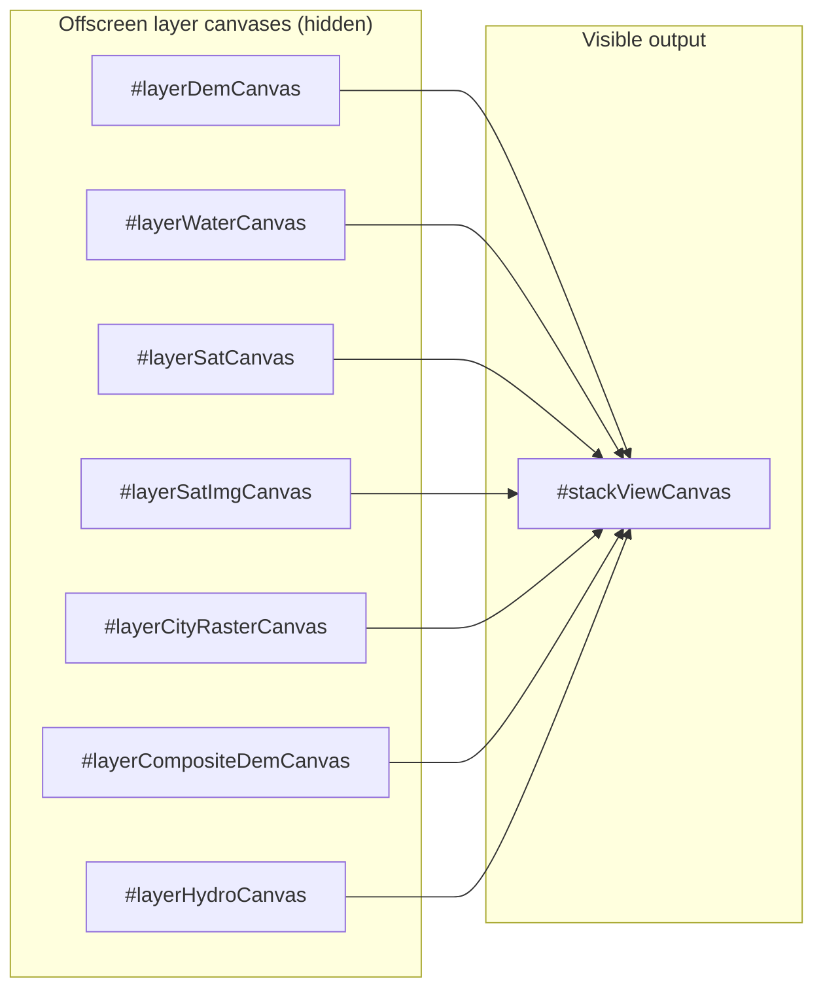
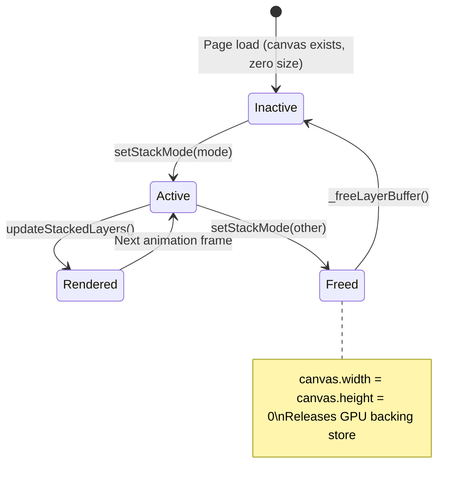
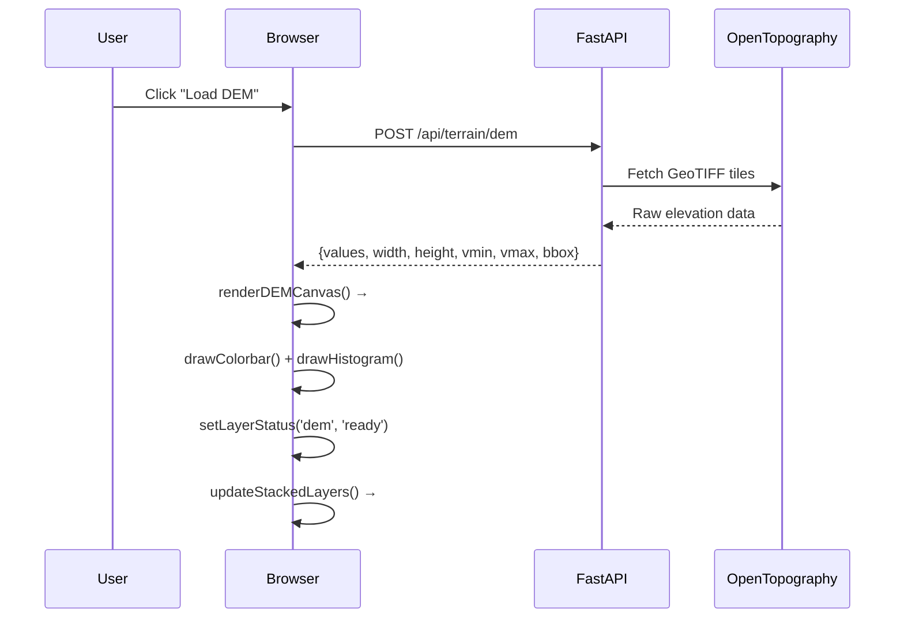
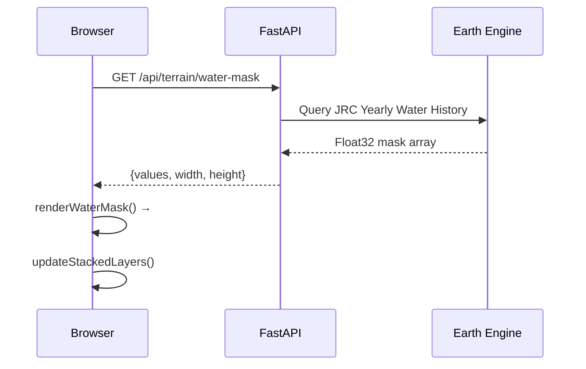
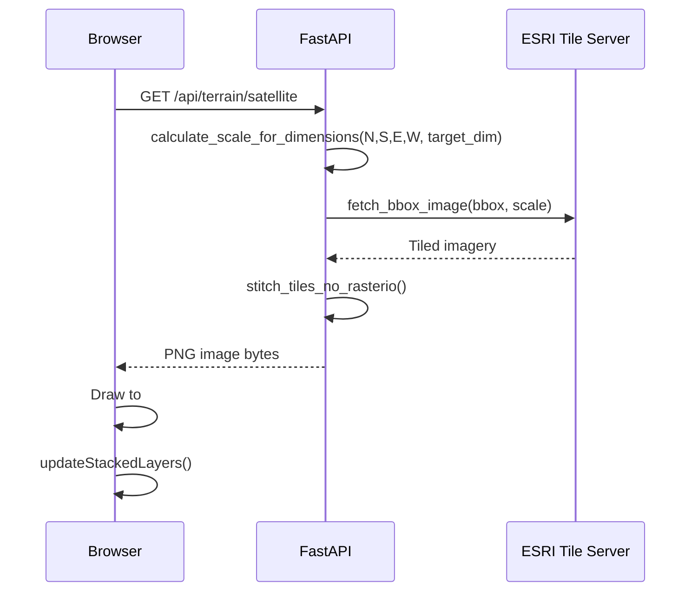
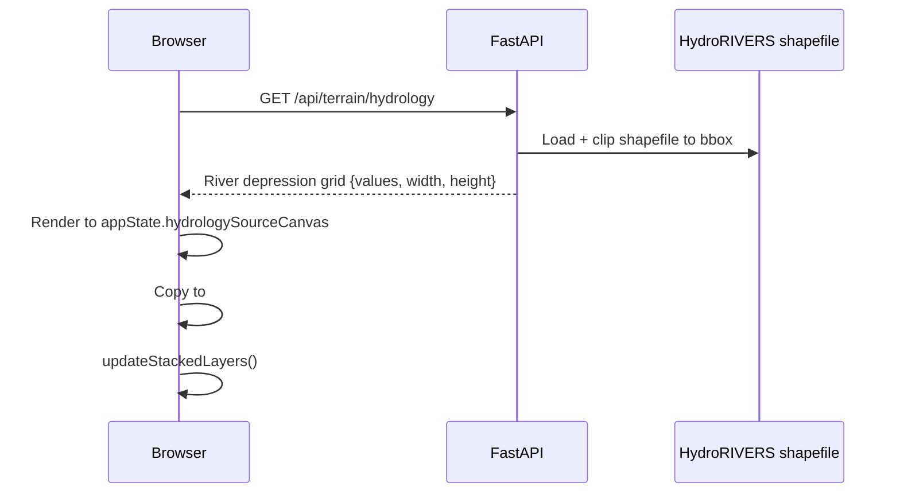
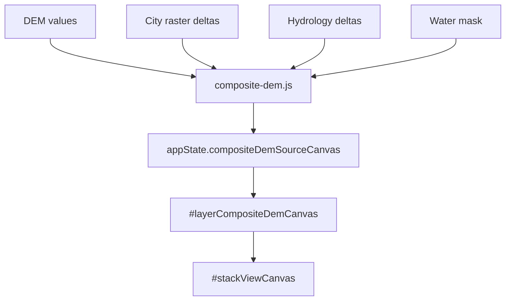

# Layer System — strm2stl

_Last updated: 2026-05-28_

Complete reference for the stacked-layer rendering pipeline, canvas lifecycle, GPU memory management, and the 7-layer compositing system.

For the short version, see [../arch.md](../arch.md).

---

## Overview

The Edit tab displays one of 7 possible data layers at a time on a single visible canvas (`#stackViewCanvas`). All other layer canvases live offscreen. When the user switches layers, the active layer is composited to `stackViewCanvas` and the previous layer's GPU backing store is freed.



---

## Layer Registry

`LAYER_CANVAS_IDS` in `stacked-layers.js` maps each layer mode key to its DOM canvas element ID:

| Mode key | Canvas ID | Data source |
|----------|-----------|-------------|
| `Dem` | `layerDemCanvas` | DEM height array → rendered by `dem-loader.js` |
| `Water` | `layerWaterCanvas` | JRC/ESA water mask → rendered by `water-mask.js` |
| `Sat` | `layerSatCanvas` | ESRI satellite tile → rendered by `dem-loader.js` |
| `SatImg` | `layerSatImgCanvas` | High-res satellite imagery → `appState.satImgSourceCanvas` |
| `CityRaster` | `layerCityRasterCanvas` | City height raster → `appState.cityRasterSourceCanvas` |
| `CompositeDem` | `layerCompositeDemCanvas` | Composite DEM output → `appState.compositeDemSourceCanvas` |
| `Hydrology` | `layerHydroCanvas` | HydroRIVERS depression grid → `appState.hydrologySourceCanvas` |

---

## Canvas Lifecycle



### Key Functions

| Function | Purpose |
|----------|---------|
| `_getLayerBuffer(mode)` | Look up canvas by `LAYER_CANVAS_IDS[mode]`, return element |
| `_freeLayerBuffer(mode)` | Set `canvas.width = canvas.height = 0` to release GPU memory |
| `setStackMode(mode)` | Deactivate old layer (`_freeLayerBuffer`), activate new layer |
| `updateStackedLayers()` | Composite active layer(s) to `stackViewCanvas` via `drawImage` |
| `moveLayer(mode, direction)` | Reorder layers in the stack |
| `setLayerOpacity(mode, opacity)` | Set alpha for a layer in compositing |
| `getLayerOrder()` | Return current ordered list of active modes |

---

## Data Pipeline Per Layer

### DEM Layer



### Water Mask Layer



Cached in `waterMaskCache` (LRU, max 20 entries) keyed by `bbox + resolution`.

### Satellite Layer



### Hydrology Layer



### City Raster Layer

Uses two separate rasterization endpoints serving different consumers:

| Endpoint | Canvas | Consumer |
|----------|--------|----------|
| `POST /api/cities/raster` | `#layerCityRasterCanvas` | `city-render.js` — standalone city height view |
| `POST /api/composite/city-raster` | feeds `composite-dem.js` | Composite DEM pipeline |

### Composite DEM Layer



---

## Zoom & Pan

All layer canvases and `.osm-overlay` share a CSS transform applied by `applyStackedTransform()`. This keeps all layers in pixel-perfect registration during zoom and pan.

```
applyStackedTransform(scale, offsetX, offsetY)
  → CSS: transform = `scale(${scale}) translate(${offsetX}px, ${offsetY}px)`
  → Applied to: all layer canvases + .osm-overlay
  → Scale change > 15%: immediate re-render of active layer
  → Scale change ≤ 15%: 300ms debounced re-render
```

---

## GPU Memory Management

Each hidden canvas element holds a GPU texture backing store proportional to `width × height × 4 bytes`. For a 1024×1024 canvas that's 4 MB of GPU memory per layer — 28 MB if all 7 layers were live simultaneously.

`_freeLayerBuffer(mode)` zeros the canvas dimensions when a layer is deactivated:

```js
function _freeLayerBuffer(mode) {
    const canvas = _getLayerBuffer(mode);
    if (canvas) {
        canvas.width = 0;
        canvas.height = 0;
    }
}
```

Setting `width = 0` causes the browser to release the GPU backing store immediately (verified in Chrome and Firefox). The canvas element itself remains in the DOM — it is reactivated by drawing to it again next time the layer is selected.

---

## Adding a New Layer

To add an 8th layer:

1. **Add a canvas to `index.html`** inside `#layersStack`:
   ```html
   <canvas id="layerMyNewCanvas" style="display:none"></canvas>
   ```

2. **Register in `LAYER_CANVAS_IDS`** in `stacked-layers.js`:
   ```js
   const LAYER_CANVAS_IDS = {
       // ...existing entries...
       MyNew: 'layerMyNewCanvas',
   };
   ```

3. **Add a backend route** in `routers/terrain.py` (or appropriate router) and a `core/` handler.

4. **Add a frontend loader** that fetches data and renders to `#layerMyNewCanvas`, then calls `updateStackedLayers()`.

5. **Add a UI button** for the layer mode switcher. The mode key must match the `LAYER_CANVAS_IDS` key exactly.

6. **Update this doc** — add the new mode key to the registry table above and describe its data pipeline.

---

## Layer System File Map

| Concern | File |
|---------|------|
| Canvas registry + compositing | `app/client/static/js/modules/layers/stacked-layers.js` |
| DEM rendering | `app/client/static/js/modules/dem/dem-loader.js` |
| Water mask rendering | `app/client/static/js/modules/layers/water-mask.js` |
| City overlay rendering | `app/client/static/js/modules/layers/city-overlay.js` |
| City raster rendering | `app/client/static/js/modules/layers/city-render.js` |
| Composite DEM | `app/client/static/js/modules/layers/composite-dem.js` |
| Hydrology overlay | `app/client/static/js/modules/layers/hydrology-overlay.js` |
| Satellite fetch | `app/server/core/sat.py` |
| Hydrology fetch | `app/server/core/hydrology.py` + `app/server/core/hydrorivers.py` |
| City raster fetch | `app/server/routers/cities.py` + `app/server/routers/composite.py` |
| Layer system analysis (historical) | `../audits/layer-system-analysis.md` |
