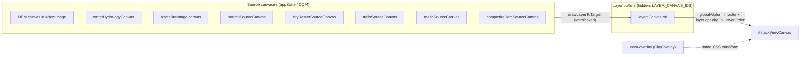
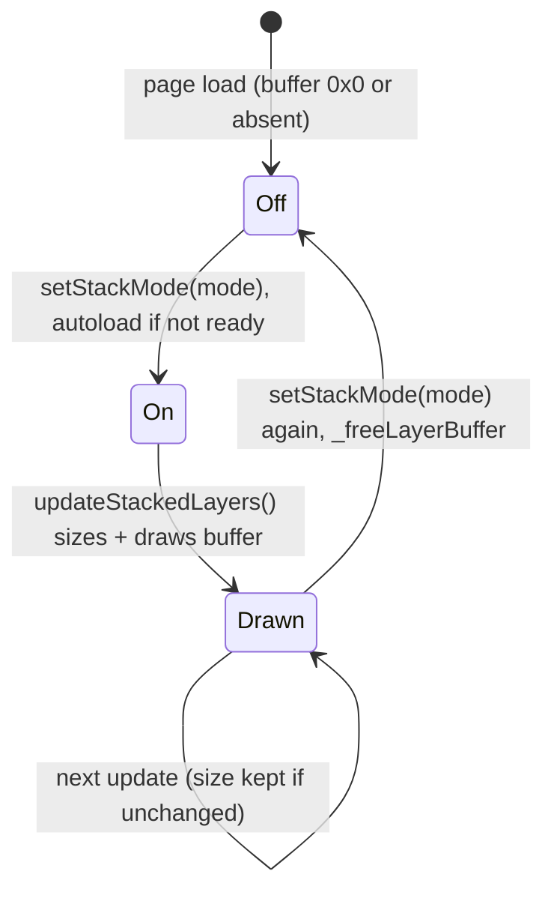
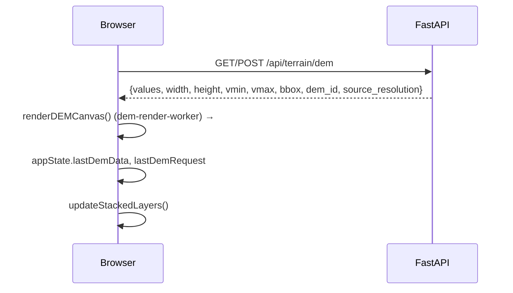
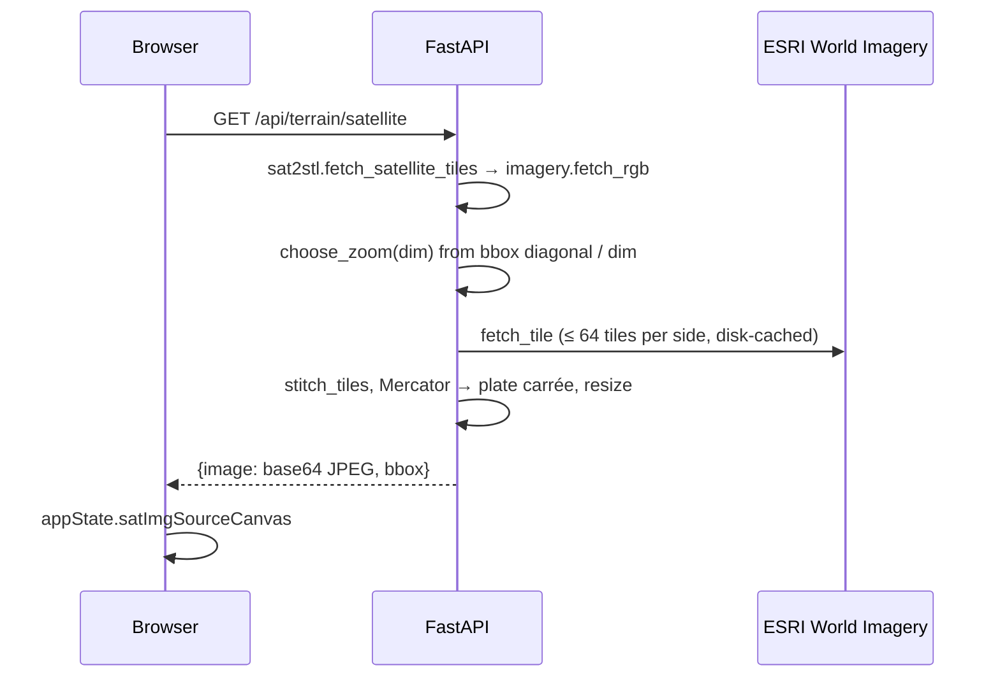
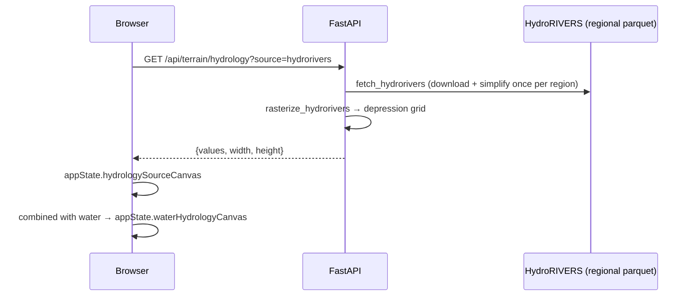
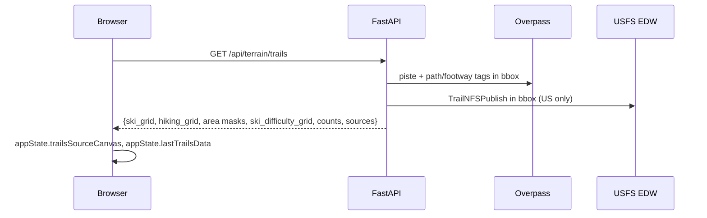
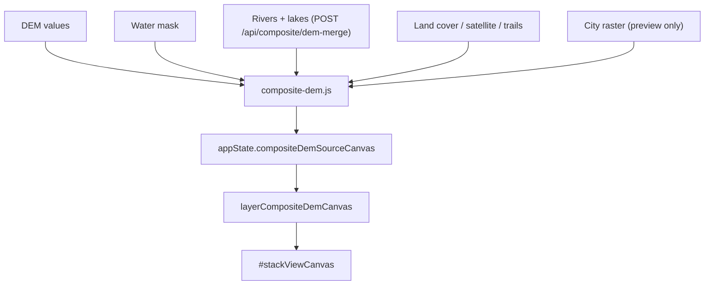

# Layer System — map2stl

_Last updated: 2026-09-28_

Reference for the Edit tab's stacked-layer view: the layer registry, how buffers are drawn and
composited, GPU memory, and where each layer's data comes from.

- Short version and data flows: [overview.md](overview.md)
- Module map: [frontend-modules.md](frontend-modules.md); state keys: [frontend.md](frontend.md)
- Composite maths: [composite-dem-design.md](composite-dem-design.md)
- Code paths are relative to `map2stl/`; the engine is
  `app/client/static/js/modules/layers/stacked-layers.js`.

---

## Overview

- Nine layer keys, several on at once. Default active set: `Dem` + `CityOverlay`.
- Each active raster layer is drawn into its own hidden buffer canvas at a shared letterbox rect,
  then all active buffers are alpha-composited, bottom to top, onto the one visible canvas
  `#stackViewCanvas`.
- `CityOverlay` is not a buffer: it is the `.osm-overlay` element inside `#layersStack`, shown,
  hidden and faded by `_syncCityOverlayLayerState`.
- The engine owns order and the active set; the layer rack in `LayerViewSection.vue` is a view
  of it. [why](../decisions/composite.md#2026-09-06--the-layer-engine-owns-stack-state-and-the-rack-is-a-view)


```mermaid
flowchart LR
    subgraph Sources ["Source canvases (appState / DOM)"]
        S1["DEM canvas in #demImage"]
        S2["waterHydrologyCanvas"]
        S3["#satelliteImage canvas"]
        S4["satImgSourceCanvas"]
        S5["cityRasterSourceCanvas"]
        S6["trailsSourceCanvas"]
        S7["meshSourceCanvas"]
        S8["compositeDemSourceCanvas"]
    end
    subgraph Buffers ["Layer buffers (hidden, LAYER_CANVAS_IDS)"]
        B["layer*Canvas x8"]
    end
    Sources -->|"drawLayerToTarget (letterboxed)"| B
    B -->|"globalAlpha = master x layer opacity, in _layerOrder"| STACK["#stackViewCanvas"]
    OSM[".osm-overlay (CityOverlay)"] -.->|"same CSS transform"| STACK
```

---

## Layer registry

- Render order: `_layerOrder` in `stacked-layers.js` (first = bottom). Mutable; `moveLayer`
  reorders it in place.
- Buffer ids: `app/client/static/js/modules/layers/stacked-layers.js::LAYER_CANVAS_IDS`.
- Source per key: the `sourceMap` inside `updateStackedLayers`.

| Key | Buffer canvas | Source | Loaded by |
|---|---|---|---|
| `Dem` | `layerDemCanvas` | DEM canvas in `#demImage` | `window.loadDEM` (`dem-main.js`) |
| `WaterHydrology` | `layerWaterHydrologyCanvas` | `appState.waterHydrologyCanvas` | `window.loadWaterHydrology` (`water-hydrology-combined.js`) |
| `Sat` | `layerSatCanvas` | `#satelliteImage canvas` (ESA WorldCover classes) | `window.loadEsaLandCover` (`water-mask.js`) |
| `SatImg` | `layerSatImgCanvas` | `appState.satImgSourceCanvas` (ESRI imagery) | `window.loadSatelliteRGBImage` (`dem-main.js`) |
| `CityRaster` | `layerCityRasterCanvas` | `appState.cityRasterSourceCanvas` | `window.loadCityRaster` (`city-render.js`) |
| `CityOverlay` | — (`.osm-overlay`) | `appState.osmCityData` | `window.loadCityData` (`city-overlay.js`) |
| `Trails` | `layerTrailsCanvas` | `appState.trailsSourceCanvas` | `window.loadTrails` (`trails-overlay.js`) |
| `MeshImport` | `layerMeshImportCanvas` | `appState.meshSourceCanvas` | user upload (`mesh-layer.js`) |
| `CompositeDem` | `layerCompositeDemCanvas` | `appState.compositeDemSourceCanvas` | built from loaded layers (`composite-dem.js`) |

- **Switching a layer on fetches its data** if it has none, via
  `app/client/static/js/modules/layers/stacked-layers.js::LAYER_AUTOLOAD` (`{ready, load}` per
  key). `MeshImport` and `CompositeDem` are deliberately absent.
  [why](../decisions/frontend.md#2026-08-28--layers-fetch-their-own-data-when-switched-on)
- `Water` and `Hydrology` were merged into `WaterHydrology`. `#layerWaterCanvas` and
  `#layerHydroCanvas` still exist in `DemContainer.vue` but are not stack buffers.
- Buffers come from `getOrCreateCanvas`: the static element in
  `app/client/static/js/vue/components/views/DemContainer.vue` if present, otherwise a new canvas
  appended to `#layersStack`.

---

## Engine functions

All `window.*` in `stacked-layers.js` unless marked private.

| Function | Purpose |
|---|---|
| `setStackMode(mode)` | Toggle a layer (at least one stays on). Off → `_freeLayerBuffer`; on → autoload if not ready. Fires `layer-stack-changed` |
| `updateStackedLayers()` | Compute the letterbox rect (publishes `appState.demLayout`), draw each active source into its buffer, composite onto `#stackViewCanvas`, then grid, transform and city overlay |
| `moveLayer(mode, delta)` | Swap in `_layerOrder` until past the next active layer; fires `layer-stack-changed` |
| `setLayerOpacity(mode, v)` | Per-layer alpha, multiplied by the master `#activeLayerOpacity` slider |
| `getLayerOrder()` / `getActiveLayers()` | Copies of the order and active set |
| `setSplitViewEnabled(on)` | Draw `CompositeDem` (left) and `SatImg` (right) side by side instead of blending |
| `clearAllLayerBuffers()` | Free every buffer, clear the display, reset zoom (region change) |
| `_getLayerBuffer(mode)` / `_freeLayerBuffer(mode)` (private) | Look up a buffer / zero its size |
| `_notifyLayerStackChanged()` (private) | Dispatch `layer-stack-changed` for the rack |


```mermaid
stateDiagram-v2
    [*] --> Off: page load (buffer 0x0 or absent)
    Off --> On: setStackMode(mode), autoload if not ready
    On --> Drawn: updateStackedLayers() sizes + draws buffer
    Drawn --> Drawn: next update (size kept if unchanged)
    Drawn --> Off: setStackMode(mode) again, _freeLayerBuffer
```

---

## Data pipeline per layer

### DEM Layer


```mermaid
sequenceDiagram
    participant FE as Browser
    participant BE as FastAPI
    FE->>BE: GET/POST /api/terrain/dem
    BE-->>FE: {values, width, height, vmin, vmax, bbox, dem_id, source_resolution}
    FE->>FE: renderDEMCanvas() (dem-render-worker) → #demImage canvas
    FE->>FE: appState.lastDemData, lastDemRequest
    FE->>FE: updateStackedLayers()
```

- Route: `app/server/routers/terrain.py::get_terrain_dem`.

### Water mask and land cover

- Water: `GET /api/terrain/water-mask` → `app/server/routers/terrain.py::get_terrain_water_mask`
  → `geo2stl/sat2stl.py::fetch_water_mask_images` (ESA WorldCover + JRC Global Surface Water
  through Earth Engine).
- Client LRU: `waterMaskCache` (`cache.js`, max 20 entries).
- Land cover (`Sat` key): `GET /api/terrain/esa-land-cover` →
  `app/server/routers/terrain.py::get_terrain_esa_land_cover`.

### Satellite imagery (`SatImg`)


```mermaid
sequenceDiagram
    participant FE as Browser
    participant BE as FastAPI
    participant ESRI as ESRI World Imagery
    FE->>BE: GET /api/terrain/satellite
    BE->>BE: sat2stl.fetch_satellite_tiles → imagery.fetch_rgb
    BE->>BE: choose_zoom(dim) from bbox diagonal / dim
    BE->>ESRI: fetch_tile (≤ 64 tiles per side, disk-cached)
    BE->>BE: stitch_tiles, Mercator → plate carrée, resize
    BE-->>FE: {image: base64 JPEG, bbox}
    FE->>FE: appState.satImgSourceCanvas
```

- Route: `app/server/routers/terrain.py::get_terrain_satellite`.
- Helpers: `geo2stl/sat2stl.py::fetch_satellite_tiles`, `geo2stl/imagery.py::fetch_rgb`,
  `geo2stl/imagery.py::choose_zoom`, `geo2stl/imagery.py::stitch_tiles`.

### Hydrology Layer


```mermaid
sequenceDiagram
    participant FE as Browser
    participant BE as FastAPI
    participant HDB as HydroRIVERS (regional parquet)
    FE->>BE: GET /api/terrain/hydrology?source=hydrorivers
    BE->>HDB: fetch_hydrorivers (download + simplify once per region)
    BE->>BE: rasterize_hydrorivers → depression grid
    BE-->>FE: {values, width, height}
    FE->>FE: appState.hydrologySourceCanvas
    FE->>FE: combined with water → appState.waterHydrologyCanvas
```

- Route: `app/server/routers/terrain.py::get_terrain_hydrology` →
  `geo2stl/hydrology.py::fetch_and_rasterize_hydrology`.
- HydroRIVERS loading and rasterizing: `geo2stl/hydrology.py::fetch_hydrorivers`,
  `geo2stl/hydrology.py::rasterize_hydrorivers`, `geo2stl/hydrology.py::HydroRiversHydrologyLayer`.
- The composite's river / lake sources reuse the same loader:
  `geo2stl/water_layers.py::register_water_layer_sources` (`hydrorivers`,
  `natural_earth_rivers`, `lakes`).

**Source choice — use `hydrorivers`; do not re-litigate.**
The client sends `hydrorivers` by default (`#hydroSource`); the server's own fallback when no
source is given is `natural_earth`. HydroRIVERS wins at every zoom for two structural reasons:

1. **Thin-feature survival.** `rasterize_hydrorivers` buffers each line to at least
   `min_buf_deg = pixel_deg * 0.6`, scaled up by Strahler order, before rasterizing, so
   tributaries survive downsampling. The Natural Earth path has no such buffer, so tributaries
   vanish at continent zoom.
2. **Strahler-weighted depth.** Depth is `depression_base * (order / max_order) ** order_exponent`
   (exponent default 1.5): major rivers carve deep, small ones still register. Natural Earth has
   no order field.

Use Natural Earth only when the HydroRIVERS regional file is not available yet, or the bbox is
outside HydroRIVERS coverage (e.g. Antarctica).

**Server cache.** The raw river grid is cached in the `hydrology` array namespace keyed on bbox,
dim, source, depression and the order parameters, with a 30-day TTL (`geo2stl/cache.py`).
Projection is re-applied on every request, including cache hits. Primitives:
`geo2stl/cache.py::make_cache_key`, `geo2stl/cache.py::read_array_cache`,
`geo2stl/cache.py::write_array_cache`; pruning in `app/server/core/cache.py::prune_cache`.
A first HydroRIVERS call over a large bbox can take minutes; repeats are milliseconds.

### Trails Layer


```mermaid
sequenceDiagram
    participant FE as Browser
    participant BE as FastAPI
    participant OSM as Overpass
    participant USFS as USFS EDW
    FE->>BE: GET /api/terrain/trails
    BE->>OSM: piste + path/footway tags in bbox
    BE->>USFS: TrailNFSPublish in bbox (US only)
    BE-->>FE: {ski_grid, hiking_grid, area masks, ski_difficulty_grid, counts, sources}
    FE->>FE: appState.trailsSourceCanvas, appState.lastTrailsData
```

- Route: `app/server/routers/terrain.py::get_terrain_trails` →
  `geo2stl/trails.py::fetch_and_rasterize_trails`.
- **Both categories always come back together**, so the category checkboxes repaint from
  `appState.lastTrailsData` (`refreshTrailsCategories()`) instead of a second Overpass trip.
- **Source choice.** OSM is authoritative for ski (OpenSkiMap / OpenSnowMap render *from* OSM
  and offer no bbox vector query). USFS EDW is the one independent source: hiking only, US only.
  `source=all` unions what is available and reports contributors in `sources`.
  [decisions](../decisions/trails.md)
- **Rendering.** Ski cyan, hiking orange, ski wins on overlap; lines buffered to ≥ 2 px before
  rasterizing (same reason as rivers).
- **Server cache.** `trails` namespace, key from `geo2stl/trails.py::trails_cache_key`
  (bbox, dim, source, relief, width), 7-day TTL. Projection and category are not in the key.

### City raster

Two endpoints, two consumers:

| Endpoint | Handler | Consumer |
|---|---|---|
| `POST /api/cities/raster` | `app/server/routers/cities.py::get_city_raster` | `CityRaster` layer (`city-render.js`) |
| `POST /api/composite/city-raster` | `app/server/routers/composite.py::get_city_raster` | Composite DEM city channels (`composite-dem.js`) |

### Composite DEM


```mermaid
flowchart TD
    DEM2["DEM values"] --> COMP2["composite-dem.js"]
    WATER2["Water mask"] --> COMP2
    HYDRO2["Rivers + lakes (POST /api/composite/dem-merge)"] --> COMP2
    LC["Land cover / satellite / trails"] --> COMP2
    CITY2["City raster (preview only)"] --> COMP2
    COMP2 --> CANVAS["appState.compositeDemSourceCanvas"]
    CANVAS --> LAYER["layerCompositeDemCanvas"]
    LAYER --> STACK2["#stackViewCanvas"]
```

- OSM channels are preview only; Apply and export use the terrain-only composite.
  [why](../decisions/composite.md#2026-09-06--both-engines-keep-compositing-and-the-export-falls-back-to-the-browsers-values)
- Details: [composite-dem-design.md](composite-dem-design.md).

---

## Zoom & pan

`app/client/static/js/modules/layers/stacked-layers.js::applyStackedTransform` applies one CSS
transform to every layer canvas and the `.osm-overlay`, so all layers stay registered.

```
transform = translate(offsetX px, offsetY px) scale(scale)   // from module-local stackZoom
then drawLayerGrid() redraws the graticule at screen resolution
city overlay re-render: immediately if scale changed > 15 %, else 300 ms after zoom settles
```

---

## GPU memory

- Each sized canvas holds a backing store of `width × height × 4` bytes (4 MB at 1024²).
- Buffers are sized to the stack only when their layer is drawn; switching a layer off calls
  `_freeLayerBuffer`, which sets `width = height = 0` and releases the store. The element stays
  and is resized on next draw.
- `updateStackedLayers` only reassigns `width`/`height` when they change, which avoids a GPU flush
  per frame.

---

## Adding a new layer

1. **Key + order:** add the key to `_layerOrder` in `stacked-layers.js`.
2. **Buffer:** add it to `LAYER_CANVAS_IDS` (the canvas is created on demand; a static
   `<canvas>` in `DemContainer.vue` is optional).
3. **Source:** add the key to `sourceMap` in `updateStackedLayers`, reading an
   `appState.*SourceCanvas` your loader sets.
4. **Loader:** a `window.loadX()` that fetches, renders to that source canvas, then calls
   `updateStackedLayers()`. Register `{ready, load}` in `LAYER_AUTOLOAD` unless the data comes
   from the user.
5. **Default opacity:** add it to `_layerOpacities`.
6. **Rack:** add a row to the `LAYERS` table in
   `app/client/static/js/vue/components/dem/LayerViewSection.vue`; class-specific controls go in
   `LayerDisplaySections.vue`.
7. **Server:** route in `app/server/routers/` delegating to a `geo2stl/` function.
8. **Docs:** add the key to the registry table above and describe its pipeline.

---

## File map

| Concern | File |
|---|---|
| Registry, stack, compositing | `app/client/static/js/modules/layers/stacked-layers.js` |
| Layer rack UI | `app/client/static/js/vue/components/dem/LayerViewSection.vue` |
| Buffer canvases (static) | `app/client/static/js/vue/components/views/DemContainer.vue` |
| DEM rendering | `app/client/static/js/modules/dem/dem-main.js`, `app/client/static/js/modules/dem/dem-loader.js` |
| Water mask / land cover | `app/client/static/js/modules/layers/water-mask.js` |
| Hydrology + combined water | `app/client/static/js/modules/layers/hydrology-overlay.js`, `app/client/static/js/modules/layers/water-hydrology-combined.js` |
| Trails | `app/client/static/js/modules/layers/trails-overlay.js` |
| City overlay / raster | `app/client/static/js/modules/layers/city-overlay.js`, `app/client/static/js/modules/layers/city-render.js` |
| Composite DEM | `app/client/static/js/modules/layers/composite-dem.js` |
| Terrain routes | `app/server/routers/terrain.py` |
| Satellite fetch | `geo2stl/sat2stl.py`, `geo2stl/imagery.py` |
| Hydrology fetch (HydroRIVERS, Natural Earth) | `geo2stl/hydrology.py`; composite water sources in `geo2stl/water_layers.py` |
| Trails fetch | `geo2stl/trails.py` |
| City raster fetch | `app/server/routers/cities.py`, `app/server/routers/composite.py` |
| Layer system analysis (historical) | [layer-system-analysis.md](../history/archive/layer-system-analysis.md) |
