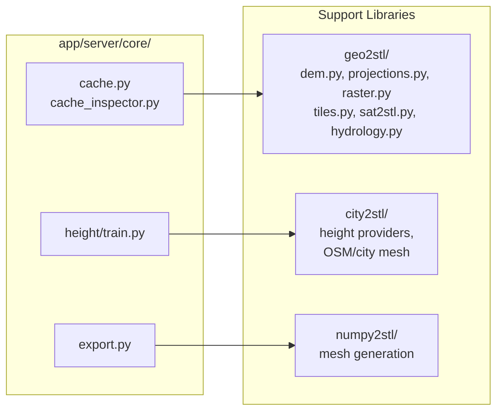

# Support Libraries -- strm2stl

_Last updated: 2026-05-03_

The app server delegates heavy computation to support libraries. Core modules should be thin wrappers that translate HTTP requests into library calls rather than re-implementing library logic.

> Principle: app/server/core/ is an API adapter around geo2stl, city2stl, and numpy2stl.

> **Current architecture (2026-05):** Routers import directly from `geo2stl` and `city2stl` for domain logic. `core/` handles server-side concerns only (cache, DB, export, validation, responses, building-height orchestration). Two deprecated compatibility wrappers (`core/terrain_raster.py`, `core/osm_cache_policy.py`) re-export from the library layer and will be removed.

---

## Library Overview

---

## Import Map

### core -> libraries

| Core module | Library | Import | Purpose |
|---|---|---|---|
| export.py | numpy2stl | array_to_mesh, writeOBJ, write3MF | Mesh generation and writers |
| height/service.py | city2stl.height.* | merge_height_rasters, provider classes | Height provider orchestration |
| height/train.py | city2stl.height.train | train helpers | Training shim + server-specific tile collector |
| terrain_raster.py ⚠️ | geo2stl.raster | bbox_longer_side_m, clamp_esa_scale, derive_sat_scale | **Deprecated wrapper** — import from geo2stl.raster directly |
| osm_cache_policy.py ⚠️ | city2stl.cache_policy | building_features, city_cache_* | **Deprecated wrapper** — import from city2stl.cache_policy directly |

### routers -> libraries (intentional direct use)

| Router | Library | Import | Note |
|---|---|---|---|
| routers/terrain.py | geo2stl.dem | fetch_dem_from_source | Primary DEM dispatcher — was `_fetch_dem_array` in router, now library function |
| routers/terrain.py | geo2stl.raster | clamp_esa_scale, derive_sat_scale | Scale math helpers |
| routers/terrain.py | geo2stl.projections | project_grid, project_water_arrays, project_rgb_image | Projection helpers |
| routers/terrain.py | geo2stl.hydrology | HYDROLOGY_LAYER | Hydrology service |
| routers/terrain.py | geo2stl.sat2stl | fetch_water_mask, fetch_satellite_tiles | ESA/WMTS satellite data |
| routers/cities.py | city2stl.cache_policy | read_osm_cache, write_osm_cache, osm_cache_key, ... | OSM cache I/O (imported directly, not via wrapper) |
| routers/cities.py | city2stl.rasterize | rasterize_composite_layers | OSM rasterization |
| routers/cities.py | geo2stl.projections | project_city_raster | City raster projection |
| routers/settings.py | geo2stl.projections | get_projection_info | Projection metadata endpoint |

### session -> libraries

terrain_session.py is primarily an HTTP client. It also imports city2stl provider classes for offline provider-merge utilities used in the SDK layer.

---

## Library Public APIs (high-value surface)

### geo2stl/

| Module | Key functions |
|---|---|
| dem.py | fetch_dem_from_source, fetch_layer_data, fetch_local_dem, fetch_h5_dem, fetch_opentopo_dem, compute_raw_dem, upsample_dem, make_dem_payload |
| raster.py | bbox_longer_side_m, clamp_esa_scale, derive_sat_scale |
| projections.py | get_projection_info, project_coordinates, project_grid, project_water_arrays, project_rgb_image, project_city_raster |
| sat2stl.py | fetch_bbox_image, fetch_sat_overlay, fetch_satellite_tiles, fetch_water_mask, fetch_water_mask_images, calculate_scale_for_dimensions |
| hydrology.py | HYDROLOGY_LAYER, fetch_and_rasterize_hydrology, merge_rivers_with_dem |
| hydrorivers.py | HydroRIVERS backend helpers used by hydrology service |
| tiles.py | stitch_tiles_no_rasterio, tile coordinate helpers |
| write.py | save_im, save_stl, savefile (mostly notebook/offline helpers) |

### numpy2stl/

| Category | Key functions |
|---|---|
| Core | array_to_mesh, polygon_to_prism, perimeter_to_walls, writeSTL, write3MF, writeOBJ |
| simplify | simplify_mesh_surfaces |
| boolean/view/verify | advanced or notebook/offline workflows |

### city2stl/

| Area | Key modules/functions |
|---|---|
| Height providers | city2stl.height.providers.* (copernicus, ghsl, google_3d, lidar_3dep, ndsm, open_buildings, roofnet, shadow_height, wsf3d) |
| Height orchestration | city2stl.height.merge_height_rasters, provider_stats |
| City raster + mesh | city2stl.fetch, city2stl.rasterize, city2stl.mesh |
| Height enhancement | city2stl.heights.enhance_buildings_with_raster |

---

## Thin Wrapper Assessment

| Module | Status | Notes |
|---|---|---|
| core/terrain_raster.py | ⚠️ Deprecated | 9-line wrapper — re-exports from geo2stl.raster; import source directly |
| core/osm_cache_policy.py | ⚠️ Deprecated | 19-line wrapper — re-exports from city2stl.cache_policy; import source directly |
| core/height/service.py | Active | Height provider orchestration; server-side logic (cache, DB, task management) stays here |
| core/height/train.py | Mixed | Re-exports training helpers + server-specific collect_tiles() |
| core/export.py | Active | HTTP concerns (task lifecycle, responses, headers, temp files); mesh ops delegated to numpy2stl |
| core/cache.py | Active | Cache key generation, array cache I/O, SQLite; server-side concern |
| core/cache_inspector.py | Active | Filesystem tree/metadata helpers extracted from routers/cache.py |

---

## Unused or Limited-Use Capabilities

| Library | Capability | Notes |
|---|---|---|
| geo2stl.write | save_* helpers | Mostly notebook/offline; app primarily uses export pipeline |
| numpy2stl.writeSTL | direct STL writer | App export path uses trimesh for STL repair/export |
| numpy2stl boolean/view/verify | advanced utilities | Mostly offline/notebook workflows |

The app actively uses these support-library functions in production paths: array_to_mesh, write3MF, writeOBJ, make_dem_image, fetch_satellite_tiles, fetch_water_mask, calculate_scale_for_dimensions/project_coordinates (through wrappers), hydrology rasterization, and city2stl height/city pipeline functions.
