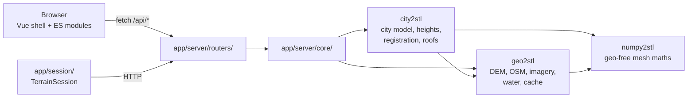
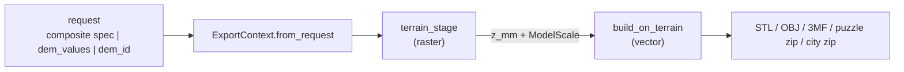
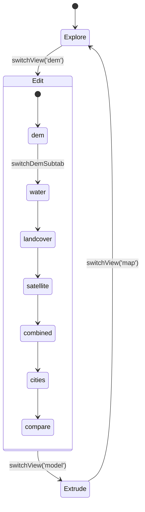

# Architecture overview — map2stl

_Last updated: 2026-09-28_

What the pieces are and how a request moves through them. Detail lives in the linked pages;
*why* lives in [decisions/](../decisions/README.md).

- Walkthrough of one export, stage by stage: [pipeline.md](pipeline.md)
- Library modules and what calls them: [packages.md](packages.md)
- Routes and request models: [api.md](api.md) · Python SDK: [sdk.md](sdk.md)
- Browser: [frontend.md](frontend.md), [frontend-modules.md](frontend-modules.md), [layer-system.md](layer-system.md)

## System map

- **Layering is one-way:** `app → city2stl / geo2stl → numpy2stl`.
  - Libraries never import `app.*`; they take keys and paths as parameters.
  - numpy2stl is geo-free: no lat/lon, no fetching. OSM and lidar fetching live in city2stl.
  - Why: [architecture](../decisions/architecture.md) ("numpy2stl is geo-free…", "Both repos install editable…").
- **Both repos install editable** (`numpy2stl/pyproject.toml`, `map2stl/pyproject.toml`); no `sys.path` hacks.
  Declared dependencies are imported unguarded, so a missing one fails loudly.
- **Shared constants have one home:**
  - metres per degree: `geo2stl/geo.py::M_PER_DEG_LAT`, `geo2stl/geo.py::M_PER_DEG_LON_EQ`
  - tag heights (3.2 m/level): `city2stl/heights.py::height_from_tags`
  - raster convention: row 0 = north; code that needs south-up flips at its own boundary.
  - Why: [architecture](../decisions/architecture.md).

## Backend (`app/server/`)

- `app/server/server.py` — FastAPI app, lifespan, router includes; also mounts the built docs
  (`/project-docs`) and Sphinx API reference (`/api-reference`).
- `app/server/schemas.py` — Pydantic request/response models. `app/server/config.py` — paths,
  `OPENTOPO_DATASETS`, API keys, test mode.
- **Rule: request handling in `routers/`, work in `core/` or the libraries.** Blocking work runs
  in an executor; never `os.chdir()`.

### Routers (one line each; full list in [api.md](api.md))

| Router | Role |
|---|---|
| `app/server/routers/terrain.py` | DEM (returns a `dem_id`), water mask, ESA land cover, satellite, hydrology, trails, sources |
| `app/server/routers/export.py` | STL/OBJ/3MF sync routes, preview, preflight, cross-section, puzzle, async `start`/`status`/`download` |
| `app/server/routers/cities.py` | OSM city layers (sync + task), city raster, height enhancement, landmarks, survey sources |
| `app/server/routers/composite.py` | server composite (`city-raster`, `dem-merge`) |
| `app/server/routers/regions.py` | saved regions, their settings blob, per-region landmark overrides |
| `app/server/routers/layers.py` | mesh import (upload / library) → heightmap → registration |
| `app/server/routers/registration.py` | plate-registration packs and tasks, model critic scores |
| `app/server/routers/height.py` | height source listing and fetch |
| `app/server/routers/guides.py` | the user guides page: `docs/guides/*.md` rendered at `/guides` |
| `app/server/routers/reports.py` | report index and files (heights, registration) |
| `app/server/routers/`: `settings`, `cache`, `auth`, `geocode`, `diagnostics` | support |

### Core modules (`app/server/core/`)

- **Export:** `export.py` (both mesh stages, formats, preview, puzzle), `export_params.py`
  (request → `ExportContext`, DEM resolution), `export_tasks.py` (background tasks),
  `city_model_task.py` (city export), `puzzle.py` (jigsaw cutting), `preflight.py` (what a build
  will produce, before building it).
- **DEM handoff:** `dem_store.py` (`dem_id` handles), `dem_cache.py` (the one DEM cache key).
- **Data:** `city_data.py` (cached OSM layers, local derivation), `landmarks.py` (override specs),
  `mesh_import.py`, `plate_registration.py`, `height/` (async glue over `city2stl.height`).
- **Storage:** `db.py` (SQLite), `cache.py` (pruning, inspector glue over `geo2stl.cache`),
  `tile_store.py` (local DEM tile folder).

## The two-stage mesh pipeline

Every mesh export — terrain STL/OBJ/3MF, 3D preview, puzzle, city model — runs the same two stages.

1. **Terrain stage (raster):** `app/server/core/export.py::terrain_stage`
   - DEM source, in priority order (`app/server/core/export_params.py::ExportContext`):
     composite spec → inline `dem_values` (edited grids) → `dem_id` handle → rebuilt cache key.
   - `app/server/core/export.py::_prepare_dem_array`: NaN fill + 3×3 median
     (`city2stl/city_model.py::prepare_dem`), river/lake carve *after* the median, sea-level cap,
     vertical scale (`city2stl/city_model.py::choose_scale`).
   - Then label engraving and contour lines. Output: `TerrainField` (heightfield in mm, row 0 north).
2. **Feature stage (vector):** `city2stl/city_model.py::build_on_terrain`
   - Adaptive watertight terrain solid (`city2stl/city_model.py::terrain_solid`, via
     `numpy2stl/src/numpy2stl/core/heightfield.py::tin_solid`).
   - OSM layers extruded / draped / cut and merged in 3D with manifold3d; landmark overrides
     swap in uploaded meshes or survey solids.
   - A terrain-only export is this stage with no layers
     (`app/server/core/export.py::_prepare_export_mesh`).
- **The composite feeds the terrain stage only.** Its OSM channels (buildings, roads, waterways,
  walls) are 2D preview; `app/server/core/export_params.py::mesh_composite_layers` drops them and the
  client filters them again (`app/client/static/js/modules/layers/composite-spec.js::FEATURE_SOURCES`).
- **Where new work goes:** terrain modifiers → terrain stage; new features → city model.
- **Why:** one route keeps scale, watertightness and simplification consistent; rasterised
  buildings in the terrain *and* the city model would print twice.
  [mesh-pipeline](../decisions/mesh-pipeline.md) ("Every mesh export runs the terrain stage, then
  the city model", "The city model is 1 px per mm…").

### Export entry points

| Output | Entry | Notes |
|---|---|---|
| STL / OBJ / 3MF | `app/server/core/export.py::_run_export_pipeline` | async; sync twins `generate_stl` / `generate_obj` / `generate_3mf` share `_prepare_export_mesh` |
| 3D preview | `app/server/core/export.py::generate_mesh_preview` | terrain stage, meshed as a capped grid for speed |
| Puzzle | `app/server/core/export.py::generate_puzzle` | mask path cuts the heightfield directly; boolean path cuts the built model (`app/server/core/puzzle.py::cut_to_zip`) |
| City model | `app/server/core/city_model_task.py::run_city_model` | terrain stage + OSM layers + landmarks → zip with STL, 3MF, optional puzzle, `report.json` |
| Preflight | `app/server/core/preflight.py::preflight` | runs the terrain stage and `city2stl/city_model.py::layer_preflight` only; OSM from cache only |

- Async tasks: `POST /api/export/start {format}` → `app/server/core/export_tasks.py::start_export_task`
  (daemon thread; formats `stl | obj | 3mf | puzzle | city`) → poll `status` → `download`
  (temp file deleted after send). Output files are not kept.

### How the DEM reaches the export

- The pipeline is **client-orchestrated**: the DEM request and the export are separate HTTP calls.
  1. `GET /api/terrain/dem` (`app/server/routers/terrain.py::get_terrain_dem`) fetches, projects,
     caches, and returns a `dem_id` from `app/server/core/dem_store.py::DemStore`.
  2. The client stores it in `appState.lastDemRequest`; export sends it back
     (`app/client/static/js/modules/export/export-handlers.js::_demSettings`).
  3. `app/server/core/export_params.py::resolve_dem` reads the grid by id; an expired id raises
     `DemGone` (HTTP 410, "reload the DEM"), after trying the disk cache.
- Fallback: rebuild the key with `app/server/core/dem_cache.py::dem_cache_key` — the only
  definition, shared with the terrain router. Never copy the key.
- Why: two drifted key copies caused "Missing DEM data"; a handle names the exact grid the user saw.
  [terrain-dem](../decisions/terrain-dem.md) ("The DEM cache key has exactly one definition"),
  [architecture](../decisions/architecture.md) ("…client-orchestrated [superseded]").

## Caches and storage

- **Disk cache primitives:** `geo2stl/cache.py`
  - Array cache (`.npz` + `.json`) per namespace (`dem/`, `water/`, `satellite/`, …); OSM cache
    (`.json.gz` + params sidecar); JSON cache (`geocode/`, `landmarks/`); raw GeoTIFFs (`opentopo/`).
  - Key: `geo2stl/cache.py::make_cache_key` = MD5(namespace + bbox to 4 dp + sorted extra params);
    OSM shorthand `geo2stl/cache.py::osm_cache_key`.
  - TTL per namespace: `geo2stl/cache.py::NAMESPACE_TTL`. Root: `geo2stl/cache.py::CACHE_ROOT`
    (`map2stl/cache/` or `$MAP2STL_CACHE`).
- **App-side:** `app/server/core/cache.py::prune_all_caches` at startup; per-bbox clearing.
- **City model caches:** `city2stl/model_cache.py` — layer polygons, layer solids, terrain TIN,
  keyed by content digests plus `city2stl/model_cache.py::MODEL_CACHE_VERSION` (bump on any
  geometry change). Disabled with `MAP2STL_CITY_CACHE=0`.
  - Why the library owns them: [mesh-pipeline](../decisions/mesh-pipeline.md) ("City builds are fast…").
- **OSM layers at other panel settings** are derived locally from a finer cached entry
  (`app/server/core/city_data.py::lookup_city_layers`).
- **SQLite (`data.db`):** tables `regions`, `region_settings` (settings JSON blob, cascade delete),
  `region_landmarks` (per-building overrides) — `app/server/core/db.py::init_db`, WAL mode.

## Frontend (summary)

- **Two layers, one state:** a Vue 3 + Pinia shell (`app/client/static/js/vue/`) renders the
  layout and panels; the legacy ES modules (`app/client/static/js/modules/`) own the canvases,
  map and pipeline calls and coordinate through `window.appState` / `window.events`.
  Details: [frontend.md](frontend.md). Why Vue: [frontend](../decisions/frontend.md) ("Standardise on Vue and retire v2").
- **Views:** three header tabs drive `window.switchView`
  (`app/client/static/js/modules/ui/view-management.js`); the `data-view` attributes on the tabs
  in `app/client/static/js/vue/components/layout/MainHeader.vue` must stay.

- Explore (`map`): Leaflet map + globe, region list, bbox drawing.
- Edit (`dem`): DEM canvas and the stacked layer view ([layer-system.md](layer-system.md)); the
  Composite panel builds the terrain spec.
- Extrude (`model`): Three.js preview (vertices from `POST /api/export/preview`), preflight panel,
  exports, puzzle and city model.
- **Guides page:** `/guides` (`app/client/templates/guides.html`, `app/client/static/js/guides.js`)
  renders every `.md` in `docs/guides/`, so only user-facing docs belong there.

## Features that cross layers

- **Landmark overrides:** replace one OSM building with an uploaded mesh or a surveyed nDSM solid.
  - Stored per region (`/api/regions/{name}/landmarks/…`, `app/server/core/landmarks.py`).
  - Client: `app/client/static/js/modules/layers/landmark-overrides.js::overridesForBuild`.
  - Build: `city2stl/landmarks.py::resolve_overrides` → `build_on_terrain(landmark_overrides=…)`.
  - Why: [roofs-landmarks](../decisions/roofs-landmarks.md).
- **Survey providers:** per-country lidar / nDSM behind one `ndsm_for_bbox` contract
  (`city2stl/height/providers/survey.py`). Sources: [survey-sources.md](survey-sources.md);
  providers overview: [height-providers.md](height-providers.md); why: [survey-lidar](../decisions/survey-lidar.md).
- **Building heights:** `city2stl/height/` merges providers per pixel; no CNN runs at request time
  ([height-providers.md](height-providers.md), [building-heights](../decisions/building-heights.md)).
- **Plate registration / critic:** `city2stl/registration/` + `app/server/core/plate_registration.py`;
  scoring in `city2stl/registration/critic.py` ([research/plate-critic.md](../research/plate-critic.md)).

## Python SDK

- `app/session/terrain_session.py::TerrainSession` is a `requests` client over the same routes the
  browser uses. It is **not** the pipeline — trace through the routers and [pipeline.md](pipeline.md).
  Why: [architecture](../decisions/architecture.md) ("TerrainSession is an SDK, not the pipeline").
- Notebook → method → route map: [sdk.md](sdk.md).
