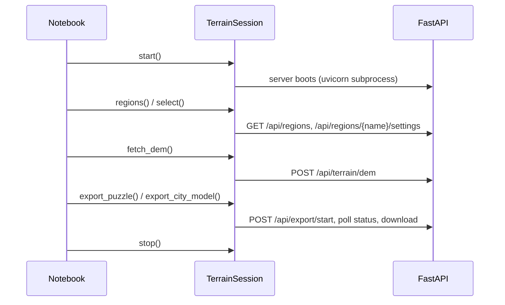

# TerrainSession SDK — map2stl

_Last updated: 2026-09-28_

How the notebooks, the Python session client and the backend routes connect.

- Client: `app/session/terrain_session.py::TerrainSession` (one class, ~3100 lines)
- Routes it calls: [api.md](api.md)
- Where the real work happens: [pipeline.md](pipeline.md), [overview.md](overview.md)

## What TerrainSession is (and is not)

- **An SDK over the HTTP server, not the pipeline.**
  - `start()` launches a uvicorn subprocess; almost every method then calls the same REST routes the browser uses (`TerrainSession._api_request`).
  - Top-level imports: only `app.server.config` constants and `geo2stl.geo::bbox_size_m`. No mesh code; nothing on the browser render path touches this file.
  - Why: its size and name make it look like the core; tracing the pipeline through it is a dead end. See [architecture decision "TerrainSession is an SDK, not the pipeline"](../decisions/architecture.md#2026-08-26--terrainsession-is-an-sdk-not-the-pipeline).
- **Exceptions that run in-process** (lazy imports, no server round-trip):
  - Building heights: `fetch_building_heights` uses `city2stl.height` providers directly (see [height-providers.md](height-providers.md))
  - Height enrichment / roofs / ML: `enrich_buildings_with_heights`, `classify_roof_shapes`, `load_roof_model`, `predict_heights`, `train_height_model`
  - STL import + infill: `load_stl` → `city2stl/height/stl_import.py::stl_to_heightmap`; `infill_heights` → `city2stl/height/infill.py::infill_idw` / `infill_nearest`

## Mesh exports reach the two-stage pipeline

- SDK export methods never build meshes locally. Both post to `POST /api/export/start` and poll `/api/export/status/{task_id}`, then download:
  - `TerrainSession.export_puzzle` → `format="puzzle"` → `app/server/core/export.py::generate_puzzle`
  - `TerrainSession.export_city_model` → `format="city"` → `app/server/core/city_model_task.py::run_city_model`
  - Shared body: `TerrainSession._mesh_export_body` (the `dem_id` handle from `fetch_dem` plus terrain-stage settings in server field names)
- Server side, every mesh export runs two stages:
  1. `app/server/core/export.py::terrain_stage` (raster: DEM, composite, median, river/lake carve, scale, label, contours)
  2. `city2stl/city_model.py::build_on_terrain` (vector OSM features on that heightfield; "terrain only" = no layers)
  - Why: one route keeps scale, watertightness and simplification consistent. See [mesh-pipeline decision](../decisions/mesh-pipeline.md#2026-09-27--every-mesh-export-runs-the-terrain-stage-then-the-city-model).
- `verify()` is local: mesh health of each OBJ in the last `export_puzzle` zip (trimesh).
- There is no SDK wrapper for the sync `/api/export/stl|obj|3mf` routes or `/api/export/preview`; call them via `_api_request` if needed. The sync routes run the same two stages; `/api/export/preview` runs only `terrain_stage`.

## Notebook path



- Happy path: `../../notebooks/API_Terrain.ipynb`
- Per-method reference: `../../notebooks/Session_API_Reference.ipynb`
- `run_all()` = `fetch_dem` → `show_dem` → `export_puzzle` → `verify`
- End-to-end test: `tests/test_session_e2e.py`

## Method map

Cite as `app/session/terrain_session.py::TerrainSession.<method>`.

**Lifecycle and configuration**
- `__init__(port=9090)`, `start`, `restart`, `stop`, `__enter__` / `__exit__`
- `server_settings` → `GET /api/settings`
- Settings shortcuts (properties): `dem_settings`, `view_settings`, `export_settings`, `city_settings`, `water_settings`
- Regions: `regions`, `select`, `create_region`, `update_region`, `delete_region` → `/api/regions*`
- `save_settings` → `PUT /api/regions/{name}/settings`; `settings_table` (local display)

**Fetch**
- `fetch_dem` → `/api/terrain/dem`
- `fetch_water_mask`, `fetch_esa_landcover` → `/api/terrain/water-mask`
- `fetch_satellite` → `/api/terrain/satellite`
- `fetch_cities` → `POST /api/cities` (the blocking variant, kept for the SDK)
- `fetch_hydrology` → `/api/terrain/hydrology`
- `fetch_building_heights` → local (see above)

**Process**
- `merge_dem` → `/api/composite/dem-merge`
- `merge_hydrology_with_dem` → `/api/composite/hydrology-merge`
- `composite_city_raster` → `/api/composite/city-raster`
- `rasterize_city` → `/api/cities/raster`; `check_city_cache` → `/api/cities/cached`
- Local: `enrich_buildings_with_heights`, `classify_roof_shapes`, `load_roof_model`, `predict_heights`, `train_height_model`, `infill_heights`, `check_alignment`, `satellite_array`

**Export**: `export_puzzle`, `export_city_model`, `verify`, `run_all` (see above)

**Display and cache**
- `show_dem` (via `app/session/viz.py::plot_data`), `show_water_mask`, `show_esa_landcover`, `show_satellite`, `show_city`, `show_hydrology`
- `cache_status` → `GET /api/cache`; `clear_cache` → `DELETE /api/cache`
- `load_stl`, `preview_stl` (local)

## Call-order contract

- Guards: `TerrainSession._ensure_bbox` (needs `select`) and `TerrainSession._require_attribute` (needs an earlier fetch).
- Order (not enforced beyond those guards):

```
start ─> select ─┬─> fetch_dem ─┬─> show_dem / check_alignment
                 │              ├─> merge_hydrology_with_dem
                 │              ├─> export_puzzle ─> verify
                 │              └─> export_city_model
                 ├─> merge_dem (sets self.dem itself)
                 ├─> fetch_water_mask / fetch_esa_landcover
                 ├─> fetch_satellite ──> predict_heights
                 └─> fetch_cities ─┬─> enrich_buildings_with_heights
                                   ├─> classify_roof_shapes
                                   └─> export_city_model
load_stl ─> preview_stl / infill_heights
```

- Most methods `return self` for chaining, so a failure at step N can surface as a misleading "Call X first" at step N+1.
- `fetch_building_heights` passes the DEM to `google3d` only when `fetch_dem` ran first; otherwise that provider runs without it.
- `export_city_model` sends local building edits (`layer_data`) only when a session method changed tags (`_buildings_dirty`); otherwise the server uses its own OSM cache.

## Known defects

Background: [pipeline audit 2026-08-26](../history/audits/pipeline-audit-2026-08-26.md) ("Structural observations"). Rechecked 2026-09-28:
- `select` swallows any error loading saved settings and silently falls back to defaults.
- No callers in the repo (notebooks, tests, app): `check_alignment`, `merge_hydrology_with_dem`, `enrich_buildings_with_heights`.
- `TerrainSession._kill_stale_server` kills whatever listens on the port, regardless of owner; every instance defaults to port 9090.
- HTTP timeouts are hardcoded per call; output is `print()` only, no `logging`.
- Fixed: `_VENV_PYTHON` points at `~/.venvs/map2stl` (2026-09-25); the old `export_obj` / `obj_split` call to a non-existent route is gone (replaced by `export_puzzle`).

## Settings ownership

`s.settings[...]` groups (defaults in `app/session/terrain_session.py::_DEFAULT_SETTINGS`):
- `projection` — all projected layers
- `dem` — terrain fetch
- `export` — terrain-stage settings sent with every mesh export
- `split` — puzzle grid and knobs (`export_puzzle`)
- `water` — water mask / land cover
- `satellite` — imagery resolution
- `city` — OSM fetch (`simplify_tolerance`, `min_area` also pick the cache entry the city export reuses)
- `view` — local display only
- `hydrology` — river extraction and depressions

## Tracing a notebook step

1. Find the method or `s.settings[...]` key in `app/session/terrain_session.py`.
2. Find its route in [api.md](api.md).
3. Open the router in `app/server/routers/`, then its logic in `app/server/core/`.
4. For mesh output, continue at `app/server/core/export.py::terrain_stage` and `city2stl/city_model.py::build_on_terrain` ([pipeline.md](pipeline.md)).

## Notebooks

| Notebook | Use it for |
|---|---|
| `../../notebooks/API_Terrain.ipynb` | End-to-end session workflow |
| `../../notebooks/Session_API_Reference.ipynb` | Method and endpoint coverage |
| `../../notebooks/Cities.ipynb`, `City_Session.ipynb` | City/building workflows |
| `../../notebooks/Oceans.ipynb` | Ocean and bathymetry |
| `../../notebooks/Rivers.ipynb` | Rivers and hydrology |
