# SOP — City and terrain models, and jigsaw puzzles

Rewritten 2026-09-27 after the fixes that came out of the first run (2026-09-26). Plans:
`docs/plans/F-CITYMODEL-vector-city-model.md`, `F-ARCH-consolidation.md`,
`F-UX-sop-followups.md`. Outputs of the reference run: `output/renders_v3/<city>/`
(gitignored).

## 1. Reference results (2026-09-27)

Built at 1 DEM pixel = 1 mm, SRTM 30 m, Vertical *auto*, 3×3 median, all city layers,
puzzle pieces ≤ 200 mm.

| City | Box | Model | Scale | Faces | Watertight | Pieces | Build + cut |
|---|---|---|---|---|---|---|---|
| Granada + Alhambra | 2.8 × 2.0 km | 796 × 574 × 77 mm | 1:3,472 true | 932 k | yes | 12 (4×3) | 441 s |
| Cartagena | 5.0 × 5.0 km | 983 × 980 × 49 mm | 1:5,083 true | 513 k | yes | 25 (5×5) | 402 s |
| Breckenridge | 8.2 × 8.9 km | 771 × 841 × 133 mm | 1:10,539 true | 1.08 M | yes | 20 (4×5) | 474 s |

Before the fixes (same inputs): 1.07 M / 630 k / 1.57 M faces, none watertight after an
STL round trip, 588 / 851 / 936 s.

Each zip holds `<city>.stl` (merged solid), `<city>.3mf` (one part per layer, for
multi-colour), `puzzle/*.obj` + `<city>_puzzle.3mf`, and `report.json` (scale, tolerances,
per-layer counts and timings, checks).

## 2. The process

**Prerequisites**: venv (`scripts/setup-venv.ps1`); OpenTopography key in *Keys* (any 30 m
source); server running (`Start 3D Maps.bat`).

Screenshots: Granada + Alhambra (N 37.1873, S 37.1693, E −3.5780, W −3.6093), taken by
`Code/agent-scripts/sop_screenshots.py` (outside the repo; its docstring says how to
refresh them). A red outline marks the control each step talks about. "Extrude → 📤
Export" below is the Export tab inside the Extrude view (there is no top-level Export tab).

1. **Pick the area** (Explore): select or draw the region (type in "Search regions…" to
   find a saved one). Check that landmarks are inside the box with margin: the
   *Near the box edge* box (bottom left of the map, and at the top of Edit → 📥 Fetch)
   lists named places within 200 m of an edge, inside or out.

   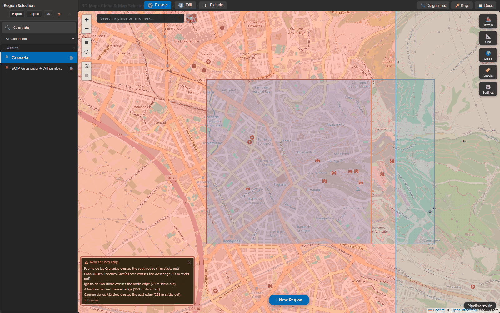
   *Granada's saved box: "Alhambra crosses the east edge (150 m sticks out)".*

   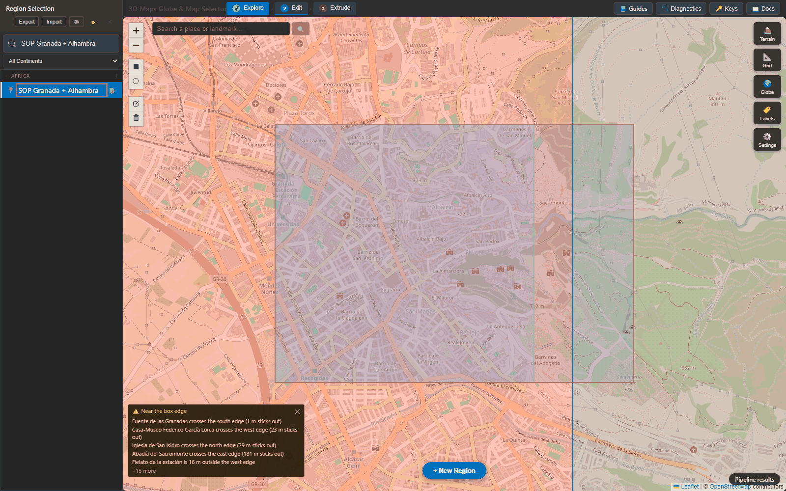
   *The box widened to E −3.5780: the Alhambra is inside; the remaining entries stick out
   by metres (Fuente de las Granadas 1 m) and can be ignored.*

2. **Load terrain** (Edit → 📥 Fetch): switching to Edit may already load the DEM with
   the region's saved (or default) settings. Click a preset in the *Preset* row — *City*,
   *Mountain*, *Region* or *Coast* — then **🏔 Load DEM** (top of the panel) to reload
   with it. Presets set source, resolution, vertical mode, layers and puzzle options; ↩
   (in *Parameter Presets*, further down) reverts. *City* and *Region* also set
   **Projection → Cosine Correction**; with *Mountain*, *Coast* or no preset, check
   **Projection** yourself — a region without saved settings starts at *None* (Plate
   Carrée), which makes Granada 1000 × 575 px (a model 25 % too wide) instead of
   797 × 575. Use SRTM 30 m or Copernicus 30 m (the local file is ~90 m). Avoid
   Copernicus **DSM** under OSM buildings: it already contains roofs.

   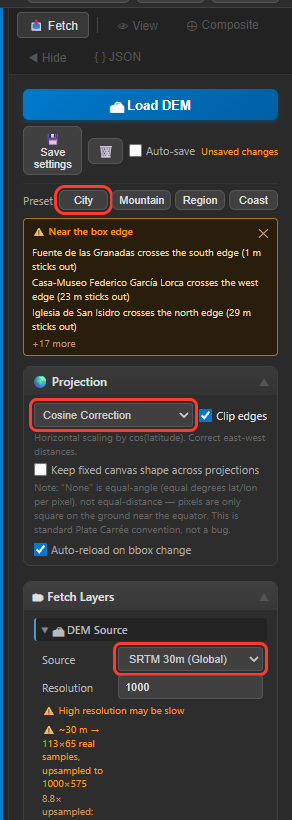
   *City preset, Cosine Correction, SRTM 30 m (Global) at 1000 px. The sampling note
   still describes the DEM Edit loaded on entry (1000 × 575, projection None) until Load
   DEM is clicked.*

   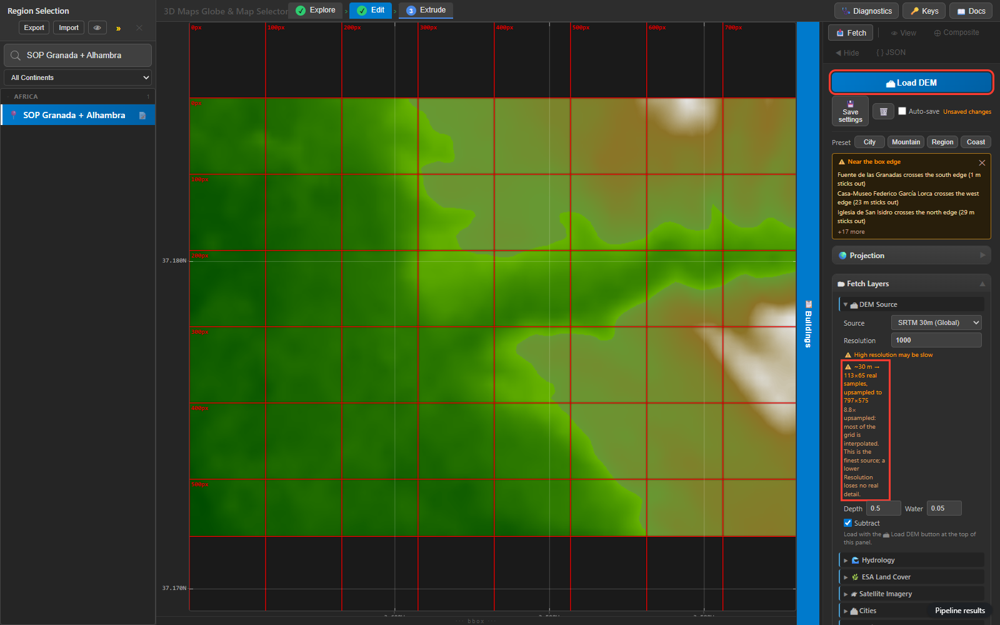
   *The note under Resolution: ~30 m → 113 × 65 real samples upsampled 8.8× to
   797 × 575 — at city scale every source is interpolated; a lower Resolution loses no
   real detail.*

3. **Terrain edits** (optional, Edit → ⊕ Composite): water depth, land cover, curve edits.
   These are the *terrain stage*. The Composite's buildings / roads / waterways / walls
   toggles are 2D preview only; in 3D those come from the City Model layers.

   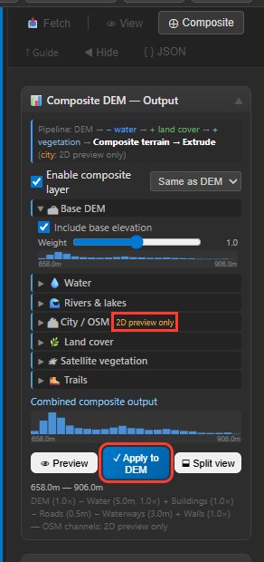
   *The Composite panel: City / OSM is marked "2D preview only"; ✓ Apply to DEM writes the
   terrain channels into the DEM.*

4. **City data** (Edit → 📥 Fetch → 🗂 Fetch Layers → 🏙 Cities → **📥 Load Cities**):
   first fetch 1–5 min, cached after; the progress box lists each OSM layer (cached /
   fetching / done) with *Cancel*. *Tolerance (m)* (default 3) and *Min area (m²)* are
   sent with the City Model build, which reads exactly the OSM cache entry Load Cities
   wrote (and the height overrides made on it), so the build fetches only the layers
   Load Cities does not (railways, green, trails). Open the **Buildings panel** (📋 Toggle Buildings Table
   Panel, or the 📋 Buildings tab at the right edge of the map) and check the height
   sources, histogram, the "> 20 % default height" warning (only shown above 20 %), the
   tallest list. Fix wrong heights with the per-building override (click a building, *Height
   (m)*, *Set*) — it is sent with the build. **🏛 Landmarks** (same tab, below Fetch Layers)
   → *🔎 Find landmarks* lists places of worship, town halls, castles, attractions and the
   tallest buildings with part count, roof shapes and height source; click one to build it
   from *OSM parts* (default), a surveyed *nDSM* or an *Uploaded mesh*, *👁 Preview* it and
   *💾 Save* (stored per region, sent with the City Model build).

   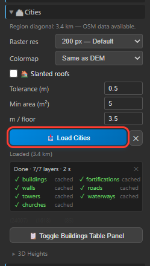
   *Tolerance 0.5 m (the build's); "Done · 7/7 layers", each served from cache.*

   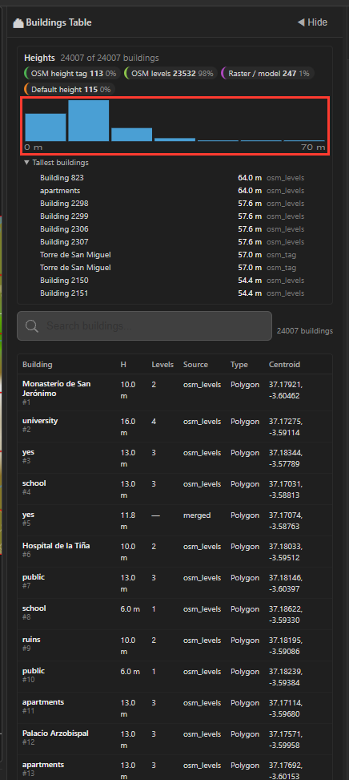
   *24,007 buildings: 98 % from OSM levels, 115 (0 %) at the default height — no warning;
   histogram 0–70 m; tallest 64 m.*

   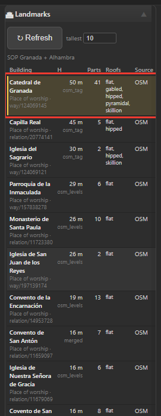
   *Find landmarks: Catedral de Granada (50 m, 41 parts, 5 roof shapes) first; click a row
   for its editor.*

5. **Model** (Extrude → 📥 Fetch): the line under the preview shows "1 mm = X m" and the
   vertical exaggeration; the bed outline and its label show fit. Vertical: *auto* = true
   scale below a 20 km diagonal, fit to *Fit height* above; override with *True scale ×
   exag.* or *Fit to height*. Smoothing 3×3. With the City preset's puzzle on, the red
   lines are already the piece grid.

   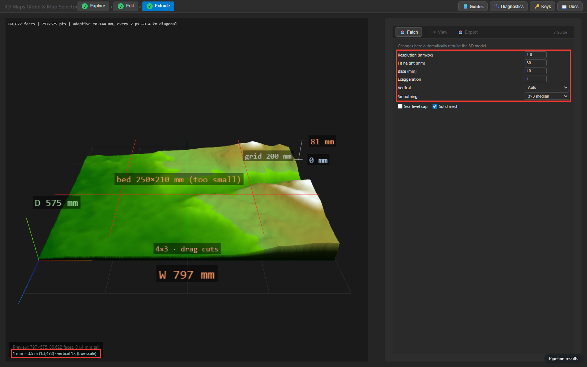
   *797 × 575 × 81 mm at 1 mm/px: "1 mm = 3.5 m (1:3,472) · vertical 1× (true scale)";
   bed 250 × 210 "too small", 4 × 3 cut lines.*

6. **Pre-flight** (Extrude → 📤 Export → ✈ Pre-flight check, *City model* or *Terrain
   puzzle*, **Run pre-flight**; seconds for terrain, about a minute with 24 k buildings):
   size vs the bed, scale and vertical exaggeration, piece grid, per-layer shapes with the
   `widened` / `capped` counts the build will report, thinnest feature, tallest spike,
   estimated faces, filament (g PLA) and print time, and a warning list. Fix what it flags
   before building (layers not yet cached are listed, not counted).

   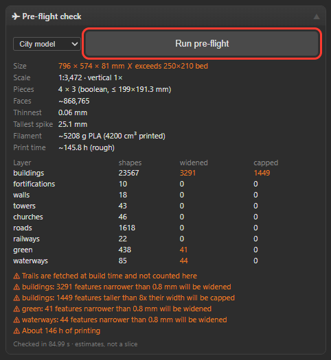
   *796 × 574 × 81 mm, 1:3,472, 4 × 3 boolean pieces; buildings: 3,291 widened, 1,449
   capped; railways and green not cached yet (fetched at build time).*

7. **Puzzle options** (Extrude → 📤 Export → 🧩 Split / Puzzle; they apply to the City
   Model puzzle too): knob shape (*classic* rounded, *dovetail*, *rectangular*), engraved
   piece ids + north arrow on the underside (on by default), *Lay out on plates* (one 3MF
   per bed). These controls only show while Split / Puzzle's **Enable** is ticked, and
   while it is ticked the preview draws *its* Columns × Rows grid and the City Model build
   ignores dragged cuts. For a City Model puzzle: tick *Enable*, set the options, untick
   it again (the options stay), then drag the red City-grid cuts in the preview (a cut
   stops where a piece would get too small for its knobs); *Reset cuts* (visible with
   *Enable* ticked) goes back to equal pieces.

   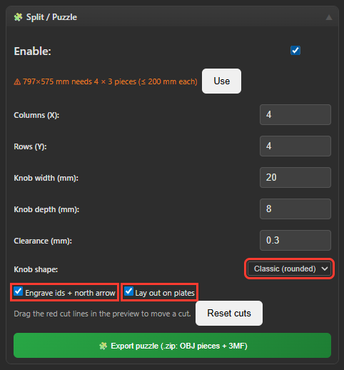
   *Enable ticked: knob shape, engraving and plate layout (Columns × Rows are the terrain
   puzzle's).*

   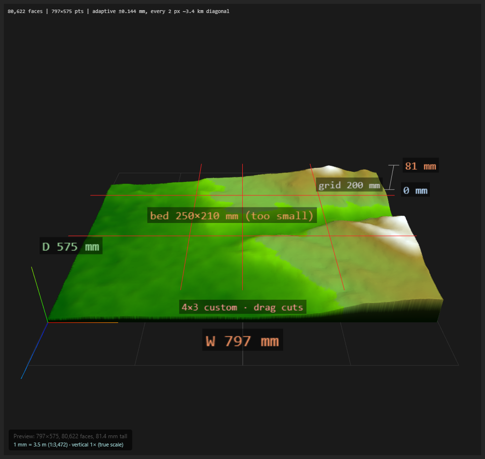
   *Enable unticked again: the City grid, left vertical cut dragged east — the label
   reads "4×3 custom · drag cuts".*

8. **Build** (Extrude → 📤 Export → 🏙️ City Model): toggle layers per situation (see §3),
   keep *Puzzle pieces* on with *max* = bed − 10 mm (set from the Printer section's bed).
   **Build city model (.zip)**. One build writes the merged STL, the per-layer 3MF, the
   puzzle (pieces in place + laid-out plates) and `report.json`. The progress bar above
   the Extrude tabs shows the server's step and the elapsed time (e.g. "Building
   model... (4:05)") with **✕ Cancel**; the download and a "CITY ready" toast (kept up
   for its full 5 s) mark the end.

   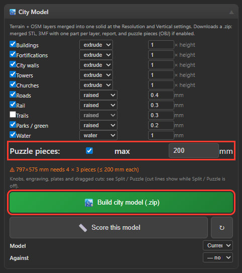
   *All ten layers, puzzle pieces ≤ 200 mm (Prusa 250 × 210 bed) → 4 × 3 pieces.*

   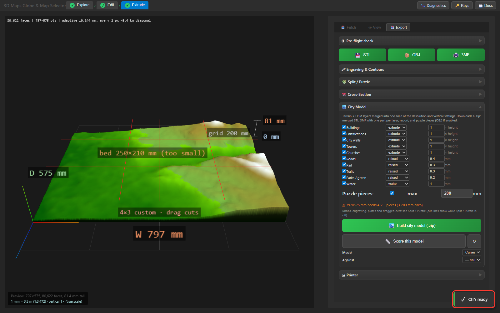
   *"CITY ready" after ~10 min (this run also fetched the uncached railways and green
   layers from Overpass).*

9. **QA**: open `report.json` — `check` (size vs bed, faces, watertight, widened/clamped
   per layer, filament and time from the real mesh, warnings), `merged.watertight`,
   `scale`, `puzzle` (grid, method, timings). In the slicer: size vs bed, no "errors
   fixed", tallest spike.

Terrain-only models (no city) use the same route: *Extrude → 📤 Export → STL/OBJ/3MF* or
*Puzzle* build the city model with no layers, so they get the same adaptive mesh and
scale. A terrain-only puzzle is cut the fast way (pieces meshed straight from the
heightfield, see §4).

The Extrude preview is the adaptive mesh capped at 150 k faces (tolerance raised until it
fits); the HUD shows the tolerance reached. The downloaded file is always the full-tolerance
mesh.

## 3. Layer choices

| Situation | Layers on | Notes |
|---|---|---|
| Historic city (Granada) | all but trails (City preset) | trails optional: turn on for the hill paths (Granada: 219 fetched, 136 kept) |
| Coastal city (Cartagena) | buildings, landmarks, roads, water, green | Coast preset caps the sea at 0 m, trails off |
| Mountain town (Breckenridge) | buildings, roads, water, trails (Mountain preset: trails on) | green is 612 k faces on steep ground — leave it off |
| Region > 20 km | none (terrain), water | see §6 |

**Trails** are off by default and fetched only when the layer is on: turn them on for
hiking / mountain models where the paths are the point. Trails = hiking paths and tracks
outside town (`highway=path|track|bridleway`, hiking / foot route relations, and
footways only with `sac_scale`, `trail_visibility` or a name; never sidewalks, crossings
or steps). City footways are excluded: the build also drops any trail with more than
half its length within 60 m of buildings or within 6 m of a road (report:
`trails_kept` / `trails_dropped`). Granada's old trails layer was 4,293 features,
3,605 of them town footways.

Per layer (Extrude → 📤 Export → City Model table): enabled, mode (extrude / raised / engraved / water),
height or depth, line width. Printability rules apply to every layer: features narrower
than 0.8 mm are widened, extruded heights capped at 8 × footprint width (reported).

## 4. How the model is built (for troubleshooting)

1. **Terrain stage** (raster): DEM from the request (composite spec, edited values, or
   the loaded DEM handle) → fill → median → sea-level cap → vertical scale → label and
   contour engraving → heightfield in mm.
2. **Terrain mesh**: adaptive TIN within max(0.05 mm, half the source's 1 m step at model
   scale) of every pixel — 200 k faces instead of 1.8 M for Granada.
3. **Feature stage** (vector): OSM outlines projected to mm, simplified 0.05 mm, snapped
   0.01 mm, clipped to the box; extruded features sit on the highest ground under them
   with a skirt down; draped layers are one slab per connected area built on the
   terrain's own vertices; water is cut flat.
   - **Print-scale reduction** (buildings and other extruded layers): flat-roofed
     buildings on the ground (not `building:part`, no `min_height`, no landmark override)
     whose *absolute* top rounds to the same 0.1 mm print layer, and whose outlines are
     closer than 0.4 mm (one nozzle), are merged into one prism: union, closed by 0.2 mm
     (a narrower gap fills in on the print anyway), simplified 0.1 mm, from the group's
     lowest skirt to its top. Pitched roofs, parts and overrides stay individual. Report:
     `merged_from` buildings → `merged_into` solids. Hillside cities merge little
     (Granada 779 of 23,937 -> 580 solids: every building's ground differs); flat
     ones merge more (Cartagena 475 of 3,065 -> 229, buildings faces -1.5 %: the OSM
     fetch already dissolves touching same-height buildings, so the reduction adds the
     sub-nozzle gaps and the same-layer neighbours of different heights). Style fields `merge_flat`, `layer_height_mm`, `min_gap_mm`,
     `outline_tol_mm` (layer overrides) change or disable it.
   - **Draped slabs** are triangulated without Shewchuk's Triangle: qhull Delaunay of the
     outline + terrain vertices, outline edges recovered by re-triangulating the crossed
     triangles with GEOS (`triangulate_polygon`); same face count as before.
4. **Merge** (manifold3d): union → contacts separated by 0.001 mm (watertight after STL
   welding) → lossless coplanar merge.
   - **Caches** (`city2stl/model_cache.py`, under `cache/`, 30 days): the terrain TIN
     (`city_terrain`), each layer's polygons (`city_polygons`, shared with the
     pre-flight), each layer's union solid (`city_solids`) and the finished model
     (`city_models`), each keyed by a digest of everything it depends on (features,
     bbox, scale, style, heightfield, landmark overrides, code version). An unchanged
     rebuild loads the finished model (Granada: 8 s instead of 101 s); changing one
     layer's style or a landmark override rebuilds only that layer, then the merge.
     `MAP2STL_CITY_CACHE=0` disables them. OSM layers loaded at other panel settings are
     re-derived locally from a finer or larger cached entry instead of refetched.
5. **Puzzle**: piece outlines from the bed size (or dragged cut positions), then
   - terrain-only (*mask* path, automatic): each piece's top is the terrain TIN's vertices
     inside the outline plus the outline itself (split at the pixel spacing), triangulated
     together, walls on the exact outline, flat bottom — no boolean engine;
   - with city layers (*boolean* path): manifold3d intersection of the merged model with
     the cutter prisms.
   Both check the volume (pieces must sum to the model minus the clearance gaps). Then the
   id and north arrow are cut 0.6 mm into each piece's underside (mirrored so they read
   with the piece turned over), and the pieces are packed onto beds for the plate 3MFs.
   `puzzle_method` / `puzzle.method` forces either path.

## 5. Known limits

- Roofs (`city2stl/roofs.py`) cover gabled, hipped, skillion, dome, onion and cone, and
  concave footprints (split into convex pieces); `building:part` towers, domes and spires
  stack; the 🏛 Landmarks panel overrides one landmark. Limits: a pitched roof on a
  footprint with a courtyard (inner ring) is flat at mid-roof height, as are unknown
  `roof:shape` values; the *nDSM* landmark source needs regional lidar coverage (else use
  *OSM parts* or an uploaded mesh).
- Draped layers duplicate terrain detail on steep ground (Breckenridge green).
- Heights outside Spain/US lidar coverage are thin; check the default-height warning.
- The city fetch shows per-layer progress, but layers the build needs that *Load Cities*
  does not fetch (railways, green, trails) are fetched from Overpass during the build,
  with no progress shown; during an Overpass outage the build waits on dead mirrors.
  Trails are then cached for 7 days (`trails_osm`), so only the first build waits.
- **Export feedback** (fixed 2026-09-27): the progress bar and ✕ Cancel now show during
  every export, toasts stay up for their requested duration, and the browser has no
  fixed time limit: it keeps polling while the server reports progress or its worker
  heartbeat (`alive`), and gives up only after 3 min without either, or when the task is
  gone (server restarted). ✕ Cancel still only stops waiting — the server task has no
  cancel route and runs to the end.

## 6. Large regions (> 20 km)

Buildings are below print resolution at these scales; build terrain only with the
*Region* preset (Vertical *auto* → fit, rivers + lakes from the Composite panel, then
*Apply to DEM*). Full procedure, reference results (Grand Canyon, Middle Rhine, Sierra
Nevada), river-depth table and known limits: **[large-region-sop.md](large-region-sop.md)**.

## History

2026-09-26 run found: city export terrain inside-out, buildings exaggerated 16× and not
clipped, buildings floating on slopes, landmark layers ignored, city export ignoring the
size settings, jigsaw cutter x/y swap dropping 40 % of non-square models, dead puzzle
settings. All fixed by F-CITYMODEL (vector city model, one scale, jigsaw puzzles).
