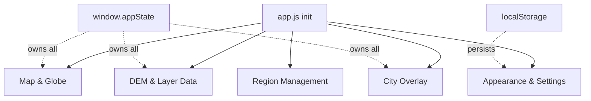

# Global State Reference — strm2stl

_Last updated: 2026-04-19_

All variables live on the `window.appState` reactive Proxy (from `modules/core/state.js`). Modules can subscribe via `window.appState.on('key', fn)`. Legacy `window.get*/set*` aliases are kept for backward compatibility.

### State ownership overview

## Map & Globe

| Key | Type | Description |
|-----|------|-------------|
| `map` | Leaflet.Map | Main 2D map instance |
| `globeScene` | THREE.Scene | Three.js scene for globe |
| `globeCamera` | THREE.PerspectiveCamera | Globe camera |
| `globeRenderer` | THREE.WebGLRenderer | Globe renderer |
| `globe` | THREE.Mesh | Globe sphere mesh |
| `drawnItems` | L.FeatureGroup | Drawn bbox rectangles |
| `preloadedLayer` | L.FeatureGroup | Preloaded region boxes |
| `editMarkersLayer` | L.FeatureGroup | Edit buttons inside each bbox |
| `boundingBox` | L.Rectangle\|null | Currently active bbox |

## Region Management

| Key | Type | Description |
|-----|------|-------------|
| `coordinatesData` | Array | `{name, label, north, south, east, west}[]` |
| `selectedRegion` | Object\|null | Currently selected region |

## DEM & Layer Data

| Key | Type | Description |
|-----|------|-------------|
| `lastDemData` | Object\|null | `{values, width, height, min, max, bbox}` |
| `lastWaterMaskData` | Object\|null | Water mask + ESA response |
| `currentDemBbox` | Object\|null | `{north,south,east,west}` for current DEM |
| `layerBboxes` | Object | `{dem, water, landCover}` each bbox or null |
| `layerStatus` | Object | `{dem, water, landCover}` — 'empty'\|'loading'\|'ready'\|'error' |
| `activeDemSubtab` | String | Current DEM sub-tab name |

## Appearance & Settings

| Key | Type | Description |
|-----|------|-------------|
| `landCoverConfig` | Object | ESA class → `{color, label, visible}` |
| `waterOpacity` | Number | 0–1, default 0.7 |
| `curvePoints` | Array | `[{x,y}]` curve editor control points |
| `userPresets` | Object | Named presets from localStorage |
| `regionNotes` | Object | `{regionName: text}` from localStorage |
| `sidebarState` | String | 'normal'\|'expanded'\|'hidden' |

## City Overlay

| Key | Type | Description |
|-----|------|-------------|
| `osmCityData` | Object\|null | `{buildings, roads, waterways, walls}` GeoJSON. Features have `height_m`, `road_width_m` (server), `terrain_z` (client), `_bbox` (pre-computed). |
| `window.renderCityOnDEM` | Function | Set by city-overlay.js; paints `.city-dem-overlay` on DEM canvas |
| `hydrologySourceCanvas` | HTMLCanvasElement\|null | Offscreen canvas with rendered river depression grid (set by hydrology-overlay.js) |
| `lastLandCoverData` | Object\|null | ESA WorldCover classification response |

## Other

| Key | Type | Description |
|-----|------|-------------|
| `stackedLayerData` | Object | `{dem, water, landCover}` each `{canvas, bbox, label}` |
| `compareData` | Object | `{left: {region, dem, ...}, right: {...}}` |
| `terrainMesh` | THREE.Mesh\|null | Current 3D terrain mesh |
| `_mergeSources` | Array | Available DEM source descriptors |
| `_mergeLayers` | Array | Current merge layer stack |
| `waterMaskCache` | Object | File-top LRU, max 20 entries. Methods: `get/set/has/generateKey/getStats/clear` |

## window.appState Keys (modules read these)

Mirrored from closure. Set via `appState.set(key, val)` or direct assignment:

| Key | Source | Used by |
|-----|--------|---------|
| `selectedRegion` | closure | city-overlay, regions, stacked-layers |
| `currentDemBbox` | closure | dem-loader, city-overlay, stacked-layers |
| `lastDemData` | closure | dem-loader, composite-dem, model-viewer |
| `osmCityData` | closure | city-overlay, composite-dem |
| `lastWaterMaskData` | closure | water-mask, composite-dem |
| `originalDemValues` | appState-only | curve-editor |
| `curveDataVmin` | appState-only | curve-editor, dem-main |
| `curveDataVmax` | appState-only | curve-editor, dem-main |
| `curvePoints` | closure | curve-editor |
| `layerBboxes` | closure (shared ref) | stacked-layers |
| `layerStatus` | closure (shared ref) | ui-helpers |
| `compositeSourceCanvas` | — | stacked-layers, composite-dem |
| `compositeFeatures` | — | composite-dem |
| `satImgSourceCanvas` | — | composite-dem |
| `_setDemEmptyState` | callback | dem-main |
| `_updateWorkflowStepper` | callback | dem-main |
