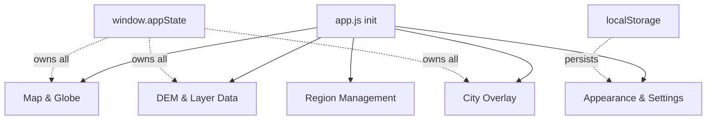

# Global State Reference — map2stl

_Last updated: 2026-05-14_

All variables live on the `window.appState` reactive Proxy (from `modules/core/state.js`). Modules can subscribe via `window.appState.on('key', fn)`. Legacy `window.get*/set*` aliases are kept for backward compatibility.

### State ownership overview

```mermaid
flowchart TD
    APP["app.js init"] --> MAP["Map & Globe"]
    APP --> REG["Region Management"]
    APP --> DEM["DEM & Layer Data"]
    APP --> STYLE["Appearance & Settings"]
    APP --> CITY["City Overlay"]
    WAS["window.appState"] -.->|owns all| MAP
    WAS -.->|owns all| DEM
    WAS -.->|owns all| CITY
    LS["localStorage"] -.->|persists| STYLE
```

## Map & Globe

| Key | Type | Description |
|-----|------|-------------|
| `map` | Leaflet.Map | Main 2D map instance |
| `globeScene` | THREE.Scene | Three.js scene for globe |
| `globeCamera` | THREE.PerspectiveCamera | Globe camera |
| `globeRenderer` | THREE.WebGLRenderer | Globe renderer |
| `globe` | THREE.Mesh | Globe sphere mesh |
| `drawnItems` | L.FeatureGroup | Drawn bbox rectangles |
| `preloadedLayer` | L.FeatureGroup | Preloaded region boxes |
| `editMarkersLayer` | L.FeatureGroup | Edit buttons inside each bbox |
| `boundingBox` | L.Rectangle\|null | Currently active bbox |

## Region Management

| Key | Type | Description |
|-----|------|-------------|
| `coordinatesData` | Array | `{name, label, north, south, east, west}[]` |
| `selectedRegion` | Object\|null | Currently selected region |

## DEM & Layer Data

| Key | Type | Description |
|-----|------|-------------|
| `lastDemData` | Object\|null | `{values, width, height, min, max, bbox}` |
| `lastWaterMaskData` | Object\|null | Water mask + ESA response |
| `currentDemBbox` | Object\|null | `{north,south,east,west}` for current DEM |
| `layerBboxes` | Object | `{dem, water, landCover}` each bbox or null |
| `layerStatus` | Object | `{dem, water, landCover}` — 'empty'\|'loading'\|'ready'\|'error' |
| `activeDemSubtab` | String | Current DEM sub-tab name |
| `demLayout` | Object | `{x, y, w, h}` pixel layout of the active DEM canvas within the viewport |
| `satImgSourceCanvas` | HTMLCanvasElement\|null | Offscreen canvas holding satellite imagery (set by `city-render.js` / `stacked-layers.js`) |
| `cityRasterSourceCanvas` | HTMLCanvasElement\|null | Offscreen canvas holding city raster (set by `city-render.js`) |
| `compositeDemSourceCanvas` | HTMLCanvasElement\|null | Offscreen canvas holding composite DEM output (set by `composite-dem.js`) |
| `compositeFeatures` | Object\|null | `{dem, water, city, cityComponents: {buildings,roads,waterways,walls}, landcover, satellite, trails, width, height}` — per-channel Float32Arrays for ML pipeline + histograms (set by `composite-dem.js`) |
| `_newCompositeApplied` | Boolean | Set by `applyCompositeToDem()`, cleared by a fresh `loadDEM()`. Tells `export-handlers.js` `_demSettings()` to send `compositeLayerSpec` (or, if a channel has no server source, the inline `lastDemData.values`) |
| `compositeLayerSpec` | `{layers, unsupported}`\|null | Terrain-only server layer spec published by `applyCompositeToDem()` — never contains the `osm_*` feature sources (two-stage mesh pipeline: those come from the City Model's vector stage) |
| `demValuesEdited` | Boolean | Browser-side edits (curve editor, mesh blend) exist in `lastDemData.values`; export ships them as `dem_values`. Applied composites put only terrain channels there, so this never carries rasterised OSM features |
| `osmCityParams` | `{simplify_tolerance, min_area, detail}`\|undefined | The Cities panel settings `loadCityData()` last fetched with. `_cityExtra()` (export-handlers.js) sends them with the City Model build so it reads the same OSM cache entry (and the height overrides match its features); falls back to the panel values when unset |
| `osmCityDetail` | `'full'`\|`'coarse'`\|undefined | Which OSM detail tier `loadCityData()` last fetched with — `'coarse'` above `CITY_MAX_DIAG_KM` (10km), rejected above `CITY_COARSE_MAX_DIAG_KM` (25km). Read by `composite-dem.js`'s `_fetchCityRaster` so the raster endpoint's OSM-cache lookup matches the fetched tier. |
| `meshImport` | Object\|null | F-MESHIMPORT state: `{uploadId, libraryRelPath, filename, heightmap: {values,width,height,bbox,minElevation,maxElevation,validPct}\|null, registered: {values,mask,width,height,rmsResidualPx}\|null}` (set by `mesh-layer.js`) |
| `meshSourceCanvas` | HTMLCanvasElement\|null | Offscreen canvas holding the *registered* mesh layer, masked to its footprint (set by `mesh-layer.js`'s `applyMeshRegistration`) |
| `meshPreviewCanvas` | HTMLCanvasElement\|null | Offscreen canvas holding the *unregistered* mesh heightmap preview (set by `computeMeshHeightmap`) |

## Appearance & Settings

| Key | Type | Description |
|-----|------|-------------|
| `landCoverConfig` | Object | ESA class → `{color, label, visible}` |
| `waterOpacity` | Number | 0–1, default 0.7 |
| `curvePoints` | Array | `[{x,y}]` curve editor control points |
| `userPresets` | Object | Named presets from localStorage |
| `regionNotes` | Object | `{regionName: text}` from localStorage |
| `sidebarState` | String | 'normal'\|'expanded'\|'hidden' |

**Preset module-level state** (in `ui/presets.js`, not on `window.appState`):

| Variable | Type | Description |
|----------|------|-------------|
| `PRESET_VERSION` | Number (const) | Currently `1`; guards against stale preset shapes in localStorage |
| `_presetSnapshot` | Object\|null | Settings snapshot taken before loading a preset; cleared on revert or new preset load |

**Region table module-level state** (in `regions/region-ui.js`, not on `window.appState`):

| Variable | Type | Description |
|----------|------|-------------|
| `TABLE_PAGE_SIZE` | Number (const) | `20` — rows per page |
| `_tablePage` | Number | Current page index (0-based) |
| `_tableSearch` | String | Current search filter text |

## City Overlay

| Key | Type | Description |
|-----|------|-------------|
| `osmCityData` | Object\|null | `{buildings, roads, waterways, walls}` GeoJSON. Features have `height_m`, `road_width_m` (server), `terrain_z` (client), `_bbox` (pre-computed). |
| `window.renderCityOnDEM` | Function | Set by city-overlay.js; paints `.city-dem-overlay` on DEM canvas |
| `hydrologySourceCanvas` | HTMLCanvasElement\|null | Offscreen canvas with rendered river depression grid (set by hydrology-overlay.js) |
| `waterHydrologyCanvas` | HTMLCanvasElement\|null | Offscreen canvas with the combined water + hydrology layer (set by water-hydrology-combined.js); read by stacked-layers.js |
| `lastLandCoverData` | Object\|null | ESA WorldCover classification response |
| `cityFetch` | Object\|null | Status of the background city fetch (`GET /api/cities/status/{id}` shape: `task_id, status, layers[{name,state}], mirror, elapsed_s, error`); written by `loadCityData()` (city-overlay.js via `city-fetch.js:runCityFetch`), read by `CityFetchProgress.vue`. `window.cancelCityFetch()` cancels |
| `demSampling` | Object\|null | `source_resolution` of the last `/api/terrain/dem` response (`native_resolution_m, native_samples, grid, upsample`); set by `loadDEM()`, cleared at the start of each load; read by `DemSamplingInfo.vue` |
| `edgeLandmarks` | Object\|null | `{key, loading, error, landmarks[]}` — named landmarks within 200 m of the box edge (`GET /api/geocode/edge-landmarks`). Written by the Explore map's `EdgeLandmarkWarnings.vue` (`fetcher`), 1.5 s after `EV.BBOX_CHANGED`; the Edit panel's compact instance only reads it |

## 3D Viewer

| Key | Type | Description |
|-----|------|-------------|
| `terrainMesh` | THREE.Mesh\|null | Current 3D terrain mesh in the Extrude viewer |
| `viewerScene` | THREE.Scene\|null | The Three.js scene for the model viewer |
| `generatedModelData` | Object\|null | `{values, width, height, resolution, exaggeration, baseHeight, vmin, vmax}` — last preview parameters, used by download buttons |
| `modelPreviewState` | `'idle'\|'building'\|'ready'\|'error'` | Extrude preview lifecycle (model-viewer.js); ModelContainer.vue words its empty state from it |
| `puzzleEdges` | `{cols: number[], rows: number[], key: string}`\|null | Puzzle cuts dragged in the Extrude preview, mm from the west / south edge; `key` = grid + model size they belong to (a different grid falls back to the even split). Sent as `col_edges_mm` / `row_edges_mm` |
| `cityHeightOverrides` | `Record<number, number>` | Buildings-panel height overrides by feature index; sent by `exportCityModel()` as `layer_data.buildings`; reset when a new building set loads |
| `cityLandmarkOverrides` | `Record<string, object>` | Landmark overrides of the selected region by OSM id (`way/123`): `{kind: osm\|ndsm\|mesh, ...}`; loaded from / saved to `/api/regions/{name}/landmarks`; non-`osm` ones sent by `exportCityModel()` as `landmark_overrides` (F-LANDMARK) |

## Other

| Key | Type | Description |
|-----|------|-------------|
| `stackedLayerData` | Object | `{dem, water, landCover}` each `{canvas, bbox, label}` |
| `compareData` | Object | `{left: {region, dem, ...}, right: {...}}` |
| `waterMaskCache` | Object | File-top LRU, max 20 entries. Methods: `get/set/has/generateKey/getStats/clear` |

## window.appState Keys (modules read these)

Mirrored from closure. Set via `appState.set(key, val)` or direct assignment:

| Key | Source | Used by |
|-----|--------|---------|
| `selectedRegion` | closure | city-overlay, regions, stacked-layers |
| `currentDemBbox` | closure | dem-loader, city-overlay, stacked-layers |
| `lastDemData` | closure | dem-loader, composite-dem, model-viewer |
| `osmCityData` | closure | city-overlay, composite-dem |
| `lastWaterMaskData` | closure | water-mask, composite-dem |
| `originalDemValues` | appState-only | curve-editor |
| `curveDataVmin` | appState-only | curve-editor, dem-main |
| `curveDataVmax` | appState-only | curve-editor, dem-main |
| `curvePoints` | closure | curve-editor |
| `layerBboxes` | closure (shared ref) | stacked-layers |
| `layerStatus` | closure (shared ref) | ui-helpers |
| `compositeSourceCanvas` | — | stacked-layers, composite-dem |
| `compositeFeatures` | — | composite-dem |
| `satImgSourceCanvas` | — | composite-dem, stacked-layers |
| `cityRasterSourceCanvas` | — | city-render, stacked-layers |
| `compositeDemSourceCanvas` | — | composite-dem, stacked-layers |
| `meshImport` | — | mesh-layer, mesh-registration |
| `meshSourceCanvas` | — | mesh-layer, stacked-layers |
| `meshPreviewCanvas` | — | mesh-layer |
| `demLayout` | — | stacked-layers, dem-loader |
| `terrainMesh` | model-viewer | export-handlers |
| `viewerScene` | model-viewer | (read-only) |
| `generatedModelData` | model-viewer | export-handlers, puzzle export |
| `modelPreviewState` | model-viewer | ModelContainer.vue |
| `puzzleEdges` | model-viewer (drag), `resetPuzzleEdges` | model-viewer, export-handlers (`puzzleEdgesFor`) |
| `cityHeightOverrides` | CityBuildingsPanel.vue | export-handlers |
| `cityLandmarkOverrides` | CityLandmarksSection.vue | export-handlers (`overridesForBuild`) |
| `_setDemEmptyState` | callback | dem-main |
| `_updateWorkflowStepper` | callback | dem-main, model-viewer |
